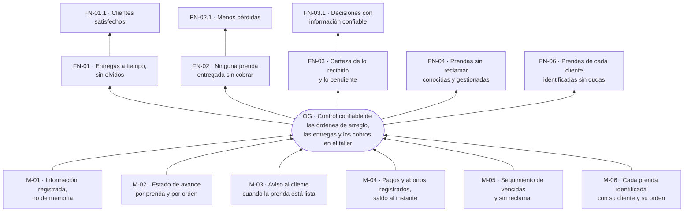

# Árbol de objetivos

**Estado:** borrador · Sprint 1 · se valida con el instructor (F-04) junto con el [árbol de problemas](arbol-de-problemas.md)

## Cómo se construyó

Cada elemento del árbol de problemas se reescribe como la situación positiva que se quiere alcanzar:

| Árbol de problemas | Árbol de objetivos | Qué significa |
| --- | --- | --- |
| Problema central (P) | **Objetivo general (OG)** | Lo que el proyecto busca lograr |
| Causas (C) | **Medios (M)** | Lo que hay que conseguir para lograrlo; de aquí salen los objetivos específicos y los requisitos |
| Efectos (E) | **Fines (FN)** | Lo que gana el taller cuando se logra |

Cada medio y cada fin conserva el código del elemento del que nace (M-04 nace de C-04), así la trazabilidad no se pierde. Los fines usan el prefijo `FN` para no confundirse con las fuentes (`F-01`…).

Los **indicadores** dicen cómo se sabrá que un medio se cumplió. Sus metas numéricas se fijan en los objetivos específicos.

## Objetivo general

> **OG · Lograr un control confiable de las órdenes de arreglo, las entregas y los cobros en el taller de costura.**
>
> Nace de P-01.

## Medios

| Código | Medio | Nace de | Indicador |
| --- | --- | --- | --- |
| **M-01** | La información del taller (clientes, prendas, arreglos, precios y abonos) queda registrada y deja de depender de la memoria | C-01 | Porcentaje de prendas recibidas que quedan registradas |
| M-01.1 | Cada prenda recibida se registra con su cliente, el arreglo, el precio y la fecha de entrega acordada | C-01.1 | Prendas registradas con todos sus datos |
| M-01.2 | Existe un único lugar donde consultar qué prendas hay, de quién son, qué arreglo llevan y cuánto deben | C-01.2 | Tiempo para responder "¿dónde está la prenda de este cliente y cuánto debe?" |
| **M-02** | Se conoce el estado de avance de cada prenda y de cada orden | C-02 | Órdenes con estado actualizado |
| M-02.1 | Una orden solo se considera lista cuando todas sus prendas están terminadas | C-02.1 | Órdenes marcadas como listas con prendas sin terminar (debe ser cero) |
| **M-03** | El cliente recibe aviso cuando su prenda está lista para recoger | C-03 | Órdenes listas con aviso enviado |
| **M-04** | Cada pago y abono queda registrado y el saldo de cada cliente se consulta al instante | C-04 | Pagos registrados frente a pagos recibidos |
| M-04.1 | El saldo se obtiene de lo cobrado y lo pagado, sin sumas ni restas a mano | C-04.1 | Diferencias entre el saldo mostrado y el calculado (debe ser cero) |
| **M-05** | Se hace seguimiento a las órdenes vencidas y a las prendas sin reclamar, con su cantidad y su antigüedad | C-05 | Cantidad de prendas sin reclamar y días que llevan esperando, consultables en todo momento |
| **M-06** | Cada prenda queda identificada con su cliente y su orden desde que se recibe | C-06 | Prendas identificables por su orden al buscarlas en el rincón |
| M-06.1 | Una foto de cada prenda al recibirla permite reconocer cuáles son de cada cliente, aunque traiga varias | C-06.1 | Prendas recibidas con al menos una foto |

## Fines

| Código | Fin | Nace de |
| --- | --- | --- |
| **FN-01** | Las entregas se cumplen a tiempo, sin olvidos | E-01 |
| FN-01.1 | Clientes satisfechos con la atención | E-01.1 |
| **FN-02** | Ninguna prenda se entrega sin cobrar o sin dejar su saldo registrado | E-02 |
| FN-02.1 | Se reducen las pérdidas económicas del negocio | E-02.1 |
| **FN-03** | Se sabe con certeza cuánto se ha recibido y cuánto falta por cobrar | E-03 |
| FN-03.1 | Las decisiones del negocio se toman con información confiable | E-03.1 |
| **FN-04** | Se sabe cuántas prendas están sin reclamar y desde cuándo, para gestionarlas | E-04 |
| **FN-06** | Se identifican sin dudas las prendas de cada cliente al trabajarlas y al entregarlas | E-06 |

## Diagrama

## Pendiente para cerrar este documento

- Validar con el instructor.
- Redactar los objetivos específicos a partir de los medios, con meta y plazo (SMART), y definir qué medios entran en el alcance de esta entrega.
