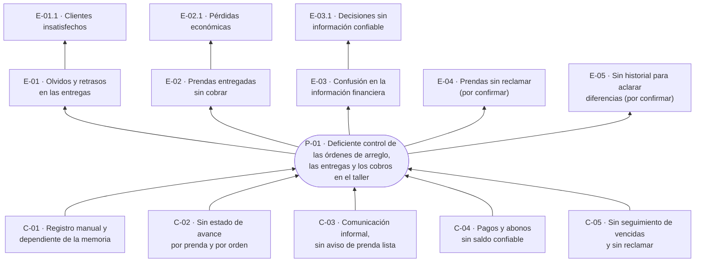

# Árbol de problemas

**Estado:** borrador · Sprint 1 · se completa con las respuestas del aprendiz y se valida con el instructor (F-04)

## Cómo se construyó

1. **Problema central:** se redacta como una situación negativa del negocio, no como la falta de un software. "No hay un sistema" describe una solución, no un problema.
2. **Causas:** por qué ocurre el problema. Las raíces se ubican debajo de las causas directas.
3. **Efectos:** qué le cuesta al negocio y a sus clientes.
4. **Fuente:** cada elemento cita de dónde sale ([fuentes](../02-requisitos/fuentes-de-requisitos.md)). Lo que no tiene fuente queda marcado **por confirmar** y no pasa a requisitos hasta confirmarse.

Este árbol es el origen de todo lo demás. Cada causa se convierte en un objetivo, cada objetivo en requisitos y reglas de negocio, y cada requisito en historias de usuario. La matriz de trazabilidad empieza aquí.

## Problema central

> **P-01 · Deficiente control de las órdenes de arreglo, las entregas y los cobros en el taller de costura.**

## Causas

| Código | Causa | Fuente |
| --- | --- | --- |
| **C-01** | El registro de clientes, prendas y trabajos es manual y depende de la memoria de quien atiende | F-01 · Contexto |
| C-01.1 | No existe un registro único donde consultar qué prendas hay, de quién son y qué arreglo llevan | F-01 · Necesidad del negocio |
| C-01.2 | Medio en el que se anota hoy (cuaderno, recibo en papel, mensajes…) | **Por confirmar** |
| **C-02** | No se lleva el estado de avance de cada prenda ni de cada orden | F-01 · Objetivos específicos |
| C-02.1 | Una orden puede darse por lista con prendas sin terminar | F-02 · hallazgo de la versión 1 |
| **C-03** | La comunicación con el cliente sobre el estado de su prenda es informal y no avisa cuando está lista | F-01 · Contexto y necesidad |
| **C-04** | Los pagos y abonos no se registran de forma que el saldo pendiente sea confiable | F-01 · Contexto |
| C-04.1 | Un saldo llevado a mano, sumando y restando, se descuadra | F-02 · hallazgo de la versión 1 |
| **C-05** | No hay seguimiento de las órdenes vencidas ni de las prendas sin reclamar | F-01 · Objetivos específicos |

## Efectos

| Código | Efecto | Fuente |
| --- | --- | --- |
| **E-01** | Olvidos y retrasos en las entregas | F-01 · Contexto |
| E-01.1 | Clientes insatisfechos y deterioro de la atención | F-01 · Necesidad del negocio |
| **E-02** | Prendas terminadas o entregadas sin haberse cobrado correctamente | F-01 · Contexto |
| E-02.1 | Pérdidas económicas para el negocio | F-01 · Contexto |
| **E-03** | Confusión en la información financiera: no se sabe con certeza cuánto se ha recibido y cuánto falta por cobrar | F-01 · Contexto y objetivos |
| E-03.1 | Decisiones del negocio sin información confiable | F-01 · Objetivos específicos |
| **E-04** | Prendas que nadie reclama ocupan espacio y dejan el trabajo sin cobrar | **Por confirmar** |
| **E-05** | Sin un historial de lo hecho en cada orden, no hay forma de aclarar una diferencia con un cliente | **Por confirmar** |

## Diagrama

## Pendiente para cerrar este documento

- Confirmar o descartar C-01.2, E-04 y E-05 con las respuestas del aprendiz.
- Cuantificar al menos un efecto (por ejemplo, cuántas órdenes por semana o cuántas entregas se atrasan) para que el problema sea medible y los objetivos tengan una meta.
- Validar el árbol con el instructor.
- Derivar el árbol de objetivos: cada causa pasa a ser un medio y cada efecto un fin.
