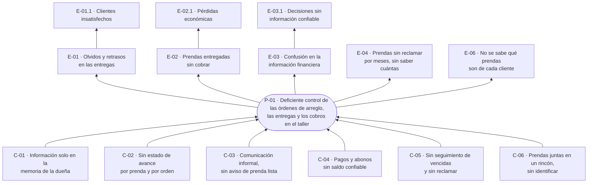

# Árbol de problemas

**Estado:** completo, pendiente de validación con el instructor (F-04) · Sprint 1

## Cómo se construyó

1. **Problema central:** se redacta como una situación negativa del negocio, no como la falta de un software. "No hay un sistema" describe una solución, no un problema.
2. **Causas:** por qué ocurre el problema. Las raíces se ubican debajo de las causas directas.
3. **Efectos:** qué le cuesta al negocio y a sus clientes.
4. **Fuente:** cada elemento cita de dónde sale ([fuentes](../02-requisitos/fuentes-de-requisitos.md)). Lo que no tiene fuente queda marcado **por confirmar** y no pasa a requisitos hasta confirmarse.

Este árbol es el origen de todo lo demás. Cada causa se convierte en un objetivo, cada objetivo en requisitos y reglas de negocio, y cada requisito en historias de usuario. La matriz de trazabilidad empieza aquí.

## Problema central

> **P-01 · Deficiente control de las órdenes de arreglo, las entregas y los cobros en el taller de costura.**

## Causas

| Código | Causa | Fuente |
| --- | --- | --- |
| **C-01** | La información del taller (clientes, prendas, arreglos, precios y abonos) vive solo en la memoria de la dueña | F-01 · Contexto · F-05 |
| C-01.1 | No se anota nada: no hay cuaderno, recibo ni ningún otro registro | F-05 |
| C-01.2 | No existe un lugar donde consultar qué prendas hay, de quién son, qué arreglo llevan y cuánto deben | F-01 · Necesidad del negocio |
| **C-02** | No se lleva el estado de avance de cada prenda ni de cada orden | F-01 · Objetivos específicos |
| C-02.1 | Una orden puede darse por lista con prendas sin terminar | F-02 · hallazgo de la versión 1 |
| **C-03** | La comunicación con el cliente sobre el estado de su prenda es informal y no avisa cuando está lista | F-01 · Contexto y necesidad · F-05 |
| **C-04** | Lo que debe cada cliente se lleva de memoria: no hay registro de pagos ni abonos | F-01 · Contexto · F-05 |
| C-04.1 | Un saldo llevado a mano, sumando y restando, se descuadra | F-02 · hallazgo de la versión 1 |
| **C-05** | No hay seguimiento de las órdenes vencidas ni de las prendas sin reclamar: no se sabe cuántas hay | F-01 · Objetivos específicos · F-05 |
| **C-06** | Las prendas por arreglar y las ya arregladas se guardan juntas en un rincón, sin nada que las identifique | F-05 |
| C-06.1 | Un cliente puede traer varias prendas a la vez (entre 3 y 5) y la dueña olvida cuáles son suyas | F-05 |

## Efectos

| Código | Efecto | Fuente |
| --- | --- | --- |
| **E-01** | Olvidos y retrasos en las entregas | F-01 · Contexto · F-05 |
| E-01.1 | Clientes insatisfechos y deterioro de la atención | F-01 · Necesidad del negocio |
| **E-02** | Prendas terminadas o entregadas sin haberse cobrado correctamente | F-01 · Contexto |
| E-02.1 | Pérdidas económicas para el negocio | F-01 · Contexto |
| **E-03** | Confusión en la información financiera: no se sabe con certeza cuánto se ha recibido y cuánto falta por cobrar | F-01 · Contexto y objetivos |
| E-03.1 | Decisiones del negocio sin información confiable | F-01 · Objetivos específicos |
| **E-04** | Prendas que no se recogen durante dos meses o más, o nunca, sin que se sepa cuántas son | F-05 |
| **E-06** | No se sabe con certeza qué prendas pertenecen a cada cliente | F-05 |

## Descartados

Se registran para dejar constancia de que se evaluaron y por qué no entran.

| Código | Efecto propuesto | Motivo del descarte | Fuente |
| --- | --- | --- | --- |
| E-05 | Sin un historial de cada orden no hay forma de aclarar una diferencia con un cliente | No ocurren desacuerdos: cuando el cliente recoge, se mide el arreglo y, si le falta algo, se termina | F-05 |

## Magnitud del problema

| Indicador | Valor | Fuente |
| --- | --- | --- |
| Prendas recibidas por semana | Entre 10 y 15, variable | F-05 |
| Prendas recibidas por mes (estimado) | Entre 40 y 60 | Derivado del anterior |
| Prendas que trae un mismo cliente | A veces entre 3 y 5 | F-05 |
| Prendas que se registran por escrito | Ninguna | F-05 |
| Prendas sin reclamar | Desconocido: algunas pasan dos meses o más, otras nunca se recogen | F-05 |

Que no se pueda saber cuántas prendas están sin reclamar ni cuánto se debe en total es, en sí mismo, una medida del problema. Los objetivos deberán convertir estos "desconocido" en cifras que el sistema entregue.

## Observaciones por analizar

Hechos conocidos que todavía no entran al árbol porque no está claro que sean parte de este problema ni que el software pueda atenderlos.

| Observación | Por qué no entra todavía | Fuente |
| --- | --- | --- |
| Los clientes suelen decir que la dueña cobra muy barato | Es una opinión de los clientes, y fijar precios es una decisión del negocio, no algo que el sistema controle. Un registro de lo cobrado por tipo de arreglo sí permitiría a la dueña revisar sus precios: se evaluará al definir el alcance | F-05 |

## Diagrama

## Pendiente para cerrar este documento

- Validar el árbol con el instructor.
- Derivar el árbol de objetivos: cada causa pasa a ser un medio y cada efecto un fin.
