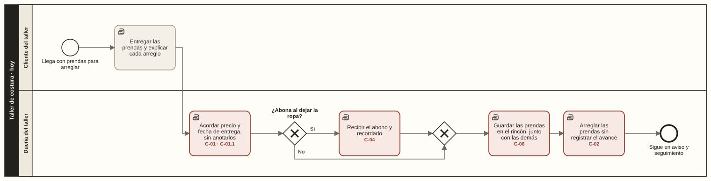
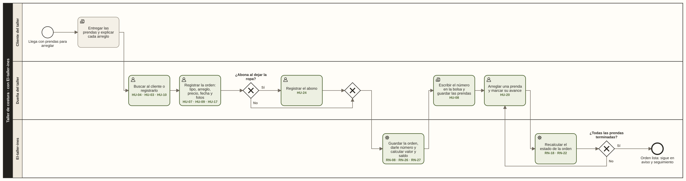
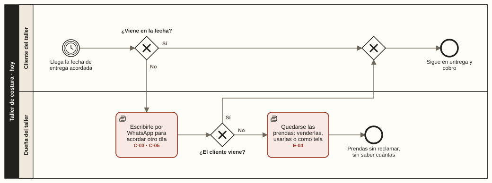
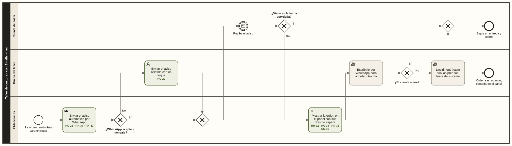
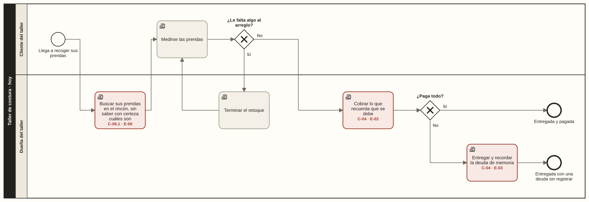
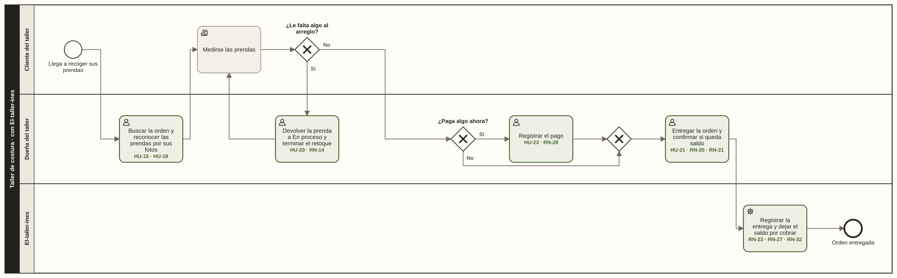

# Proceso actual y proceso propuesto

**Estado:** borrador · Sprint 1 · DOC-11 · se valida con el instructor (F-04) · [ver los diagramas en el navegador](proceso-actual-y-propuesto.html)

## Para qué sirve

El [árbol de problemas](arbol-de-problemas.md) dice **por qué** falla el control del taller. Este documento muestra **dónde** falla: en qué paso del trabajo diario nace cada causa, y cómo cambia ese paso con el sistema. Así se ve que cada historia de usuario reemplaza o apoya un paso real y no agrega trabajo que nadie pidió.

## Cómo se construyó

- **Notación:** BPMN 2.0, el estándar para modelar procesos de negocio.
- **Proceso actual:** se reconstruyó con dos fuentes.
  - La especificación original (F-01), que solo dice que el proceso es manual y depende de la memoria.
  - Los hechos que conoce el aprendiz como familiar de la dueña (F-05), registrados con fecha en las [fuentes de requisitos](../02-requisitos/fuentes-de-requisitos.md).
- **Proceso propuesto:** no agrega pasos por su cuenta. Cada paso del sistema sale de una historia de usuario, una regla de negocio o un ADR ya escritos.
- **Tres fases:** recepción y arreglo, aviso y seguimiento, entrega y cobro. Un solo diagrama con todo quedaba de más de 2.000 píxeles de ancho e ilegible. Cada fase termina donde empieza la siguiente.

### Limitaciones

- **No hubo observación estructurada ni validación con la dueña**, que no está disponible. El proceso actual puede tener variaciones que el aprendiz no conoce; por eso pasa por la validación del instructor.
- **Por confirmar:** qué ocurre cuando el cliente llega en la fecha acordada y la prenda todavía no está terminada. No se representa en el proceso actual porque no se tiene el dato.

### Cómo leer los diagramas

| Símbolo | Significa |
| --- | --- |
| Círculo delgado | Inicio. Con un reloj adentro, el proceso empieza porque llega una fecha |
| Círculo grueso | Fin |
| Círculo doble con un sobre | El cliente recibe un mensaje |
| Rombo con una X | Decisión: sale por un solo camino |
| Rectángulo con una mano | Tarea manual, sin sistema |
| Rectángulo con una persona | Tarea que la dueña hace en el sistema |
| Rectángulo con un engranaje | Tarea que el sistema hace solo |
| Rectángulo con un sobre relleno | El sistema envía un mensaje |
| **Borde rojo** (proceso actual) | En ese paso nace una causa o un efecto del árbol de problemas; el código aparece en la tarea |
| **Borde verde** (proceso propuesto) | Ese paso lo sostienen las historias de usuario y reglas de negocio que aparecen en la tarea |

Los carriles separan quién hace cada paso: el cliente del taller, la dueña y, en el proceso propuesto, el sistema.

### Archivos

Los diagramas se generan con `python scripts/generar_procesos.py`, que además comprueba que cada código citado exista. Los archivos `.bpmn` se abren y se editan en [bpmn.io](https://demo.bpmn.io) o Camunda Modeler.

| Fase | Proceso actual | Proceso propuesto |
| --- | --- | --- |
| **1 · Recepción y arreglo** | [BPMN](procesos/actual-1-recepcion-y-arreglo.bpmn) · [imagen](procesos/actual-1-recepcion-y-arreglo.svg) | [BPMN](procesos/propuesto-1-recepcion-y-arreglo.bpmn) · [imagen](procesos/propuesto-1-recepcion-y-arreglo.svg) |
| **2 · Aviso y seguimiento** | [BPMN](procesos/actual-2-aviso-y-seguimiento.bpmn) · [imagen](procesos/actual-2-aviso-y-seguimiento.svg) | [BPMN](procesos/propuesto-2-aviso-y-seguimiento.bpmn) · [imagen](procesos/propuesto-2-aviso-y-seguimiento.svg) |
| **3 · Entrega y cobro** | [BPMN](procesos/actual-3-entrega-y-cobro.bpmn) · [imagen](procesos/actual-3-entrega-y-cobro.svg) | [BPMN](procesos/propuesto-3-entrega-y-cobro.bpmn) · [imagen](procesos/propuesto-3-entrega-y-cobro.svg) |

## Fase 1 · Recepción y arreglo

### Hoy

| Paso | Quién | Qué pasa | Causa |
| --- | --- | --- | --- |
| 1 | Cliente | Llega con las prendas y explica cada arreglo. Puede traer entre 3 y 5 | — |
| 2 | Dueña | Acuerdan el precio y la fecha de entrega. No se anota nada | C-01, C-01.1 |
| 3 | Dueña | Si el cliente abona, recibe el dinero en efectivo o por Nequi y lo recuerda | C-04 |
| 4 | Dueña | Guarda las prendas en el rincón, junto con las de otros clientes y las ya arregladas | C-06 |
| 5 | Dueña | Arregla las prendas. Nadie más sabe en qué va cada una | C-02 |

### Con El-taller-ines

| Paso | Quién | Qué pasa | Lo sostiene |
| --- | --- | --- | --- |
| 1 | Cliente | Llega con las prendas y explica cada arreglo | — |
| 2 | Dueña | Busca al cliente por nombre o celular; si es nuevo, lo registra | HU-04, HU-03, HU-10 (Should) |
| 3 | Dueña | Registra la orden con cada prenda: tipo, arreglo, precio, fecha acordada y hasta 3 fotos | HU-07, HU-09, HU-17 · RN-06, RN-10, RN-17 |
| 4 | Dueña | Si el cliente abona, registra el abono y su método | HU-24 (Should) · RN-25, RN-28 |
| 5 | Sistema | Guarda la orden, le da su número y calcula el valor y el saldo | RN-08, RN-26, RN-27 |
| 6 | Dueña | Escribe el número de la orden en la bolsa donde guarda las prendas | HU-08 |
| 7 | Dueña | Arregla cada prenda y marca su avance: Pendiente, En proceso, Terminada | HU-20 · RN-12 |
| 8 | Sistema | Recalcula el estado de la orden. Cuando todas las prendas están terminadas, la orden queda lista y se guarda la fecha | RN-18, RN-22 |

Mientras tanto, el panel del día muestra las órdenes cuya fecha acordada ya pasó y siguen en proceso (HU-33, RN-34).

## Fase 2 · Aviso y seguimiento

### Hoy

| Paso | Quién | Qué pasa | Causa o efecto |
| --- | --- | --- | --- |
| 1 | — | Llega la fecha de entrega acordada. Nadie le avisa al cliente si la ropa está lista | C-03 |
| 2 | Cliente | Si viene ese día, pasa a la entrega (fase 3) | — |
| 3 | Dueña | Si no viene, le escribe por WhatsApp y acuerdan otro día; a veces es el cliente quien avisa que pasará después | C-03, C-05 |
| 4 | Dueña | Si el cliente no vuelve, se queda las prendas para venderlas, usarlas o aprovecharlas como tela | E-04 |

No se sabe cuántas prendas están esperando ni desde cuándo (C-05, E-04).

### Con El-taller-ines

| Paso | Quién | Qué pasa | Lo sostiene |
| --- | --- | --- | --- |
| 1 | Sistema | En cuanto la orden queda lista, envía el aviso por la API oficial de WhatsApp | HU-28 · RN-37, RN-38, RN-40 · ADR-003 |
| 2 | Dueña | Si la API no está configurada o sigue fallando después de los reintentos, envía el aviso asistido con un toque | HU-29 · RN-40 |
| 3 | Cliente | Recibe el aviso con el número de orden, las prendas listas y el saldo | RN-42 |
| 4 | Sistema | Si el cliente no viene, la orden sigue en el panel con sus días de espera; a los 30 días pasa a las sin reclamar | HU-32, HU-34 · RN-35, RN-36 |
| 5 | Dueña | Le escribe por WhatsApp para acordar otro día, sabiendo a quién escribirle y desde cuándo espera | — |
| 6 | Dueña | Si no vuelve, decide qué hacer con las prendas, fuera del sistema | — |

Si la orden deja de estar lista antes de que salga el aviso (por ejemplo, una prenda vuelve a En proceso), el aviso no se envía y queda registrado como descartado (HU-30, RN-39).

## Fase 3 · Entrega y cobro

### Hoy

| Paso | Quién | Qué pasa | Causa o efecto |
| --- | --- | --- | --- |
| 1 | Cliente | Llega a recoger sus prendas | — |
| 2 | Dueña | Busca las prendas en el rincón, entre las de todos, sin saber con certeza cuáles son | C-06.1, E-06 |
| 3 | Cliente | Se mide las prendas. Si le falta algo, la dueña termina el retoque y se vuelve a medir | — |
| 4 | Dueña | Cobra lo que recuerda que se debe | C-04, E-02 |
| 5 | Dueña | Si el cliente no paga todo, entrega igual y recuerda la deuda de memoria | C-04, E-03 |

El retoque no se marca como problema: al medirse, lo que falta se termina y no genera desacuerdos (E-05 descartado en el árbol de problemas).

### Con El-taller-ines

| Paso | Quién | Qué pasa | Lo sostiene |
| --- | --- | --- | --- |
| 1 | Cliente | Llega a recoger sus prendas | — |
| 2 | Dueña | Busca la orden por número o por cliente y reconoce las prendas por sus fotos | HU-15, HU-18 |
| 3 | Cliente y dueña | Se mide las prendas; si falta algo, la prenda vuelve a En proceso y se termina | HU-20 · RN-14 |
| 4 | Dueña | Si el cliente paga algo, registra el pago. El sistema no deja registrar más que el saldo | HU-23 · RN-28 |
| 5 | Dueña | Entrega la orden. Si queda saldo, lo confirma después de ver cuánto se debe | HU-21 · RN-20, RN-21 |
| 6 | Sistema | Registra la fecha de entrega; lo que falta queda en el total por cobrar | RN-23, RN-27, RN-32 |

## Qué cambia

| Momento | Hoy | Con El-taller-ines | Causa | Medio |
| --- | --- | --- | --- | --- |
| **Recibir** | No se anota nada | La orden queda registrada con sus prendas, precios, fecha y fotos | C-01 | M-01 |
| **Identificar** | Las prendas de todos van juntas al rincón | El número va escrito en la bolsa y las fotos permiten reconocer cada prenda | C-06 | M-06 |
| **Arreglar** | El avance solo lo conoce la dueña | Cada prenda tiene su estado y el de la orden se calcula | C-02 | M-02 |
| **Avisar** | El cliente viene en la fecha sin saber si está lista; si no viene, se le escribe a mano | El aviso sale solo cuando la orden queda lista | C-03 | M-03 |
| **Cobrar** | Los abonos y las deudas se llevan de memoria | Cada pago queda registrado y el saldo se calcula | C-04 | M-04 |
| **Seguir** | No se sabe cuántas prendas esperan ni desde cuándo | El panel muestra las atrasadas y las sin reclamar, con sus días de espera | C-05 | M-05 |

## Qué no cambia

El sistema apoya el trabajo de la dueña; no lo reemplaza. Estos pasos siguen siendo suyos:

- **Acordar con el cliente** el precio y la fecha, arreglar las prendas y medírselas al cliente.
- **Recibir el dinero** en efectivo o por Nequi en su cuenta personal. El sistema solo registra el pago y su método (RN-25).
- **Escribirle al cliente que no viene.** El sistema le dice a quién y desde cuándo espera; los recordatorios automáticos quedan fuera de esta entrega ([alcance](alcance.md)).
- **Decidir qué hacer con las prendas sin reclamar.** El sistema cuenta cuántas son y desde cuándo, que es lo que pide el medio M-05, pero no registra qué se hizo con ellas ([alcance](alcance.md)).
- **Marcar la bolsa** con el número escrito a mano, porque no hay presupuesto para una impresora de etiquetas.

## Observación por analizar

Hoy la dueña se queda con las prendas que nadie reclama. No se sabe si al recibirlas se le dice al cliente cuánto tiempo se guardan. Si el negocio quisiera fijar y comunicar un plazo, sería una regla de negocio nueva que hoy no existe. Se deja para conversarlo con el instructor, sin agregarla al alcance.

## Pendiente para cerrar este documento

- Validar ambos procesos con el instructor (DOC-12).
- Confirmar qué pasa cuando el cliente llega en la fecha acordada y la prenda no está terminada.
