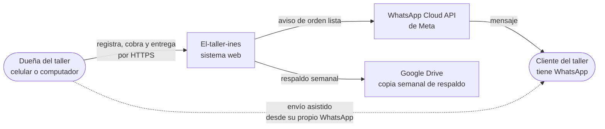
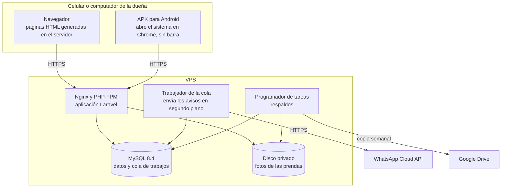
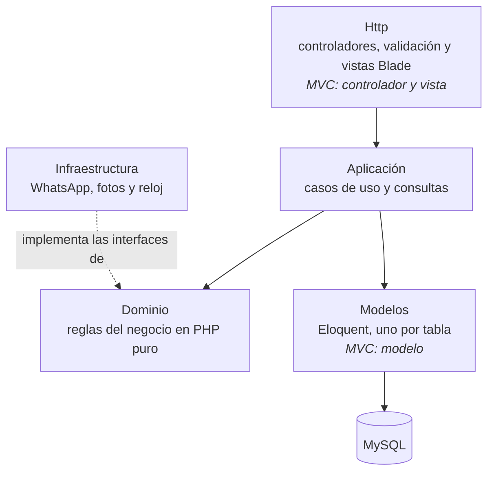
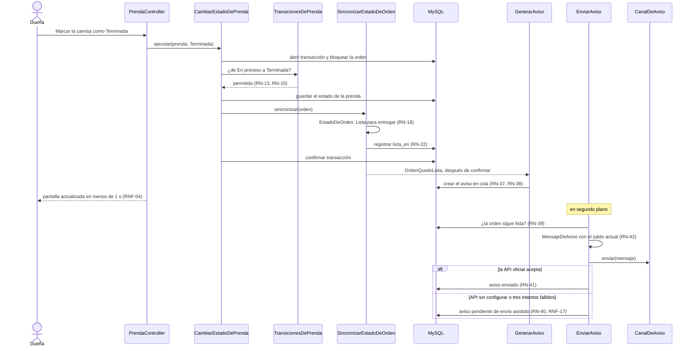
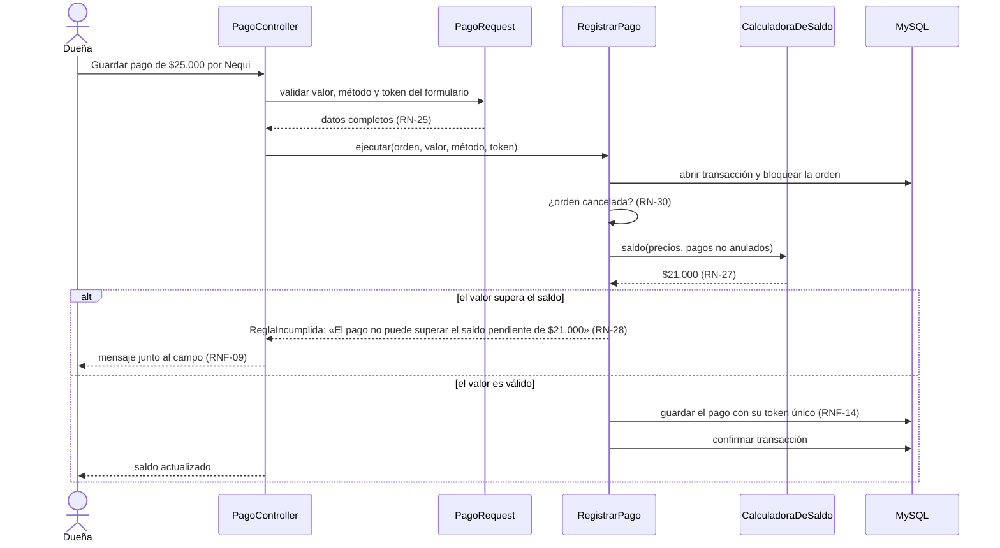

# Arquitectura del sistema

**Estado:** borrador · DOC-16 · adelantado del Sprint 2 · se valida con el instructor · **Decisión:** [ADR-005](../adr/ADR-005-arquitectura-en-capas.md)

## Para qué sirve

Define cómo se organiza el código antes de escribirlo: qué partes tiene el sistema, qué puede usar cada una, en qué clase vive cada regla de negocio y qué caso de uso atiende cada historia. Es la guía del Sprint 3 y la base del diagrama de clases (DOC-18).

`python scripts/verificar_arquitectura.py` comprueba que este documento no deje nada por fuera:
- las 44 reglas y las 36 historias tienen su clase;
- cada clase nombrada está en la estructura de carpetas;
- cada pantalla citada existe en los mockups;
- ninguna regla que el modelo de datos deja a la aplicación queda asignada solo a la base de datos.

## ¿Es MVC o Clean Architecture?

**Es MVC, como lo propone Laravel, con el núcleo organizado según la regla de dependencias de Clean Architecture.**

| De MVC toma | De Clean Architecture toma | De Clean Architecture no toma |
| --- | --- | --- |
| Controladores que reciben la solicitud | Un dominio que no depende del framework ni de la base de datos | Repositorios: los casos de uso usan Eloquent |
| Vistas Blade que muestran la respuesta | Casos de uso, uno por acción de las historias | Entidades duplicadas y mapeadores |
| Modelos Eloquent que guardan los datos | Interfaces para lo externo: WhatsApp, fotos y hora | Puertos para la base de datos |

Las razones, y las alternativas descartadas, están en [ADR-005](../adr/ADR-005-arquitectura-en-capas.md).

## Contexto

Quién usa el sistema y con qué se comunica (nivel 1 del modelo C4):



## Contenedores

Qué se ejecuta y dónde (nivel 2 del modelo C4). Todo corre en el VPS; el detalle de instalación va en el diagrama de despliegue (DOC-18).



| Contenedor | Por qué existe | Requisito |
| --- | --- | --- |
| **APK para Android** | La usuaria trabaja desde el celular: el APK abre el mismo sistema a pantalla completa. No contiene lógica ni datos; en otros celulares se instala desde el navegador | RNF-35 · ADR-006 |
| **Aplicación Laravel** | Atiende todas las pantallas; genera el HTML en el servidor con los estilos de los mockups | ADR-001 |
| **Trabajador de la cola** | La pantalla no espera a WhatsApp, y un envío que falla se reintenta | RNF-04 · RNF-17 · ADR-003 |
| **Programador de tareas** | Respaldo diario en el VPS y copia semanal fuera del servidor | RNF-15 |
| **MySQL 8.4** | Datos del negocio y tabla de trabajos de la cola | [Modelo de datos](../modelo-de-datos/README.md) |
| **Disco privado** | Las fotos no quedan en una carpeta pública; solo se entregan con sesión y del propio negocio | RNF-25 |

## Capas



**La regla de dependencias:** las flechas van hacia adentro. El dominio no usa nada de las demás partes; si se borrara Laravel, sus clases seguirían funcionando.

| Capa | Responsabilidad | No hace |
| --- | --- | --- |
| **Http** | Recibe la solicitud, valida el formulario, llama un caso de uso o una consulta y devuelve la vista con los mensajes en español (RNF-09) | No contiene reglas de negocio ni usa modelos directamente |
| **Aplicación** | Coordina cada acción: abre la transacción, carga los modelos, pregunta al dominio, guarda y emite eventos | No decide reglas por su cuenta: se las pregunta al dominio |
| **Dominio** | Decide: transiciones permitidas, estado de la orden, saldo, días de atraso, formato del número, validez del celular y texto del aviso | No lee ni escribe en la base de datos, no usa Laravel, no conoce HTTP |
| **Modelos** | Representan las tablas y sus relaciones; aplican el filtro por negocio | No contienen reglas de negocio |
| **Infraestructura** | Habla con lo externo: la API de WhatsApp, el disco de fotos y la hora del sistema | No decide cuándo avisar ni qué decir |

## Estructura de carpetas

El código vive en `sistema/` desde el Sprint 3. Cada clase nombrada en este documento está aquí.

<!-- estructura:inicio -->

```text
sistema/
├── app/
│   ├── Dominio/                          Reglas del negocio en PHP puro
│   │   ├── Clientes/
│   │   │   └── Celular.php                 Objeto de valor: 10 dígitos que empiezan por 3
│   │   ├── Ordenes/
│   │   │   ├── EstadoDePrenda.php          Enumeración de los cinco estados
│   │   │   ├── TransicionesDePrenda.php    Qué cambios de estado se permiten
│   │   │   ├── EstadoDeOrden.php           Calcula el estado de la orden desde sus prendas
│   │   │   ├── NumeroDeOrden.php           Objeto de valor: formato #0042
│   │   │   ├── ReglasDeSeguimiento.php     Atrasada, sin reclamar y días de espera
│   │   │   └── OrdenQuedoLista.php         Evento
│   │   ├── Pagos/
│   │   │   ├── Dinero.php                  Objeto de valor: pesos enteros y su formato
│   │   │   ├── CalculadoraDeSaldo.php      Valor, saldo y estado de pago
│   │   │   └── ReglasDeValor.php           Lo pagado no supera el valor
│   │   ├── Avisos/
│   │   │   ├── CanalDeAviso.php            Interfaz (ADR-003)
│   │   │   ├── ResultadoDeEnvio.php
│   │   │   └── MensajeDeAviso.php          Texto con los datos del momento
│   │   ├── Fotos/
│   │   │   └── AlmacenDeFotos.php          Interfaz
│   │   └── Compartido/
│   │       ├── Reloj.php                   Interfaz: la fecha y hora de Colombia
│   │       └── ReglaIncumplida.php         Excepción con el mensaje para la usuaria
│   ├── Aplicacion/                       Una clase por acción de las historias
│   │   ├── Clientes/
│   │   │   ├── RegistrarCliente.php
│   │   │   └── CorregirCliente.php
│   │   ├── Ordenes/
│   │   │   ├── RegistrarOrden.php
│   │   │   ├── ResolverTipoDePrenda.php
│   │   │   ├── AgregarPrenda.php
│   │   │   ├── CorregirPrenda.php
│   │   │   ├── EliminarPrenda.php
│   │   │   ├── CambiarEstadoDePrenda.php
│   │   │   ├── DevolverPrendaSinArreglar.php
│   │   │   ├── SincronizarEstadoDeOrden.php
│   │   │   ├── EntregarOrden.php
│   │   │   └── CancelarOrden.php
│   │   ├── Fotos/
│   │   │   ├── AgregarFoto.php
│   │   │   └── EliminarFoto.php
│   │   ├── Pagos/
│   │   │   ├── RegistrarPago.php
│   │   │   └── AnularPago.php
│   │   ├── Avisos/
│   │   │   ├── GenerarAviso.php            Oyente del evento OrdenQuedoLista
│   │   │   ├── EnviarAviso.php             Trabajo en cola con reintentos
│   │   │   └── ConfirmarEnvioAsistido.php
│   │   ├── Configuracion/
│   │   │   ├── CambiarContrasena.php
│   │   │   ├── CambiarPlazoSinReclamar.php
│   │   │   └── GestionarTiposDePrenda.php
│   │   └── Consultas/                      Lectura para las pantallas
│   │       ├── PanelDelDia.php
│   │       ├── BuscarClientes.php
│   │       ├── FichaDeCliente.php
│   │       ├── ListarOrdenes.php
│   │       ├── DetalleDeOrden.php
│   │       ├── FotosDeOrden.php
│   │       ├── OrdenesAtrasadas.php
│   │       ├── OrdenesSinReclamar.php
│   │       ├── QuienMeDebe.php
│   │       ├── DineroRecibido.php
│   │       └── AvisosPorEnviar.php
│   ├── Modelos/                          Eloquent: una clase por tabla
│   │   ├── PerteneceANegocio.php           Filtro global por negocio (ADR-002)
│   │   ├── Negocio.php
│   │   ├── Usuario.php
│   │   ├── Cliente.php
│   │   ├── TipoPrenda.php
│   │   ├── MetodoPago.php
│   │   ├── Orden.php
│   │   ├── Prenda.php
│   │   ├── Foto.php
│   │   ├── Pago.php
│   │   └── Aviso.php
│   ├── Infraestructura/
│   │   ├── Avisos/
│   │   │   ├── WhatsAppCloudApiCanal.php
│   │   │   └── WhatsAppAsistidoCanal.php
│   │   ├── Fotos/
│   │   │   └── AlmacenLocalPrivado.php     Reduce y guarda en el disco privado
│   │   └── Reloj/
│   │       └── RelojDeColombia.php
│   ├── Http/
│   │   ├── Controladores/
│   │   │   ├── SesionController.php
│   │   │   ├── PanelController.php
│   │   │   ├── ClienteController.php
│   │   │   ├── OrdenController.php
│   │   │   ├── PrendaController.php
│   │   │   ├── FotoController.php
│   │   │   ├── PagoController.php
│   │   │   ├── AvisoController.php
│   │   │   ├── SeguimientoController.php
│   │   │   ├── DineroController.php
│   │   │   └── AjustesController.php
│   │   └── Solicitudes/
│   │       ├── ClienteRequest.php
│   │       ├── OrdenRequest.php
│   │       ├── PrendaRequest.php
│   │       ├── PagoRequest.php
│   │       ├── AnulacionRequest.php
│   │       └── ContrasenaRequest.php
│   └── Providers/
│       └── AppServiceProvider.php          Enlaza cada interfaz con su implementación
├── resources/
│   ├── css/estilos.css                     La hoja de estilos de los mockups
│   └── views/                              Una vista por pantalla PT-xx
├── public/
│   ├── manifest.webmanifest                Nombre, íconos y colores para instalar el sistema (ADR-006)
│   ├── sw.js                               Service worker: página sin conexión
│   └── .well-known/assetlinks.json         Prueba que el APK y el sitio son del mismo dueño
├── routes/web.php
├── database/
│   ├── migrations/                         Producen el esquema del modelo de datos
│   └── seeders/                            Negocio, tipos de prenda y métodos de pago iniciales
└── tests/
    ├── Unit/Dominio/                       Reglas sin base de datos
    ├── Feature/                            Casos de uso y pantallas con base de datos
    └── Arquitectura/                       Regla de dependencias entre capas

movil/                                      Proyecto del APK generado con Bubblewrap; la llave de firma no se versiona
```

<!-- estructura:fin -->

## Historias y casos de uso

| Historia | Pantalla | Controlador | Caso de uso o consulta |
| --- | --- | --- | --- |
| **HU-01** | PT-01, PT-23 | `SesionController` | Autenticación de Laravel con límite de intentos |
| **HU-02** | PT-23 | `AjustesController` | `CambiarContrasena`, validado por `ContrasenaRequest` |
| **HU-03** | PT-04 | `ClienteController` | `RegistrarCliente` |
| **HU-04** | PT-03 | `ClienteController` | `BuscarClientes` |
| **HU-05** | PT-05 | `ClienteController` | `FichaDeCliente` |
| **HU-06** | PT-04 | `ClienteController` | `CorregirCliente` |
| **HU-07** | PT-06, PT-07 | `OrdenController` | `RegistrarOrden` |
| **HU-08** | PT-07 | `OrdenController` | `RegistrarOrden`, `NumeroDeOrden` |
| **HU-09** | PT-06 | `OrdenController` | `ResolverTipoDePrenda` |
| **HU-10** | PT-04, PT-06 | `ClienteController` | `RegistrarCliente` |
| **HU-11** | PT-09 | `PrendaController` | `AgregarPrenda` |
| **HU-12** | PT-13 | `PrendaController` | `CorregirPrenda` |
| **HU-13** | PT-13 | `PrendaController` | `EliminarPrenda` |
| **HU-14** | PT-09 | `OrdenController` | `DetalleDeOrden` |
| **HU-15** | PT-08 | `OrdenController` | `ListarOrdenes` |
| **HU-16** | PT-23 | `AjustesController` | `GestionarTiposDePrenda` |
| **HU-17** | PT-06, PT-13 | `FotoController` | `AgregarFoto` |
| **HU-18** | PT-10 | `FotoController` | `FotosDeOrden` |
| **HU-19** | PT-13 | `FotoController` | `EliminarFoto` |
| **HU-20** | PT-11 | `PrendaController` | `CambiarEstadoDePrenda` |
| **HU-21** | PT-16 | `OrdenController` | `EntregarOrden` |
| **HU-22** | PT-17 | `OrdenController` | `CancelarOrden` |
| **HU-23** | PT-14 | `PagoController` | `RegistrarPago` |
| **HU-24** | PT-06 | `OrdenController` | `RegistrarOrden` |
| **HU-25** | PT-15 | `PagoController` | `AnularPago` |
| **HU-26** | PT-22 | `DineroController` | `QuienMeDebe` |
| **HU-27** | PT-22 | `DineroController` | `DineroRecibido` |
| **HU-28** | PT-19 | Ninguno: ocurre en la cola | `GenerarAviso`, `EnviarAviso` |
| **HU-29** | PT-18 | `AvisoController` | `AvisosPorEnviar`, `ConfirmarEnvioAsistido` |
| **HU-30** | PT-18 | Ninguno: ocurre en la cola | `EnviarAviso` |
| **HU-31** | PT-09 | `OrdenController` | `DetalleDeOrden` |
| **HU-32** | PT-02 | `PanelController` | `PanelDelDia` |
| **HU-33** | PT-20 | `SeguimientoController` | `OrdenesAtrasadas` |
| **HU-34** | PT-21 | `SeguimientoController` | `OrdenesSinReclamar` |
| **HU-35** | PT-23 | `AjustesController` | `CambiarPlazoSinReclamar` |
| **HU-36** | PT-12 | `PrendaController` | `DevolverPrendaSinArreglar` |

## Dónde vive cada regla en el código

Complementa la tabla del [modelo de datos](../modelo-de-datos/README.md#dónde-se-garantiza-cada-regla): allí está lo que garantiza la base de datos; aquí, la clase que aplica la regla en el código.

| Regla | Capa | Dónde | Cómo |
| --- | --- | --- | --- |
| **RN-01** | Modelos | `PerteneceANegocio` | Filtra toda consulta por el negocio de la sesión y lo asigna al crear. `RegistrarOrden` y `RegistrarPago` comprueban que el tipo de prenda y el método de pago sean del mismo negocio |
| **RN-02** | Http | `ClienteRequest` | Nombre obligatorio, con el mensaje junto al campo |
| **RN-03** | Dominio | `Celular` | Quita espacios y exige 10 dígitos que empiecen por 3; `ClienteRequest` usa la misma regla para el mensaje |
| **RN-04** | Base de datos | — | Sin clave única en el celular; ningún código lo impide |
| **RN-05** | Base de datos | `RegistrarOrden` | La orden se crea siempre con su cliente |
| **RN-06** | Aplicación | `RegistrarOrden`, `EliminarPrenda`, `DevolverPrendaSinArreglar` | La orden y sus prendas se guardan juntas; no se elimina ni se devuelve la última prenda |
| **RN-07** | Http | `OrdenRequest` | La fecha acordada no puede ser anterior a hoy |
| **RN-08** | Aplicación | `RegistrarOrden`, `NumeroDeOrden` | Bloquea la fila del negocio, toma el mayor número más uno (ADR-004); `NumeroDeOrden` da el formato #0042 |
| **RN-09** | Infraestructura | `Reloj`, `RelojDeColombia` | Todo «hoy» y «ahora» sale del reloj, fijado en America/Bogota y reemplazable en las pruebas |
| **RN-10** | Http | `PrendaRequest` | Tipo, descripción y precio obligatorios |
| **RN-11** | Dominio | `Dinero` | Solo acepta enteros mayores que cero |
| **RN-12** | Dominio | `EstadoDePrenda` | Los cinco estados; toda prenda nueva empieza Pendiente |
| **RN-13** | Dominio | `TransicionesDePrenda` | Entregada solo desde Terminada |
| **RN-14** | Dominio | `TransicionesDePrenda` | Terminada puede volver a En proceso |
| **RN-15** | Dominio | `TransicionesDePrenda` | Entregada y Devuelta no cambian ni se editan |
| **RN-16** | Dominio | `ReglasDeValor` | `CorregirPrenda`, `EliminarPrenda` y `DevolverPrendaSinArreglar` preguntan si el nuevo valor queda por debajo de lo pagado |
| **RN-17** | Aplicación | `AgregarFoto`, `AlmacenLocalPrivado` | Máximo tres fotos por prenda; la imagen se reduce antes de guardarla (RNF-03) |
| **RN-18** | Dominio | `EstadoDeOrden` | Calcula En proceso, Lista para entregar, Entregada o Cancelada |
| **RN-19** | Http | `PrendaController` | No existe ruta ni caso de uso para cambiar el estado de la orden; solo el de sus prendas |
| **RN-20** | Aplicación | `EntregarOrden` | Marca Entregadas las prendas Terminadas y deja las demás |
| **RN-21** | Aplicación | `EntregarOrden` | Si hay saldo, exige la confirmación de la usuaria también en el servidor, no solo en la pantalla |
| **RN-22** | Aplicación | `SincronizarEstadoDeOrden` | Después de cualquier cambio en las prendas, recalcula el estado y registra o borra la fecha en que quedó lista |
| **RN-23** | Aplicación | `EntregarOrden`, `EstadoDeOrden` | Registra la hora de entrega de cada prenda; la entrega de la orden es la última |
| **RN-24** | Aplicación | `CancelarOrden`, `EstadoDeOrden` | Solo cancela órdenes no entregadas; los demás casos de uso rechazan cambios en una orden cancelada |
| **RN-25** | Http | `PagoRequest` | Valor y método obligatorios |
| **RN-26** | Dominio | `CalculadoraDeSaldo` | Suma los precios de las prendas que no están Devueltas |
| **RN-27** | Dominio | `CalculadoraDeSaldo` | Valor menos pagos no anulados |
| **RN-28** | Aplicación | `RegistrarPago`, `CalculadoraDeSaldo` | Bloquea la orden y compara con el saldo al guardar |
| **RN-29** | Dominio | `CalculadoraDeSaldo` | Pagada o Por cobrar |
| **RN-30** | Aplicación | `RegistrarPago` | Acepta pagos en órdenes entregadas y los rechaza en canceladas |
| **RN-31** | Aplicación | `AnularPago`, `AnulacionRequest` | Exige el motivo; no existe caso de uso para borrar un pago |
| **RN-32** | Aplicación | `QuienMeDebe`, `PanelDelDia`, `CalculadoraDeSaldo` | Suma los saldos de las órdenes no canceladas |
| **RN-33** | Aplicación | `DineroRecibido` | Suma los pagos no anulados del período, con fechas del `Reloj` |
| **RN-34** | Dominio | `ReglasDeSeguimiento` | En proceso con fecha acordada anterior a hoy; lo usa `OrdenesAtrasadas` |
| **RN-35** | Dominio | `ReglasDeSeguimiento` | Lista por más días que el plazo del negocio; lo usa `OrdenesSinReclamar` |
| **RN-36** | Dominio | `ReglasDeSeguimiento` | Días calendario desde que quedó lista |
| **RN-37** | Aplicación | `SincronizarEstadoDeOrden`, `OrdenQuedoLista`, `GenerarAviso` | Al quedar lista se emite el evento después de confirmar la transacción, y el oyente crea el aviso |
| **RN-38** | Aplicación | `GenerarAviso` | Si ya existe el aviso de esa vez, la clave única lo impide y el oyente no crea otro |
| **RN-39** | Aplicación | `EnviarAviso` | Antes de enviar, vuelve a calcular el estado; si ya no está lista, lo descarta |
| **RN-40** | Aplicación | `EnviarAviso`, `CanalDeAviso` | Intenta la API oficial si está configurada; si no, o si falla tres veces, lo deja para envío asistido |
| **RN-41** | Aplicación | `EnviarAviso`, `ConfirmarEnvioAsistido` | Registra canal, mensaje y resultado |
| **RN-42** | Dominio | `MensajeDeAviso` | Arma el texto con el número, las prendas listas y el saldo del momento |
| **RN-43** | Aplicación | `ResolverTipoDePrenda` | Busca el tipo sin distinguir mayúsculas ni tildes; si no existe, lo crea en la lista del negocio |
| **RN-44** | Aplicación | `DevolverPrendaSinArreglar`, `TransicionesDePrenda` | Solo desde Pendiente o En proceso, sin dejar la orden sin prendas por resolver ni lo pagado por encima del valor |

## Dos recorridos

### La última prenda queda terminada y sale el aviso

Muestra por qué la pantalla no espera a WhatsApp (RNF-04) y cómo cada capa hace solo su parte.



### Registrar un pago que supera el saldo

Muestra cómo una regla del dominio llega a la pantalla como mensaje en español (RNF-09) y por qué dos toques seguidos no duplican el pago (RNF-14).



## Atributos de calidad

| Requisito | Decisión de arquitectura |
| --- | --- |
| **RNF-01 · RNF-02** Rapidez y consultas acotadas | Las clases de `Consultas` cargan prendas y pagos por adelantado (eager loading); la medición real es HT-06 |
| **RNF-03** Fotos reducidas | `AlmacenLocalPrivado` reduce la imagen antes de guardarla |
| **RNF-04 · RNF-17** No esperar a WhatsApp y no perder avisos | `EnviarAviso` corre en la cola, con tres intentos y espera creciente |
| **RNF-06** Solo la API oficial | Únicamente `WhatsAppCloudApiCanal` conoce la API; un cambio de versión se hace solo ahí |
| **RNF-08 · RNF-09** Formatos y mensajes para la usuaria | `Dinero` y `NumeroDeOrden` dan formato; `ReglaIncumplida` lleva el mensaje en español hasta la vista |
| **RNF-13** Operaciones completas o nada | Cada caso de uso que toca varias filas trabaja dentro de una transacción |
| **RNF-14** Sin registros duplicados | Token de formulario con clave única en órdenes y pagos |
| **RNF-19 · RNF-20 · RNF-21** Acceso | Autenticación de Laravel: hash de contraseña, límite de intentos y expiración de la sesión |
| **RNF-22** Aislamiento entre negocios | `PerteneceANegocio` en los modelos raíz y prueba automática con dos negocios |
| **RNF-23** Ataques web comunes | Protección CSRF de Laravel, escape automático de Blade y consultas parametrizadas de Eloquent |
| **RNF-24 · RNF-34** Secretos y configuración | Credenciales de la base de datos y de WhatsApp en variables de entorno |
| **RNF-25** Fotos privadas | `FotoController` entrega cada foto desde el disco privado solo con sesión y del propio negocio |
| **RNF-27** Reglas separadas | Capas con regla de dependencias y pruebas de arquitectura |
| **RNF-28** Reglas probadas | Las reglas del dominio se prueban sin base de datos |
| **RNF-35** App en el celular | Manifiesto y service worker en `public/`; APK con Trusted Web Activity que abre el mismo sistema (ADR-006) |
| **RNF-29 · RNF-30 · RNF-31** Calidad continua | Pint, Larastan y pruebas en GitHub Actions; esquema solo por migraciones (HT-02) |

## Principios SOLID en este diseño

| Principio | Dónde se ve |
| --- | --- |
| **Responsabilidad única** | Un caso de uso por acción: `RegistrarPago` no anula pagos; `AnularPago` es otra clase. Los controladores no calculan |
| **Abierto/cerrado** | Un canal de aviso nuevo es una clase que implementa `CanalDeAviso`, sin modificar `EnviarAviso` |
| **Sustitución de Liskov** | `WhatsAppCloudApiCanal`, `WhatsAppAsistidoCanal` y el canal falso de las pruebas se usan de la misma forma y devuelven el mismo `ResultadoDeEnvio` |
| **Segregación de interfaces** | Interfaces pequeñas y separadas: `CanalDeAviso` solo envía, `AlmacenDeFotos` solo guarda y entrega, `Reloj` solo da la hora |
| **Inversión de dependencias** | Los casos de uso dependen de `CanalDeAviso`, `AlmacenDeFotos` y `Reloj`, no de sus implementaciones; `AppServiceProvider` las enlaza |

## Pruebas por capa

| Capa | Tipo de prueba | Qué comprueba | Ejemplo |
| --- | --- | --- | --- |
| **Dominio** | Unitaria, sin base de datos | Cada regla con los ejemplos de las reglas de negocio | `EstadoDeOrden` con Terminada y Devuelta da Lista para entregar |
| **Aplicación** | De integración, con base de datos | Transacciones, bloqueos, eventos y cola, con reloj y canal falsos | Dos pagos con el mismo token guardan uno solo |
| **Http** | De funcionalidad | Criterios de aceptación de principio a fin | CA-23.3 muestra «El pago no puede superar el saldo pendiente de $21.000» |
| **Toda la aplicación** | De arquitectura | La regla de dependencias | Nada en `App\Dominio` usa `Illuminate`; los controladores no usan `App\Modelos` |
| **Modelos** | De aislamiento | RN-01 en todas las rutas | Pedir la orden de otro negocio responde como si no existiera |

## Pendiente

- Validar con el instructor, en especial la respuesta a «¿MVC o Clean Architecture?».
- Diagramas de clases, secuencia, estados, componentes y despliegue en detalle (DOC-18).
