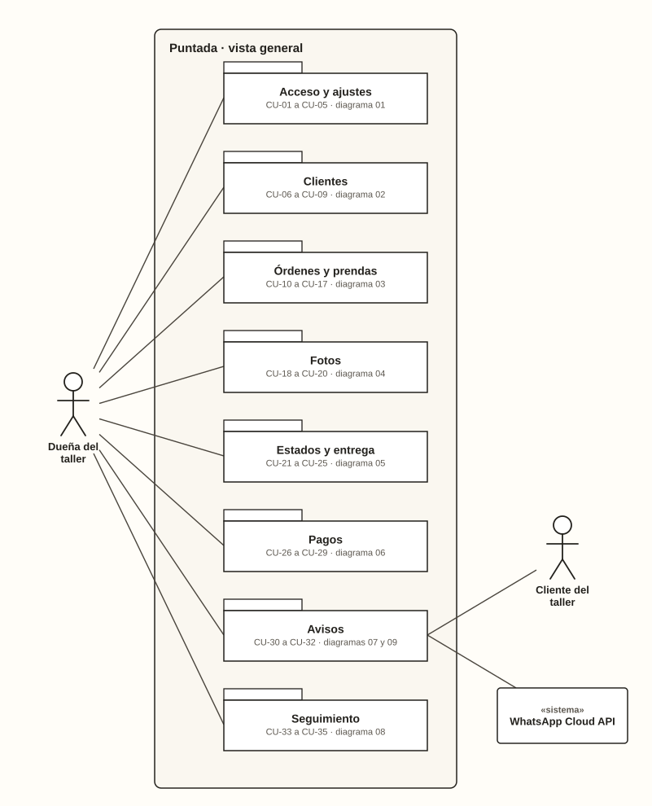

# Casos de uso

**Estado:** borrador · DOC-15 · adelantado del Sprint 2 · se valida con el instructor

## Para qué sirven

Muestran qué hace cada actor con el sistema y describen cada caso paso a paso, con sus variantes y las reglas que se aplican.

Complementan las [historias de usuario](../../02-requisitos/historias-de-usuario.md):
- **una historia** dice qué necesita alguien y para qué;
- **un caso de uso** describe la conversación completa entre el actor y el sistema, incluidos los errores y los caminos alternativos.

## Cómo están organizados

- **Por actor.** La dueña del taller participa en 34 de los 35 casos, así que sus diagramas se dividen por área, siguiendo las épicas de las historias.
- **Un diagrama por documento**, con el actor a un lado y los casos en columna, para que las líneas no se crucen.
- **Verificación automática:** `python scripts/generar_casos_de_uso.py` dibuja los diagramas y comprueba:
  - que ninguna línea se cruce con otra ni atraviese un caso;
  - que cada nombre, actor y relación del dibujo coincida con su especificación;
  - que se cubran las 36 historias.

| # | Actor | Área | Casos | Documento |
| --- | --- | --- | --- | --- |
| 00 | Todos | Vista general | — | Este documento |
| 01 | Dueña del taller | Acceso y ajustes | CU-01 a CU-05 | [01-acceso-y-ajustes.md](duena-del-taller/01-acceso-y-ajustes.md) |
| 02 | Dueña del taller | Clientes | CU-06 a CU-09 | [02-clientes.md](duena-del-taller/02-clientes.md) |
| 03 | Dueña del taller | Órdenes y prendas | CU-10 a CU-17 | [03-ordenes-y-prendas.md](duena-del-taller/03-ordenes-y-prendas.md) |
| 04 | Dueña del taller | Fotos | CU-18 a CU-20 | [04-fotos.md](duena-del-taller/04-fotos.md) |
| 05 | Dueña del taller | Estados y entrega | CU-21 a CU-25 | [05-estados-y-entrega.md](duena-del-taller/05-estados-y-entrega.md) |
| 06 | Dueña del taller | Pagos | CU-26 a CU-29 | [06-pagos.md](duena-del-taller/06-pagos.md) |
| 07 | Dueña del taller | Avisos | CU-30 y CU-31 | [07-avisos.md](duena-del-taller/07-avisos.md) |
| 08 | Dueña del taller | Seguimiento | CU-33 a CU-35 | [08-seguimiento.md](duena-del-taller/08-seguimiento.md) |
| 09 | Cliente del taller y WhatsApp Cloud API | Avisos al cliente | CU-32 | [09-avisos-al-cliente.md](cliente-y-whatsapp/09-avisos-al-cliente.md) |

## Actores

| Actor | Tipo | Quién es | Participa en |
| --- | --- | --- | --- |
| **Dueña del taller** | Persona · actor principal | La usuaria del sistema; lo usa todos los días desde el celular | CU-01 a CU-31 y CU-33 a CU-35 |
| **Cliente del taller** | Persona que no usa el sistema | Deja prendas y recibe el aviso de que su orden está lista | CU-32 y, como secundario, CU-30 |
| **WhatsApp Cloud API** | Sistema externo | Entrega el aviso automático al celular del cliente | CU-32 |

**No son actores:**
- **El programador de tareas que hace los respaldos:** no responde a ninguna historia de usuario, así que se documenta en el [diagrama de despliegue](../diagramas/README.md#13-despliegue).
- **El paso del tiempo:** «atrasada» y «sin reclamar» se calculan al consultar, no los dispara un reloj.

## Notación

Los diagramas siguen UML.

| Elemento | Cómo se dibuja | Significa |
| --- | --- | --- |
| **Actor persona** | Figura humana | Alguien que participa en el caso |
| **Actor sistema** | Rectángulo con «sistema» | Otro sistema que participa |
| **Caso de uso** | Elipse con código y nombre | Algo que el actor logra con el sistema |
| **Caso de otro diagrama** | Elipse punteada con «ver diagrama NN» | Se detalla en otro documento; aparece aquí solo por su relación |
| **Límite del sistema** | Rectángulo «El-taller-ines · área» | Lo que está adentro lo hace el sistema |
| **Asociación** | Línea continua | El actor participa en el caso |
| **«extend»** | Línea punteada con flecha hacia el caso base | El caso agrega un comportamiento opcional al caso base, bajo una condición |
| **Generalización** | Línea con triángulo hueco hacia el caso general | El caso es una forma particular de otro |

**No se usa «include»:** ningún caso incluye siempre a otro. Las variaciones del taller son opcionales (cliente nuevo, abono al dejar la ropa, tipo de prenda nuevo, fotos), por eso se modelan como «extend».

## Vista general

## Plantilla de especificación

| Campo | Qué contiene |
| --- | --- |
| **Actor principal** | Quién logra el objetivo del caso |
| **Actores secundarios** | Quién más participa, si alguien |
| **Historias** | Las historias de usuario que el caso cumple |
| **Pantallas** | Los mockups donde ocurre |
| **Implementa** | La clase de la [arquitectura](../arquitectura/README.md) que lo resuelve |
| **Precondición** | Lo que debe ser cierto antes de empezar |
| **Disparador** | Lo que hace empezar el caso |
| **Postcondición** | Lo que queda cierto cuando termina bien |
| **Relaciones** | «extend» o generalización con otros casos |
| **Flujo principal** | Los pasos cuando todo sale bien |
| **Flujos alternativos** | Variantes y errores, numerados por el paso donde ocurren (3a, 3b…), con sus reglas y criterios de aceptación |

## Trazabilidad

Generada desde las especificaciones.

<!-- trazabilidad:inicio -->

| Caso de uso | Actor principal | Historias | Pantallas | Implementa | Diagrama |
| --- | --- | --- | --- | --- | --- |
| [**CU-01** · Iniciar sesión](duena-del-taller/01-acceso-y-ajustes.md#cu-01--iniciar-sesión) | Dueña del taller | HU-01 | PT-01 | `SesionController` | 01 |
| [**CU-02** · Cerrar sesión](duena-del-taller/01-acceso-y-ajustes.md#cu-02--cerrar-sesión) | Dueña del taller | HU-01 | PT-23 | `SesionController` | 01 |
| [**CU-03** · Cambiar contraseña](duena-del-taller/01-acceso-y-ajustes.md#cu-03--cambiar-contraseña) | Dueña del taller | HU-02 | PT-23 | `CambiarContrasena` | 01 |
| [**CU-04** · Cambiar el plazo para órdenes sin reclamar](duena-del-taller/01-acceso-y-ajustes.md#cu-04--cambiar-el-plazo-para-órdenes-sin-reclamar) | Dueña del taller | HU-35 | PT-23 | `CambiarPlazoSinReclamar` | 01 |
| [**CU-05** · Gestionar tipos de prenda](duena-del-taller/01-acceso-y-ajustes.md#cu-05--gestionar-tipos-de-prenda) | Dueña del taller | HU-16 | PT-23 | `GestionarTiposDePrenda` | 01 |
| [**CU-06** · Buscar cliente](duena-del-taller/02-clientes.md#cu-06--buscar-cliente) | Dueña del taller | HU-04 | PT-03 | `BuscarClientes` | 02 |
| [**CU-07** · Registrar cliente](duena-del-taller/02-clientes.md#cu-07--registrar-cliente) | Dueña del taller | HU-03, HU-10 | PT-04 | `RegistrarCliente` | 02 |
| [**CU-08** · Consultar la ficha del cliente](duena-del-taller/02-clientes.md#cu-08--consultar-la-ficha-del-cliente) | Dueña del taller | HU-05 | PT-05 | `FichaDeCliente` | 02 |
| [**CU-09** · Corregir datos del cliente](duena-del-taller/02-clientes.md#cu-09--corregir-datos-del-cliente) | Dueña del taller | HU-06 | PT-04, PT-05 | `CorregirCliente` | 02 |
| [**CU-10** · Registrar orden](duena-del-taller/03-ordenes-y-prendas.md#cu-10--registrar-orden) | Dueña del taller | HU-07, HU-08 | PT-06, PT-07 | `RegistrarOrden` | 03 |
| [**CU-11** · Escribir un tipo de prenda nuevo](duena-del-taller/03-ordenes-y-prendas.md#cu-11--escribir-un-tipo-de-prenda-nuevo) | Dueña del taller | HU-09 | PT-06 | `ResolverTipoDePrenda` | 03 |
| [**CU-12** · Registrar abono inicial](duena-del-taller/03-ordenes-y-prendas.md#cu-12--registrar-abono-inicial) | Dueña del taller | HU-24 | PT-06 | `RegistrarOrden` | 03 |
| [**CU-13** · Agregar una prenda a una orden](duena-del-taller/03-ordenes-y-prendas.md#cu-13--agregar-una-prenda-a-una-orden) | Dueña del taller | HU-11 | PT-09 | `AgregarPrenda` | 03 |
| [**CU-14** · Corregir una prenda](duena-del-taller/03-ordenes-y-prendas.md#cu-14--corregir-una-prenda) | Dueña del taller | HU-12 | PT-11, PT-13 | `CorregirPrenda` | 03 |
| [**CU-15** · Eliminar una prenda](duena-del-taller/03-ordenes-y-prendas.md#cu-15--eliminar-una-prenda) | Dueña del taller | HU-13 | PT-13 | `EliminarPrenda` | 03 |
| [**CU-16** · Consultar el detalle de la orden](duena-del-taller/03-ordenes-y-prendas.md#cu-16--consultar-el-detalle-de-la-orden) | Dueña del taller | HU-14 | PT-09 | `DetalleDeOrden` | 03 |
| [**CU-17** · Listar y buscar órdenes](duena-del-taller/03-ordenes-y-prendas.md#cu-17--listar-y-buscar-órdenes) | Dueña del taller | HU-15 | PT-08 | `ListarOrdenes` | 03 |
| [**CU-18** · Tomar fotos de una prenda](duena-del-taller/04-fotos.md#cu-18--tomar-fotos-de-una-prenda) | Dueña del taller | HU-17 | PT-06, PT-13 | `AgregarFoto` | 04 |
| [**CU-19** · Ver las fotos de la orden](duena-del-taller/04-fotos.md#cu-19--ver-las-fotos-de-la-orden) | Dueña del taller | HU-18 | PT-10 | `FotosDeOrden` | 04 |
| [**CU-20** · Eliminar una foto](duena-del-taller/04-fotos.md#cu-20--eliminar-una-foto) | Dueña del taller | HU-19 | PT-13 | `EliminarFoto` | 04 |
| [**CU-21** · Cambiar el estado de una prenda](duena-del-taller/05-estados-y-entrega.md#cu-21--cambiar-el-estado-de-una-prenda) | Dueña del taller | HU-20 | PT-11 | `CambiarEstadoDePrenda` | 05 |
| [**CU-22** · Devolver una prenda sin arreglar](duena-del-taller/05-estados-y-entrega.md#cu-22--devolver-una-prenda-sin-arreglar) | Dueña del taller | HU-36 | PT-11, PT-12 | `DevolverPrendaSinArreglar` | 05 |
| [**CU-23** · Entregar la orden](duena-del-taller/05-estados-y-entrega.md#cu-23--entregar-la-orden) | Dueña del taller | HU-21 | PT-16 | `EntregarOrden` | 05 |
| [**CU-24** · Confirmar entrega con saldo](duena-del-taller/05-estados-y-entrega.md#cu-24--confirmar-entrega-con-saldo) | Dueña del taller | HU-21 | PT-16 | `EntregarOrden` | 05 |
| [**CU-25** · Cancelar la orden](duena-del-taller/05-estados-y-entrega.md#cu-25--cancelar-la-orden) | Dueña del taller | HU-22 | PT-17 | `CancelarOrden` | 05 |
| [**CU-26** · Registrar pago](duena-del-taller/06-pagos.md#cu-26--registrar-pago) | Dueña del taller | HU-23 | PT-14 | `RegistrarPago` | 06 |
| [**CU-27** · Anular pago](duena-del-taller/06-pagos.md#cu-27--anular-pago) | Dueña del taller | HU-25 | PT-15 | `AnularPago` | 06 |
| [**CU-28** · Ver quién me debe](duena-del-taller/06-pagos.md#cu-28--ver-quién-me-debe) | Dueña del taller | HU-26 | PT-22 | `QuienMeDebe` | 06 |
| [**CU-29** · Ver dinero recibido](duena-del-taller/06-pagos.md#cu-29--ver-dinero-recibido) | Dueña del taller | HU-27 | PT-22 | `DineroRecibido` | 06 |
| [**CU-30** · Enviar aviso asistido](duena-del-taller/07-avisos.md#cu-30--enviar-aviso-asistido) | Dueña del taller | HU-29 | PT-18 | `AvisosPorEnviar`, `ConfirmarEnvioAsistido` | 07 |
| [**CU-31** · Consultar los avisos de una orden](duena-del-taller/07-avisos.md#cu-31--consultar-los-avisos-de-una-orden) | Dueña del taller | HU-31 | PT-09 | `DetalleDeOrden` | 07 |
| [**CU-32** · Avisar que la orden está lista](cliente-y-whatsapp/09-avisos-al-cliente.md#cu-32--avisar-que-la-orden-está-lista) | Cliente del taller | HU-28, HU-30 | PT-19 | `GenerarAviso`, `EnviarAviso` | 09 |
| [**CU-33** · Ver el panel del día](duena-del-taller/08-seguimiento.md#cu-33--ver-el-panel-del-día) | Dueña del taller | HU-32 | PT-02 | `PanelDelDia` | 08 |
| [**CU-34** · Ver órdenes atrasadas](duena-del-taller/08-seguimiento.md#cu-34--ver-órdenes-atrasadas) | Dueña del taller | HU-33 | PT-20 | `OrdenesAtrasadas` | 08 |
| [**CU-35** · Ver órdenes sin reclamar](duena-del-taller/08-seguimiento.md#cu-35--ver-órdenes-sin-reclamar) | Dueña del taller | HU-34 | PT-21 | `OrdenesSinReclamar` | 08 |

<!-- trazabilidad:fin -->

## Pendiente

- Validar los casos de uso con el instructor.
