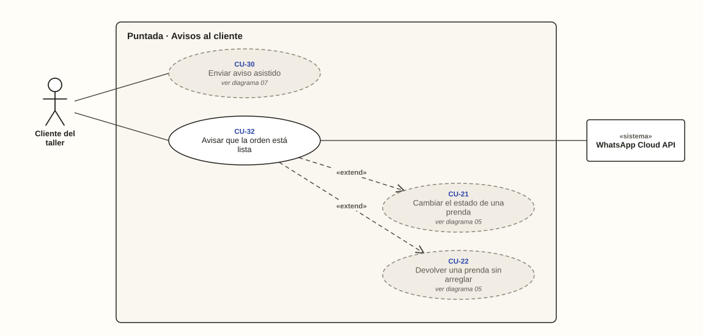

# Cliente del taller y WhatsApp Cloud API · Avisos al cliente

**Diagrama 09** · [índice de casos de uso](../README.md)

El cliente no usa el sistema, pero es quien recibe el valor del aviso: saber que su ropa está lista sin tener que preguntar.
- **El aviso automático** extiende a los dos casos que pueden dejar la orden lista: cambiar el estado de una prenda y devolver una prenda sin arreglar (diagrama 05).
- **Si el aviso automático no sale**, el cliente lo recibe por envío asistido (CU-30, diagrama 07).

---

### CU-32 · Avisar que la orden está lista

| Campo | Detalle |
| --- | --- |
| **Actor principal** | Cliente del taller |
| **Actores secundarios** | WhatsApp Cloud API |
| **Historias** | HU-28, HU-30 |
| **Pantallas** | PT-19 |
| **Implementa** | `GenerarAviso`, `EnviarAviso` |
| **Precondición** | El cliente tiene un celular colombiano registrado (RN-03) |
| **Disparador** | La orden queda Lista para entregar al cambiar el estado de una prenda (CU-21) o al devolver una sin arreglar (CU-22) |
| **Postcondición** | El aviso queda registrado como enviado, pendiente de envío asistido o descartado |
| **Relaciones** | «extend» CU-21, CU-22 |

**Flujo principal**

1. La orden queda lista y el sistema genera un aviso, uno solo por cada vez que queda lista (RN-37, RN-38).
2. En segundo plano, sin hacer esperar a la dueña, el sistema comprueba que la orden siga lista (RN-39, CA-28.2).
3. El sistema arma el mensaje con el número de orden, las prendas listas y el saldo de ese momento (RN-42, CA-28.3).
4. El sistema envía el mensaje por WhatsApp Cloud API, que lo acepta (RN-40).
5. El cliente recibe el mensaje en su WhatsApp.
6. El sistema registra el aviso como enviado por la API oficial (RN-41, CA-28.1).

**Flujos alternativos**

- **1a. La orden vuelve a quedar lista después de un aviso descartado:** se genera un aviso nuevo (CA-30.3).
- **2a. La orden ya no está lista, por ejemplo por un retoque:** el aviso no se envía y queda descartado (CA-30.1).
- **4a. La API falla y responde a la tercera vez:** el cliente recibe un solo mensaje (CA-28.4).
- **4b. La API no está configurada o falla en los tres intentos:** el aviso queda pendiente de envío asistido y la dueña lo envía desde su WhatsApp (CU-30, CA-28.5).
