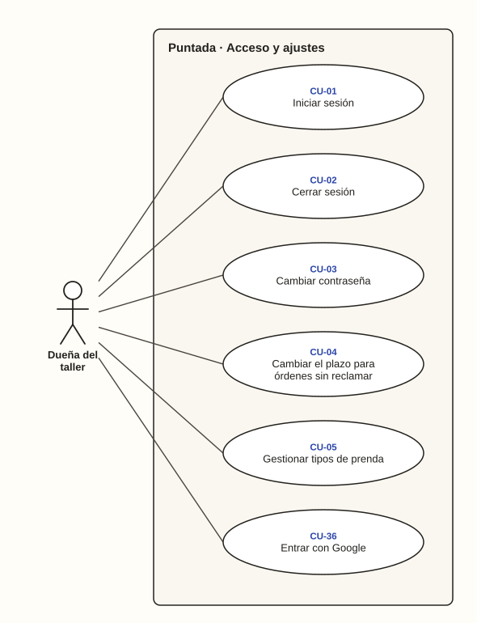

# Dueña del taller · Acceso y ajustes

**Diagrama 01** · [índice de casos de uso](../README.md)

Lo que la dueña hace para entrar al sistema y para ajustarlo a su taller. Son casos independientes entre sí.

---

### CU-01 · Iniciar sesión

| Campo | Detalle |
| --- | --- |
| **Actor principal** | Dueña del taller |
| **Historias** | HU-01 |
| **Pantallas** | PT-01 |
| **Implementa** | `SesionController` |
| **Precondición** | Tiene usuario y contraseña de su negocio |
| **Disparador** | Abre el sistema en el navegador o en el APK |
| **Postcondición** | Ve el panel del día de su negocio |
| **Relaciones** | — |

**Flujo principal**

1. La dueña abre el sistema.
2. Escribe su usuario y su contraseña y toca «Entrar».
3. El sistema comprueba las credenciales.
4. El sistema muestra el panel del día de su negocio (CU-33).

**Flujos alternativos**

- **3a. Datos incorrectos:** el sistema muestra «Usuario o contraseña incorrectos», sin decir cuál de los dos falló, y no deja entrar (CA-01.2).
- **3b. Cinco intentos fallidos en el último minuto:** el sistema pide esperar antes de volver a intentarlo, aunque la contraseña sea correcta (CA-01.3).

### CU-37 · Ponerle nombre al taller

| Campo | Detalle |
| --- | --- |
| **Actor principal** | Dueña del taller |
| **Historias** | HU-38 |
| **Pantallas** | PT-23, PT-02 |
| **Implementa** | `AjustesController` |
| **Precondición** | Tiene la sesión iniciada |
| **Disparador** | Quiere que el sistema la llame por su nombre, o que sus clientes sepan de qué taller les escriben |
| **Postcondición** | El panel la saluda por su nombre y los avisos nombran su taller |
| **Relaciones** | — |

**Flujo principal**

1. La dueña abre Ajustes.
2. Escribe el nombre de su taller y el suyo, y toca «Guardar».
3. El sistema los guarda y vuelve a Ajustes con la confirmación.
4. El panel la saluda según la hora y con su nombre (RN-47), y los avisos siguientes nombran su taller (RN-46).

**Flujos alternativos**

- **2a. Deja alguno en blanco:** el sistema no lo acepta, lo dice junto al campo y conserva el nombre anterior (CA-38.4).

### CU-36 · Entrar con Google

| Campo | Detalle |
| --- | --- |
| **Actor principal** | Dueña del taller |
| **Historias** | HU-37 |
| **Pantallas** | PT-01 |
| **Implementa** | `SesionController` |
| **Precondición** | Su correo de Google quedó registrado en su usuaria al instalar el sistema |
| **Disparador** | Abre el sistema y prefiere no escribir contraseña |
| **Postcondición** | Ve el panel del día de su negocio |
| **Relaciones** | — |

**Flujo principal**

1. La dueña abre el sistema y toca «Entrar con Google».
2. El sistema la lleva a Google, que le pide elegir su cuenta.
3. Google devuelve a la dueña al sistema con la confirmación de quién es.
4. El sistema comprueba que ese correo esté registrado en una usuaria (RN-45).
5. El sistema muestra el panel del día de su negocio (CU-33).

**Flujos alternativos**

- **4a. El correo no está registrado:** el sistema no la deja entrar, le dice que ese correo no tiene acceso y **no crea ninguna usuaria ni ningún negocio** (CA-37.2, RN-45).
- **2a. La dueña cancela en Google:** vuelve a la pantalla de inicio de sesión sin cambios.
- **1a. El sistema se instaló sin las llaves de Google:** el botón no aparece y la dueña entra con usuario y contraseña (CA-37.4, CU-01).

### CU-02 · Cerrar sesión

| Campo | Detalle |
| --- | --- |
| **Actor principal** | Dueña del taller |
| **Historias** | HU-01 |
| **Pantallas** | PT-23 |
| **Implementa** | `SesionController` |
| **Precondición** | Tiene la sesión iniciada |
| **Disparador** | Termina de usar el sistema o presta el celular |
| **Postcondición** | La sesión queda cerrada y el botón Atrás no muestra datos del taller |
| **Relaciones** | — |

**Flujo principal**

1. La dueña abre Ajustes y toca «Cerrar sesión».
2. El sistema cierra la sesión.
3. El sistema muestra el inicio de sesión; con el botón Atrás tampoco se ven datos (CA-01.4).

**Flujos alternativos**

- **1a. La sesión quedó abierta más de 8 horas sin uso:** el sistema la cierra solo y, al volver, pide iniciar sesión (CA-01.5).

### CU-03 · Cambiar contraseña

| Campo | Detalle |
| --- | --- |
| **Actor principal** | Dueña del taller |
| **Historias** | HU-02 |
| **Pantallas** | PT-23 |
| **Implementa** | `CambiarContrasena` |
| **Precondición** | Tiene la sesión iniciada |
| **Disparador** | Cree que alguien más conoce su contraseña |
| **Postcondición** | La siguiente vez entra con la contraseña nueva |
| **Relaciones** | — |

**Flujo principal**

1. La dueña abre Ajustes.
2. Escribe su contraseña actual y dos veces la nueva.
3. El sistema comprueba la contraseña actual, la longitud y que las dos nuevas coincidan.
4. El sistema guarda la contraseña nueva, nunca en texto plano, y lo confirma (CA-02.1).

**Flujos alternativos**

- **3a. Contraseña actual incorrecta:** no cambia y el sistema lo indica (CA-02.2).
- **3b. Nueva contraseña de menos de 8 caracteres:** no cambia y el sistema indica el mínimo (CA-02.3).
- **3c. Las dos contraseñas nuevas no coinciden:** no cambia y el sistema lo indica (CA-02.4).

### CU-04 · Cambiar el plazo para órdenes sin reclamar

| Campo | Detalle |
| --- | --- |
| **Actor principal** | Dueña del taller |
| **Historias** | HU-35 |
| **Pantallas** | PT-23 |
| **Implementa** | `CambiarPlazoSinReclamar` |
| **Precondición** | Tiene la sesión iniciada |
| **Disparador** | Quiere que la alerta de órdenes sin reclamar se ajuste a sus clientes |
| **Postcondición** | El seguimiento usa el plazo nuevo |
| **Relaciones** | — |

**Flujo principal**

1. La dueña abre Ajustes.
2. Escribe el número de días después de los cuales una orden lista queda sin reclamar.
3. El sistema comprueba que esté entre 1 y 365 días (RN-35).
4. El sistema guarda el plazo, y las órdenes sin reclamar se calculan con él (CA-35.1).

**Flujos alternativos**

- **3a. Plazo fuera de rango:** no se guarda y el sistema indica que debe estar entre 1 y 365 días (CA-35.2).

### CU-05 · Gestionar tipos de prenda

| Campo | Detalle |
| --- | --- |
| **Actor principal** | Dueña del taller |
| **Historias** | HU-16 |
| **Pantallas** | PT-23 |
| **Implementa** | `GestionarTiposDePrenda` |
| **Precondición** | Tiene la sesión iniciada |
| **Disparador** | Quiere ordenar la lista de tipos de prenda |
| **Postcondición** | La lista de tipos del negocio queda actualizada |
| **Relaciones** | — |

**Flujo principal**

1. La dueña abre Ajustes y ve los tipos de prenda de su negocio.
2. Elige un tipo y escribe su nombre nuevo.
3. El sistema comprueba que el nombre no exista ya en su lista (RN-43).
4. El sistema lo guarda, y las prendas que tenían ese tipo muestran el nombre nuevo (CA-16.1).

**Flujos alternativos**

- **2a. Desactivar un tipo:** deja de aparecer al registrar prendas nuevas, y las prendas que ya lo tenían lo conservan (CA-16.2).
- **3a. El nombre ya existe, aunque cambien mayúsculas o tildes:** no se guarda y el sistema lo indica (RN-43).
