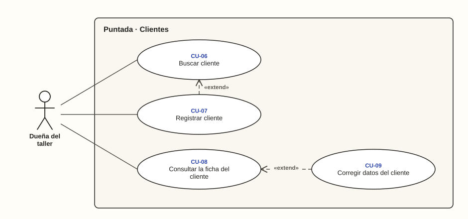

# Dueña del taller · Clientes

**Diagrama 02** · [índice de casos de uso](../README.md)

Registrar, encontrar y consultar a quienes dejan prendas.
- **Registrar cliente** extiende a **Buscar cliente** cuando el cliente no aparece; también se usa desde el registro de una orden (diagrama 03).
- **Corregir datos** extiende a la **ficha del cliente**, desde donde se hace.

---

### CU-06 · Buscar cliente

| Campo | Detalle |
| --- | --- |
| **Actor principal** | Dueña del taller |
| **Historias** | HU-04 |
| **Pantallas** | PT-03 |
| **Implementa** | `BuscarClientes` |
| **Precondición** | Tiene la sesión iniciada |
| **Disparador** | Llega un cliente al taller |
| **Postcondición** | Ve los clientes que coinciden y puede abrir su ficha |
| **Relaciones** | — |

**Flujo principal**

1. La dueña abre Clientes.
2. Escribe parte del nombre o el celular.
3. El sistema busca solo en los clientes de su negocio, sin distinguir mayúsculas ni tildes (RN-01, CA-04.1, CA-04.2, CA-04.4).
4. El sistema muestra los clientes que coinciden.

**Flujos alternativos**

- **3a. No hay resultados:** el sistema lo indica y ofrece registrar un cliente nuevo (CA-04.3); continúa en CU-07.

### CU-07 · Registrar cliente

| Campo | Detalle |
| --- | --- |
| **Actor principal** | Dueña del taller |
| **Historias** | HU-03, HU-10 |
| **Pantallas** | PT-04 |
| **Implementa** | `RegistrarCliente` |
| **Precondición** | Tiene la sesión iniciada |
| **Disparador** | Llega un cliente que no está registrado |
| **Postcondición** | El cliente queda registrado en el negocio |
| **Relaciones** | «extend» CU-06, CU-10 |

**Flujo principal**

1. La dueña toca «Registrar cliente».
2. Escribe el nombre y el celular.
3. El sistema comprueba que el nombre no esté vacío y que el celular sea colombiano, de 10 dígitos y empiece por 3 (RN-02, RN-03).
4. El sistema guarda el cliente, aunque otro cliente tenga el mismo celular (RN-04, CA-03.4).
5. El sistema muestra la ficha del cliente (CA-03.1).

**Flujos alternativos**

- **1a. Desde el registro de una orden:** al guardar, el sistema vuelve a la orden con el cliente elegido y las prendas que ya estaban escritas (CA-10.1).
- **3a. Sin celular:** no se guarda y el campo indica que es obligatorio (CA-03.2).
- **3b. Número fijo o incompleto:** no se guarda y el sistema muestra «Escribe un celular colombiano de 10 dígitos que empiece por 3» (CA-03.3).
- **3c. Error desde la orden:** el cliente no se registra y la dueña sigue en la orden con lo que había escrito (CA-10.2).

### CU-08 · Consultar la ficha del cliente

| Campo | Detalle |
| --- | --- |
| **Actor principal** | Dueña del taller |
| **Historias** | HU-05 |
| **Pantallas** | PT-05 |
| **Implementa** | `FichaDeCliente` |
| **Precondición** | El cliente está registrado |
| **Disparador** | Necesita saber qué órdenes tiene un cliente y cuánto debe |
| **Postcondición** | Conoce las órdenes del cliente y el total que debe |
| **Relaciones** | — |

**Flujo principal**

1. La dueña elige un cliente, normalmente desde CU-06.
2. El sistema muestra sus datos y sus órdenes con número, fecha de recepción, estado de avance y estado de pago.
3. El sistema calcula el total que debe, sin contar las órdenes canceladas (RN-27, RN-29, CA-05.1, CA-05.2).

**Flujos alternativos**

- **2a. El cliente no tiene órdenes:** el sistema lo indica y muestra que no debe nada (CA-05.3).

### CU-09 · Corregir datos del cliente

| Campo | Detalle |
| --- | --- |
| **Actor principal** | Dueña del taller |
| **Historias** | HU-06 |
| **Pantallas** | PT-04, PT-05 |
| **Implementa** | `CorregirCliente` |
| **Precondición** | Tiene abierta la ficha del cliente |
| **Disparador** | El cliente cambió de celular o su nombre está mal escrito |
| **Postcondición** | Los datos quedan corregidos y los avisos siguientes llegan al celular nuevo |
| **Relaciones** | «extend» CU-08 |

**Flujo principal**

1. Desde la ficha, la dueña toca «Corregir datos».
2. Cambia el nombre o el celular.
3. El sistema comprueba los datos con las mismas reglas del registro (RN-02, RN-03).
4. El sistema guarda los cambios (CA-06.1).

**Flujos alternativos**

- **3a. Nombre vacío:** no se guarda y el sistema indica que es obligatorio (CA-06.2).
- **3b. Celular incompleto:** no se guarda y el sistema indica cómo debe ser (CA-06.3).
