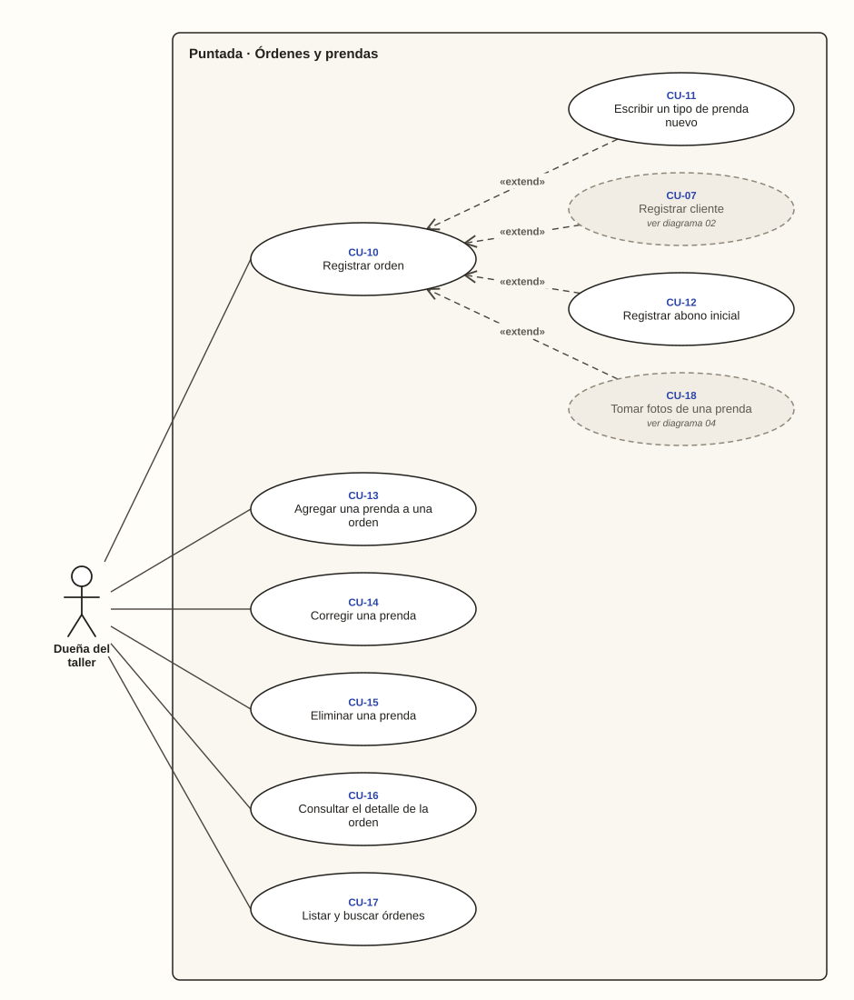

# Dueña del taller · Órdenes y prendas

**Diagrama 03** · [índice de casos de uso](../README.md)

El registro de lo que deja cada cliente y el trabajo con sus prendas. **Registrar orden** es el caso central. Lo extienden cuatro variaciones opcionales mientras el cliente está enfrente:
- escribir un tipo de prenda nuevo;
- registrar a un cliente nuevo;
- anotar un abono;
- tomar fotos.

---

### CU-10 · Registrar orden

| Campo | Detalle |
| --- | --- |
| **Actor principal** | Dueña del taller |
| **Historias** | HU-07, HU-08 |
| **Pantallas** | PT-06, PT-07 |
| **Implementa** | `RegistrarOrden` |
| **Precondición** | Tiene la sesión iniciada |
| **Disparador** | Un cliente deja prendas para arreglar |
| **Postcondición** | La orden queda En proceso, con su número, sus prendas Pendientes y su valor |
| **Relaciones** | — |

**Flujo principal**

1. La dueña toca «Nueva».
2. Elige al cliente.
3. Escribe la fecha de entrega acordada.
4. Agrega cada prenda con su tipo, la descripción del arreglo y el precio.
5. Toca «Guardar orden».
6. El sistema comprueba los datos y guarda la orden con todas sus prendas en una sola operación (RN-06, RN-07, RN-10, RN-11).
7. El sistema le asigna el número siguiente del negocio, que nunca se repite (RN-08).
8. El sistema muestra el número destacado para escribirlo en la bolsa (CA-08.1).

**Flujos alternativos**

- **2a. El cliente no está registrado:** continúa en CU-07 sin perder lo escrito.
- **4a. El tipo de prenda no está en la lista:** continúa en CU-11.
- **4b. La dueña quiere fotos de la prenda:** continúa en CU-18.
- **5a. El cliente abona algo:** continúa en CU-12.
- **6a. La orden no tiene prendas:** no se guarda y el sistema indica que debe tener al menos una (CA-07.2).
- **6b. La fecha de entrega es anterior a hoy:** no se guarda y el sistema lo indica (CA-07.3). Si es hoy mismo, se acepta (CA-07.4).
- **6c. Una prenda es inválida, por ejemplo con precio $0:** no se guarda ninguna parte de la orden y la prenda indica el error (CA-07.5).
- **6d. La dueña toca guardar dos veces:** se registra una sola orden (RNF-14).

### CU-11 · Escribir un tipo de prenda nuevo

| Campo | Detalle |
| --- | --- |
| **Actor principal** | Dueña del taller |
| **Historias** | HU-09 |
| **Pantallas** | PT-06 |
| **Implementa** | `ResolverTipoDePrenda` |
| **Precondición** | Está agregando una prenda |
| **Disparador** | El tipo de prenda no está en la lista |
| **Postcondición** | El tipo queda en la lista del negocio para las próximas prendas |
| **Relaciones** | «extend» CU-10 |

**Flujo principal**

1. En la prenda, la dueña elige «Otro».
2. Escribe el tipo, por ejemplo «Overol».
3. El sistema lo busca en la lista del negocio sin distinguir mayúsculas ni tildes.
4. Como no existe, el sistema lo agrega a la lista y la prenda queda con ese tipo (RN-43, CA-09.1).

**Flujos alternativos**

- **2a. No escribe el tipo:** no se guarda y el sistema pide escribirlo (CA-09.3).
- **3a. El tipo ya existe escrito de otra forma, como «overol»:** se usa el existente y la lista no lo repite (CA-09.2).

### CU-12 · Registrar abono inicial

| Campo | Detalle |
| --- | --- |
| **Actor principal** | Dueña del taller |
| **Historias** | HU-24 |
| **Pantallas** | PT-06 |
| **Implementa** | `RegistrarOrden` |
| **Precondición** | Está registrando una orden |
| **Disparador** | El cliente abona algo al dejar la ropa |
| **Postcondición** | La orden queda guardada con el pago del abono y su saldo |
| **Relaciones** | «extend» CU-10 · «generalización» CU-26 |

**Flujo principal**

1. En la orden, la dueña escribe cuánto abona el cliente y el método de pago.
2. Guarda la orden.
3. El sistema guarda la orden y el pago juntos, y calcula el saldo (CA-24.1).

**Flujos alternativos**

- **3a. El abono supera el valor de la orden:** no se guarda ni la orden ni el pago, y el sistema indica el máximo (RN-28, CA-24.2).

### CU-13 · Agregar una prenda a una orden

| Campo | Detalle |
| --- | --- |
| **Actor principal** | Dueña del taller |
| **Historias** | HU-11 |
| **Pantallas** | PT-09 |
| **Implementa** | `AgregarPrenda` |
| **Precondición** | La orden está En proceso o Lista para entregar |
| **Disparador** | Olvidó registrar una prenda que el cliente dejó |
| **Postcondición** | La prenda queda Pendiente y el valor de la orden sube |
| **Relaciones** | — |

**Flujo principal**

1. En el detalle de la orden, la dueña toca «Agregar una prenda».
2. Escribe el tipo, la descripción del arreglo y el precio.
3. El sistema comprueba los datos y guarda la prenda (RN-10, RN-11).
4. El sistema recalcula la orden: si estaba lista, vuelve a En proceso y se borra la fecha en que había quedado lista (RN-22, CA-11.1).

**Flujos alternativos**

- **1a. La orden está Entregada o Cancelada:** el sistema no lo permite (RN-24, CA-11.2, CA-11.3).

### CU-14 · Corregir una prenda

| Campo | Detalle |
| --- | --- |
| **Actor principal** | Dueña del taller |
| **Historias** | HU-12 |
| **Pantallas** | PT-11, PT-13 |
| **Implementa** | `CorregirPrenda` |
| **Precondición** | La prenda no está Entregada ni Devuelta |
| **Disparador** | La descripción o el precio quedaron mal escritos |
| **Postcondición** | La prenda queda corregida y el valor y el saldo de la orden, recalculados |
| **Relaciones** | — |

**Flujo principal**

1. En las acciones de la prenda, la dueña toca «Corregir arreglo, precio o fotos».
2. Cambia la descripción o el precio.
3. El sistema comprueba que lo ya pagado no supere el nuevo valor de la orden (RN-16).
4. El sistema guarda y recalcula el valor y el saldo (CA-12.1).

**Flujos alternativos**

- **1a. La prenda está Entregada:** el sistema no permite editarla (RN-15, CA-12.3).
- **3a. El nuevo valor queda por debajo de lo pagado:** no se guarda y el sistema indica que primero hay que anular el pago que sobra (CA-12.2).

### CU-15 · Eliminar una prenda

| Campo | Detalle |
| --- | --- |
| **Actor principal** | Dueña del taller |
| **Historias** | HU-13 |
| **Pantallas** | PT-13 |
| **Implementa** | `EliminarPrenda` |
| **Precondición** | La prenda se registró por error y no está Entregada |
| **Disparador** | Registró una prenda que el cliente no dejó |
| **Postcondición** | La orden queda sin esa prenda ni sus fotos, con el valor recalculado |
| **Relaciones** | — |

**Flujo principal**

1. Al corregir la prenda, la dueña toca «Eliminar esta prenda».
2. El sistema pide confirmación.
3. La dueña confirma.
4. El sistema comprueba que no sea la única prenda, que no esté entregada y que lo pagado no supere el nuevo valor (RN-06, RN-15, RN-16).
5. El sistema elimina la prenda con sus fotos y recalcula la orden (CA-13.1).

**Flujos alternativos**

- **3a. La dueña no confirma:** nada cambia (CA-13.2).
- **4a. Es la única prenda de la orden:** no se permite y el sistema sugiere cancelar la orden (CA-13.3).
- **4b. La prenda está Entregada:** no se permite (CA-13.4).

### CU-16 · Consultar el detalle de la orden

| Campo | Detalle |
| --- | --- |
| **Actor principal** | Dueña del taller |
| **Historias** | HU-14 |
| **Pantallas** | PT-09 |
| **Implementa** | `DetalleDeOrden` |
| **Precondición** | La orden existe en su negocio |
| **Disparador** | Necesita saber en qué va una orden o cuánto se debe |
| **Postcondición** | Conoce el estado completo de la orden |
| **Relaciones** | — |

**Flujo principal**

1. La dueña abre una orden desde la lista, la ficha del cliente o el panel.
2. El sistema muestra el cliente, el número, la fecha de recepción y la de entrega acordada.
3. Muestra las prendas con su estado y sus fotos, el valor, los pagos, el saldo, el estado de avance y el estado de pago (CA-14.1).

**Flujos alternativos**

- **1a. La orden es de otro negocio:** el sistema responde como si no existiera (RN-01, CA-14.3).
- **3a. La orden ya se entregó:** muestra además la fecha en que quedó lista y la de entrega real (CA-14.2).

### CU-17 · Listar y buscar órdenes

| Campo | Detalle |
| --- | --- |
| **Actor principal** | Dueña del taller |
| **Historias** | HU-15 |
| **Pantallas** | PT-08 |
| **Implementa** | `ListarOrdenes` |
| **Precondición** | Tiene la sesión iniciada |
| **Disparador** | Busca las prendas de un cliente por el número escrito en la bolsa |
| **Postcondición** | Encuentra la orden |
| **Relaciones** | — |

**Flujo principal**

1. La dueña abre Órdenes.
2. Filtra por estado de avance (CA-15.1) o escribe el número de la bolsa, por ejemplo «42» (CA-15.2).
3. El sistema muestra las órdenes que coinciden.
4. La dueña abre la orden (CU-16).

**Flujos alternativos**

- **2a. No existe una orden con ese número:** el sistema lo indica (CA-15.3).
