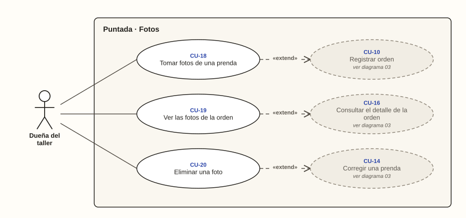

# Dueña del taller · Fotos

**Diagrama 04** · [índice de casos de uso](../README.md)

Las fotos sirven para reconocer las prendas guardadas juntas en el rincón (C-06). Cada caso extiende a otro, del que forma parte:
- **tomar fotos**, a registrar la orden;
- **ver las fotos**, al detalle de la orden;
- **eliminar una foto**, a corregir la prenda.

---

### CU-18 · Tomar fotos de una prenda

| Campo | Detalle |
| --- | --- |
| **Actor principal** | Dueña del taller |
| **Historias** | HU-17 |
| **Pantallas** | PT-06, PT-13 |
| **Implementa** | `AgregarFoto` |
| **Precondición** | Está registrando o corrigiendo una prenda |
| **Disparador** | Quiere poder reconocer la prenda después |
| **Postcondición** | La foto queda reducida, guardada en el disco privado y asociada a la prenda |
| **Relaciones** | «extend» CU-10 |

**Flujo principal**

1. La dueña toca «Tomar foto» o «Galería» (CA-17.1, CA-17.2).
2. Elige o toma la imagen.
3. El sistema la reduce a 1.600 px en su lado mayor y a no más de 400 KB (CA-17.5).
4. El sistema la guarda fuera de la carpeta pública y la asocia a la prenda (RN-17).

**Flujos alternativos**

- **1a. La prenda ya tiene 3 fotos:** el sistema no permite agregar otra (CA-17.3).
- **1b. La dueña guarda la prenda sin foto:** se guarda, y el sistema sugiere tomarle una (CA-17.4).

### CU-19 · Ver las fotos de la orden

| Campo | Detalle |
| --- | --- |
| **Actor principal** | Dueña del taller |
| **Historias** | HU-18 |
| **Pantallas** | PT-10 |
| **Implementa** | `FotosDeOrden` |
| **Precondición** | Tiene abierto el detalle de la orden |
| **Disparador** | El cliente vino a recoger y hay que sacar sus prendas del rincón |
| **Postcondición** | Reconoce las prendas del cliente |
| **Relaciones** | «extend» CU-16 |

**Flujo principal**

1. En el detalle de la orden, la dueña toca «Ver fotos juntas».
2. El sistema muestra las fotos agrupadas por prenda, con su tipo y su descripción (CA-18.1).
3. La dueña toca una foto y el sistema la muestra ampliada (CA-18.2).

**Flujos alternativos**

- **2a. Alguien pide una foto sin sesión o de otro negocio:** el sistema no la entrega (CA-18.3).

### CU-20 · Eliminar una foto

| Campo | Detalle |
| --- | --- |
| **Actor principal** | Dueña del taller |
| **Historias** | HU-19 |
| **Pantallas** | PT-13 |
| **Implementa** | `EliminarFoto` |
| **Precondición** | Está corrigiendo una prenda que tiene fotos |
| **Disparador** | Una foto quedó borrosa o es de otra prenda |
| **Postcondición** | La foto se elimina y la prenda sigue registrada |
| **Relaciones** | «extend» CU-14 |

**Flujo principal**

1. Al corregir la prenda, la dueña toca la X de una foto.
2. El sistema pide confirmación.
3. La dueña confirma.
4. El sistema elimina la foto y libera su lugar para otra (RN-17, CA-19.1, CA-19.2).

**Flujos alternativos**

- **3a. La dueña no confirma:** la foto se conserva.
