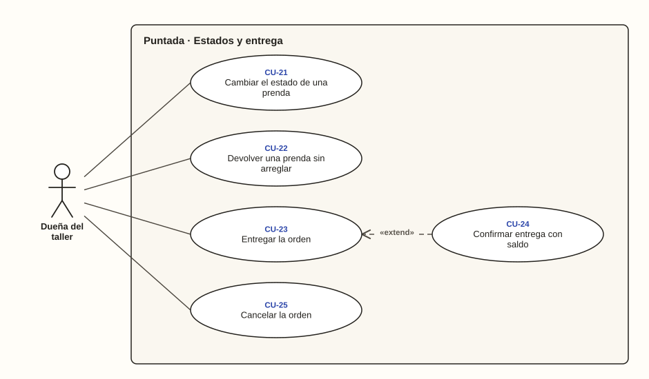

# Dueña del taller · Estados y entrega

**Diagrama 05** · [índice de casos de uso](../README.md)

El avance del trabajo y la salida de las prendas del taller. **Confirmar entrega con saldo** extiende a **Entregar orden** cuando el cliente todavía debe. Los estados posibles están en el [diagrama de estados de la prenda](../../diagramas/README.md#4-estados-de-una-prenda).

Cambiar el estado de una prenda y devolverla sin arreglar pueden dejar la orden lista. En ese caso se avisa al cliente (CU-32, diagrama 09).

---

### CU-21 · Cambiar el estado de una prenda

| Campo | Detalle |
| --- | --- |
| **Actor principal** | Dueña del taller |
| **Historias** | HU-20 |
| **Pantallas** | PT-11 |
| **Implementa** | `CambiarEstadoDePrenda` |
| **Precondición** | La orden no está cancelada |
| **Disparador** | Empieza, termina o retoca un arreglo |
| **Postcondición** | La prenda queda en el nuevo estado y el estado de la orden, recalculado |
| **Relaciones** | — |

**Flujo principal**

1. En la prenda, la dueña toca «Cambiar estado».
2. El sistema ofrece solo los estados permitidos desde el actual; nunca Entregada (RN-13, CA-20.2).
3. La dueña elige el estado, por ejemplo de Pendiente a En proceso (CA-20.1).
4. El sistema guarda el estado y recalcula el de la orden desde sus prendas (RN-18, RN-19).
5. Si era la última prenda por terminar, la orden queda Lista para entregar y se registra la fecha y hora (RN-22, CA-20.3).

**Flujos alternativos**

- **1a. La orden está Cancelada:** el sistema no permite cambiar estados (RN-24, CA-20.6).
- **3a. Retoque:** al medírsela, a la prenda Terminada le falta algo. Vuelve a En proceso, la orden también, y se borra la fecha en que quedó lista (RN-14, CA-20.4).
- **5a. La orden quedó lista:** el sistema avisa al cliente (CU-32).

### CU-22 · Devolver una prenda sin arreglar

| Campo | Detalle |
| --- | --- |
| **Actor principal** | Dueña del taller |
| **Historias** | HU-36 |
| **Pantallas** | PT-11, PT-12 |
| **Implementa** | `DevolverPrendaSinArreglar` |
| **Precondición** | La prenda está Pendiente o En proceso |
| **Disparador** | El cliente se lleva la prenda sin esperar el arreglo |
| **Postcondición** | La prenda queda Devuelta y su precio deja de contar en el valor de la orden |
| **Relaciones** | — |

**Flujo principal**

1. En las acciones de la prenda, la dueña toca «Devolver sin arreglar».
2. El sistema muestra cómo quedarán el valor y el saldo.
3. La dueña confirma.
4. El sistema comprueba que queden otras prendas por resolver y que lo pagado no supere el nuevo valor (RN-06, RN-16, RN-44).
5. La prenda queda Devuelta y el valor baja (CA-36.1).
6. El sistema recalcula la orden, que puede quedar lista.

**Flujos alternativos**

- **1a. La prenda está Terminada:** la opción no aparece (CA-36.3).
- **3a. La dueña no confirma:** nada cambia (CA-36.2).
- **4a. Es la única prenda por resolver:** no se permite y el sistema sugiere cancelar la orden (CA-36.4).
- **4b. Lo pagado superaría el nuevo valor:** no se permite y el sistema indica que primero hay que anular el pago que sobra (CA-36.5).
- **6a. La orden quedó lista:** el sistema avisa al cliente (CU-32).

### CU-23 · Entregar la orden

| Campo | Detalle |
| --- | --- |
| **Actor principal** | Dueña del taller |
| **Historias** | HU-21 |
| **Pantallas** | PT-16 |
| **Implementa** | `EntregarOrden` |
| **Precondición** | La orden tiene al menos una prenda Terminada |
| **Disparador** | El cliente recoge sus prendas |
| **Postcondición** | Las prendas Terminadas quedan Entregadas con su fecha y hora |
| **Relaciones** | — |

**Flujo principal**

1. En el detalle de la orden, la dueña toca «Entregar».
2. El sistema muestra qué prendas se entregan y cuáles se quedan en el taller.
3. La dueña confirma.
4. El sistema marca Entregadas las prendas Terminadas con la fecha y hora (RN-20, RN-23).
5. Si no queda nada por entregar, la orden queda Entregada (CA-21.1).

**Flujos alternativos**

- **2a. La orden tiene saldo:** continúa en CU-24.
- **5a. Quedan prendas Pendientes o En proceso:** es una entrega parcial y la orden sigue En proceso (CA-21.2).

### CU-24 · Confirmar entrega con saldo

| Campo | Detalle |
| --- | --- |
| **Actor principal** | Dueña del taller |
| **Historias** | HU-21 |
| **Pantallas** | PT-16 |
| **Implementa** | `EntregarOrden` |
| **Precondición** | Está entregando una orden con saldo pendiente |
| **Disparador** | El cliente se lleva sus prendas debiendo |
| **Postcondición** | La orden se entrega y queda Por cobrar |
| **Relaciones** | «extend» CU-23 |

**Flujo principal**

1. El sistema muestra, por ejemplo, «Marta debe $12.000. ¿Entregar de todos modos?» (CA-21.3).
2. La dueña confirma.
3. El sistema entrega la orden y queda Por cobrar con su saldo (RN-21, CA-21.4).

**Flujos alternativos**

- **2a. La dueña no confirma:** nada cambia (CA-21.5).
- **2b. El cliente paga antes de llevársela:** la dueña registra el pago (CU-26) y vuelve a entregar.

### CU-25 · Cancelar la orden

| Campo | Detalle |
| --- | --- |
| **Actor principal** | Dueña del taller |
| **Historias** | HU-22 |
| **Pantallas** | PT-17 |
| **Implementa** | `CancelarOrden` |
| **Precondición** | La orden no está Entregada |
| **Disparador** | El cliente desiste del arreglo |
| **Postcondición** | La orden queda Cancelada; no cuenta como trabajo pendiente ni como deuda |
| **Relaciones** | — |

**Flujo principal**

1. En el detalle de la orden, la dueña toca «Cancelar la orden».
2. El sistema explica qué implica y que no se puede reabrir.
3. La dueña confirma.
4. La orden queda Cancelada y sus pagos se conservan (RN-24, CA-22.1).

**Flujos alternativos**

- **1a. La orden está Entregada:** el sistema no permite cancelarla (CA-22.2).
- **3a. La dueña no confirma:** nada cambia.
- **4a. Después de cancelada:** no admite pagos ni prendas nuevas (CA-22.3).
