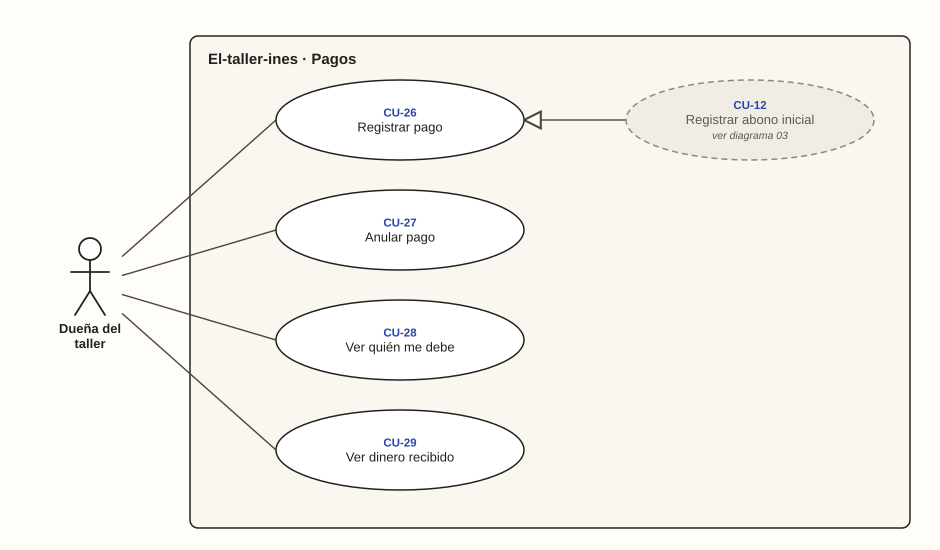

# Dueña del taller · Pagos

**Diagrama 06** · [índice de casos de uso](../README.md)

El dinero que entra y el que falta por cobrar. **Registrar abono inicial** (diagrama 03) es una forma particular de **Registrar pago**: ocurre al crear la orden, con las mismas reglas.

---

### CU-26 · Registrar pago

| Campo | Detalle |
| --- | --- |
| **Actor principal** | Dueña del taller |
| **Historias** | HU-23 |
| **Pantallas** | PT-14 |
| **Implementa** | `RegistrarPago` |
| **Precondición** | La orden no está cancelada |
| **Disparador** | El cliente paga una parte o todo lo que debe |
| **Postcondición** | El pago queda registrado y el saldo y el estado de pago, recalculados |
| **Relaciones** | — |

**Flujo principal**

1. En el detalle de la orden, la dueña toca «Registrar pago».
2. Escribe el valor y elige el método: efectivo o Nequi (RN-25).
3. Toca «Guardar pago».
4. El sistema bloquea la orden y comprueba que el pago no supere el saldo en ese momento (RN-28).
5. El sistema guarda el pago con la fecha de hoy y recalcula el saldo (CA-23.1, CA-23.2).

**Flujos alternativos**

- **1a. La orden ya se entregó y tiene saldo:** el pago se permite (RN-30, CA-23.6).
- **1b. La orden está Cancelada:** el sistema no permite registrar pagos (CA-23.7).
- **3a. La dueña toca guardar dos veces seguidas:** se registra un solo pago (CA-23.5).
- **4a. El pago supera el saldo:** no se guarda y el sistema muestra «El pago no puede superar el saldo pendiente de $21.000» (CA-23.3).
- **4b. Valor de $0:** no se guarda y el sistema indica que debe ser mayor que cero (CA-23.4).

### CU-27 · Anular pago

| Campo | Detalle |
| --- | --- |
| **Actor principal** | Dueña del taller |
| **Historias** | HU-25 |
| **Pantallas** | PT-15 |
| **Implementa** | `AnularPago` |
| **Precondición** | El pago está registrado y no está anulado |
| **Disparador** | Registró un pago con el valor equivocado |
| **Postcondición** | El pago deja de contar en el saldo y sigue visible como anulado |
| **Relaciones** | — |

**Flujo principal**

1. En los pagos de la orden, la dueña toca «Anular este pago».
2. Escribe el motivo.
3. Confirma.
4. El sistema anula el pago con la fecha y el motivo, sin borrarlo, y recalcula el saldo (RN-31, CA-25.1).

**Flujos alternativos**

- **2a. No escribe el motivo:** no se anula y el sistema indica que es obligatorio (CA-25.2).
- **1a. El pago ya está anulado:** no existe la opción de anularlo otra vez ni de borrarlo (CA-25.3).

### CU-28 · Ver quién me debe

| Campo | Detalle |
| --- | --- |
| **Actor principal** | Dueña del taller |
| **Historias** | HU-26 |
| **Pantallas** | PT-22 |
| **Implementa** | `QuienMeDebe` |
| **Precondición** | Tiene la sesión iniciada |
| **Disparador** | Quiere saber a quién cobrarle primero |
| **Postcondición** | Conoce las órdenes con saldo y el total por cobrar |
| **Relaciones** | «extend» CU-33 |

**Flujo principal**

1. La dueña abre Dinero, o toca el total por cobrar en el panel del día.
2. El sistema lista las órdenes con saldo, de la mayor deuda a la menor, y el total por cobrar (RN-32, CA-26.1).
3. Las órdenes pagadas y las canceladas no aparecen (CA-26.2).

### CU-29 · Ver dinero recibido

| Campo | Detalle |
| --- | --- |
| **Actor principal** | Dueña del taller |
| **Historias** | HU-27 |
| **Pantallas** | PT-22 |
| **Implementa** | `DineroRecibido` |
| **Precondición** | Tiene la sesión iniciada |
| **Disparador** | Quiere saber cuánto recibió en un período |
| **Postcondición** | Conoce el dinero recibido en el período |
| **Relaciones** | — |

**Flujo principal**

1. La dueña abre Dinero.
2. Elige hoy, la semana, el mes o un rango de fechas (CA-27.3).
3. El sistema suma los pagos no anulados de ese período, con las fechas en hora de Colombia (RN-33, CA-27.1, CA-27.2).
