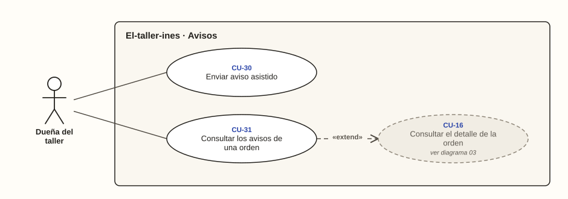

# Dueña del taller · Avisos

**Diagrama 07** · [índice de casos de uso](../README.md)

Lo que hace la dueña con los avisos. El aviso automático no lo inicia ella: ocurre cuando la orden queda lista y se describe desde el cliente en el [diagrama 09](../cliente-y-whatsapp/09-avisos-al-cliente.md).

---

### CU-30 · Enviar aviso asistido

| Campo | Detalle |
| --- | --- |
| **Actor principal** | Dueña del taller |
| **Actores secundarios** | Cliente del taller |
| **Historias** | HU-29 |
| **Pantallas** | PT-18 |
| **Implementa** | `AvisosPorEnviar`, `ConfirmarEnvioAsistido` |
| **Precondición** | Hay avisos que no salieron solos: la API no está configurada o falló |
| **Disparador** | El panel muestra avisos por enviar |
| **Postcondición** | El aviso queda registrado como enviado por envío asistido |
| **Relaciones** | — |

**Flujo principal**

1. La dueña abre «Avisos por enviar».
2. El sistema muestra cada aviso con el mensaje ya redactado, armado con los datos del momento (RN-42, CA-29.1).
3. La dueña toca «Abrir WhatsApp y enviar».
4. Se abre WhatsApp con el celular del cliente y el mensaje escrito (CA-29.2).
5. La dueña lo envía desde su WhatsApp y el cliente lo recibe.
6. Vuelve al sistema y toca «Sí, ya lo envié».
7. El sistema registra el aviso como enviado por envío asistido (RN-41, CA-29.3).

**Flujos alternativos**

- **2a. La orden dejó de estar lista:** el aviso ya no aparece en la lista (RN-39, CA-30.2).
- **6a. La dueña vuelve sin confirmar:** el aviso sigue pendiente (CA-29.4).

### CU-31 · Consultar los avisos de una orden

| Campo | Detalle |
| --- | --- |
| **Actor principal** | Dueña del taller |
| **Historias** | HU-31 |
| **Pantallas** | PT-09 |
| **Implementa** | `DetalleDeOrden` |
| **Precondición** | Tiene abierto el detalle de la orden |
| **Disparador** | Un cliente dice que no le avisaron |
| **Postcondición** | Sabe qué avisos se enviaron y cuáles no |
| **Relaciones** | «extend» CU-16 |

**Flujo principal**

1. En el detalle de la orden, la dueña baja hasta «Avisos al cliente».
2. El sistema muestra cada aviso con su fecha y hora, canal, mensaje y resultado: enviado, pendiente o descartado (RN-41, CA-31.1).
