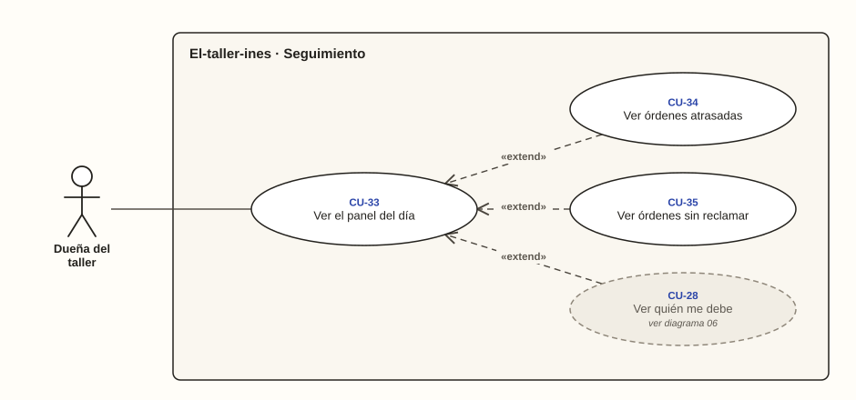

# Dueña del taller · Seguimiento

**Diagrama 08** · [índice de casos de uso](../README.md)

El panel del día es lo primero que ve la dueña. Las órdenes atrasadas, las sin reclamar y quién debe extienden al panel: se abren tocando su cifra.

---

### CU-33 · Ver el panel del día

| Campo | Detalle |
| --- | --- |
| **Actor principal** | Dueña del taller |
| **Historias** | HU-32 |
| **Pantallas** | PT-02 |
| **Implementa** | `PanelDelDia` |
| **Precondición** | Inició sesión |
| **Disparador** | Entra al sistema |
| **Postcondición** | Sabe qué necesita su atención hoy |
| **Relaciones** | — |

**Flujo principal**

1. La dueña entra al sistema.
2. El sistema muestra el total por cobrar, las órdenes atrasadas, las órdenes y prendas sin reclamar y los avisos por enviar (RN-32, RN-34, RN-35, RN-40, CA-32.1).
3. La dueña toca una cifra y el sistema muestra su lista (CA-32.2).

**Flujos alternativos**

- **2a. Todo está al día:** los indicadores aparecen en cero (CA-32.3).

### CU-34 · Ver órdenes atrasadas

| Campo | Detalle |
| --- | --- |
| **Actor principal** | Dueña del taller |
| **Historias** | HU-33 |
| **Pantallas** | PT-20 |
| **Implementa** | `OrdenesAtrasadas` |
| **Precondición** | Está en el panel del día |
| **Disparador** | Hay órdenes atrasadas |
| **Postcondición** | Sabe qué trabajo priorizar |
| **Relaciones** | «extend» CU-33 |

**Flujo principal**

1. En el panel, la dueña toca «Atrasadas».
2. El sistema lista las órdenes En proceso cuya fecha acordada ya pasó, de la más atrasada a la menos, con sus días de atraso (RN-34, CA-33.1).
3. Las órdenes listas no aparecen, y «hoy» es la fecha de Colombia (RN-09, CA-33.2, CA-33.3).

### CU-35 · Ver órdenes sin reclamar

| Campo | Detalle |
| --- | --- |
| **Actor principal** | Dueña del taller |
| **Historias** | HU-34 |
| **Pantallas** | PT-21 |
| **Implementa** | `OrdenesSinReclamar` |
| **Precondición** | Está en el panel del día |
| **Disparador** | Hay órdenes listas que nadie recoge |
| **Postcondición** | Sabe a quién contactar y desde cuándo espera |
| **Relaciones** | «extend» CU-33 |

**Flujo principal**

1. En el panel, la dueña toca «Sin reclamar».
2. El sistema lista las órdenes que llevan más días listas que el plazo del negocio, de la mayor espera a la menor, con sus días de espera y sus prendas (RN-35, RN-36, CA-34.1, CA-34.3).
3. Las órdenes dentro del plazo no aparecen (CA-34.2).
