# Diagramas de diseño

**Estado:** borrador · DOC-18 · adelantado del Sprint 2 · se valida con el instructor

## Para qué sirven

Muestran el diseño desde los ángulos que pide el desarrollo:

| Diagrama | Qué responde |
| --- | --- |
| **Clases** | Qué clases hay y cómo se relacionan |
| **Estados** | Por qué estados pasan las prendas, las órdenes, los avisos y los pagos |
| **Secuencia** | Cómo colaboran las clases en cada acción importante |
| **Componentes** | De qué partes está hecho el sistema |
| **Despliegue** | Dónde se ejecuta cada parte |

Salen de la [arquitectura](../arquitectura/README.md) y del [modelo de datos](../modelo-de-datos/README.md), y no los contradicen: `python scripts/verificar_diagramas.py` comprueba que las clases existan en la estructura de carpetas, que los atributos de los modelos sean columnas reales del esquema y que los estados sean exactamente los que permiten la base de datos y las reglas.

**Notación:** UML dibujado con Mermaid, que GitHub muestra directamente. Mermaid no tiene la notación UML de componentes ni de despliegue, así que esos dos se dibujan como diagramas de bloques con estereotipos (`«componente»`, `«dispositivo»`, `«servidor»`).

## Índice

| # | Diagrama | Tipo |
| --- | --- | --- |
| 1 | [Clases del dominio](#1-clases-del-dominio) | Clases |
| 2 | [Clases de los modelos](#2-clases-de-los-modelos) | Clases |
| 3 | [Casos de uso e implementaciones](#3-casos-de-uso-e-implementaciones) | Clases |
| 4 | [Estados de una prenda](#4-estados-de-una-prenda) | Estados |
| 5 | [Estados de una orden](#5-estados-de-una-orden) | Estados |
| 6 | [Estados de un aviso](#6-estados-de-un-aviso) | Estados |
| 7 | [Estados de un pago](#7-estados-de-un-pago) | Estados |
| 8 | [Registrar una orden](#8-registrar-una-orden) | Secuencia |
| 9 | [Enviar un aviso asistido](#9-enviar-un-aviso-asistido) | Secuencia |
| 10 | [Devolver una prenda sin arreglar](#10-devolver-una-prenda-sin-arreglar) | Secuencia |
| 11 | [Ver una foto privada](#11-ver-una-foto-privada) | Secuencia |
| 12 | [Componentes](#12-componentes) | Componentes |
| 13 | [Despliegue](#13-despliegue) | Despliegue |

Otras dos secuencias ya están en la arquitectura: [la última prenda queda terminada y sale el aviso](../arquitectura/README.md#la-última-prenda-queda-terminada-y-sale-el-aviso) y [registrar un pago que supera el saldo](../arquitectura/README.md#registrar-un-pago-que-supera-el-saldo).

---

## 1. Clases del dominio

Las reglas del negocio en PHP puro. No dependen de Laravel ni de la base de datos: reciben datos simples y devuelven decisiones.

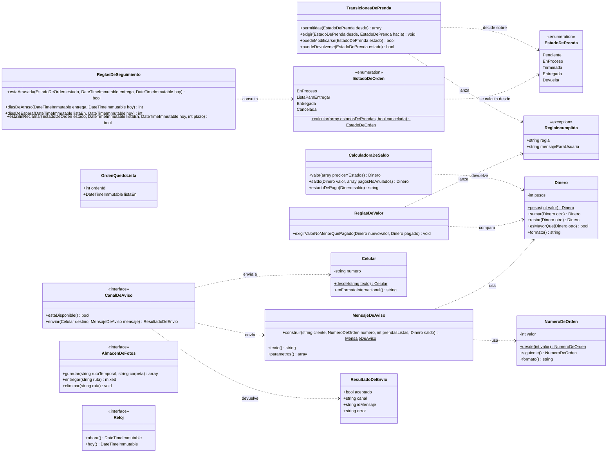

- **Objetos de valor:** `Dinero`, `Celular` y `NumeroDeOrden` no se pueden crear con un valor inválido; así una regla como RN-03 se comprueba en un solo lugar.
- **`ReglaIncumplida`** lleva el código de la regla y el mensaje en español que la vista muestra junto al campo (RNF-09).
- **Interfaces:** `CanalDeAviso`, `AlmacenDeFotos` y `Reloj` son las únicas; las implementa la infraestructura (diagrama 3).

## 2. Clases de los modelos

Un modelo Eloquent por tabla, con las mismas relaciones y cardinalidades del modelo de datos. Los atributos son columnas reales del [esquema](../modelo-de-datos/esquema.sql).

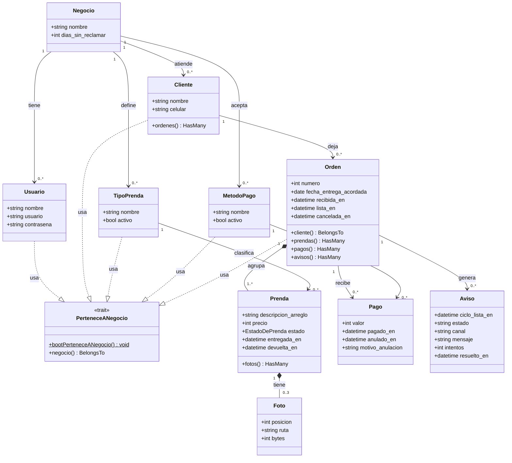

- **Composición** (rombo lleno): una prenda no existe sin su orden, y una foto no existe sin su prenda. La orden tiene al menos una prenda (RN-06) y la prenda hasta tres fotos (RN-17).
- **`PerteneceANegocio`** se usa en las tablas que tienen `negocio_id`: las raíces de ADR-002 y `Orden`, por ADR-004. Prendas, fotos, pagos y avisos se filtran a través de su orden.
- **`Prenda.estado`** se convierte automáticamente a la enumeración `EstadoDePrenda` del dominio.

## 3. Casos de uso e implementaciones

Cómo los controladores llaman a los casos de uso, y cómo estos dependen de interfaces del dominio y no de sus implementaciones (inversión de dependencias). Se muestran los casos de uso que tocan las tres interfaces; los demás siguen el mismo patrón.

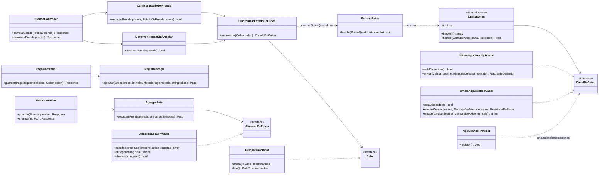

- **`EnviarAviso`** pregunta a `WhatsAppCloudApiCanal` si está disponible; si no lo está, o si falla después de tres intentos (`tries`), el aviso queda para `WhatsAppAsistidoCanal` (RN-40, ADR-003).
- **`WhatsAppAsistidoCanal.enlace()`** arma la dirección `https://wa.me/57…?text=…` que abre WhatsApp con el mensaje escrito.
- **En las pruebas**, `AppServiceProvider` se reemplaza por un canal falso, un almacén en memoria y un reloj fijo en el miércoles 16 de septiembre de 2026.

## 4. Estados de una prenda

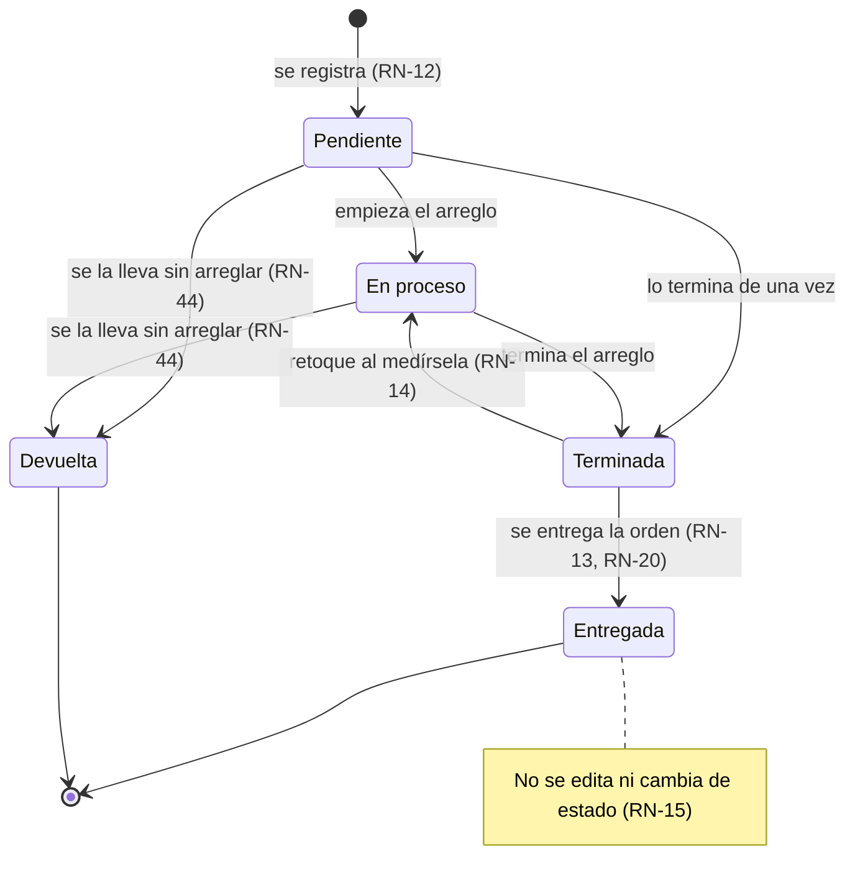

| Desde | Hacia | Cuándo | Acción | Regla |
| --- | --- | --- | --- | --- |
| — | Pendiente | Al registrar la prenda | `RegistrarOrden`, `AgregarPrenda` | RN-12 |
| Pendiente | En proceso | La dueña empieza el arreglo | `CambiarEstadoDePrenda` | RN-12 |
| Pendiente o En proceso | Terminada | Termina el arreglo | `CambiarEstadoDePrenda` | RN-12 |
| Terminada | En proceso | Al medírsela, le falta algo | `CambiarEstadoDePrenda` | RN-14 |
| Terminada | Entregada | Se entrega la orden; no desde la prenda sola | `EntregarOrden` | RN-13 · RN-20 |
| Pendiente o En proceso | Devuelta | El cliente se la lleva sin arreglar | `DevolverPrendaSinArreglar` | RN-44 |

Cualquier otro cambio lo rechaza `TransicionesDePrenda`. Si la orden está cancelada, ninguno está permitido (RN-24).

## 5. Estados de una orden

El estado de la orden no se guarda ni se cambia a mano (RN-18, RN-19): `EstadoDeOrden` lo calcula cada vez desde sus prendas.

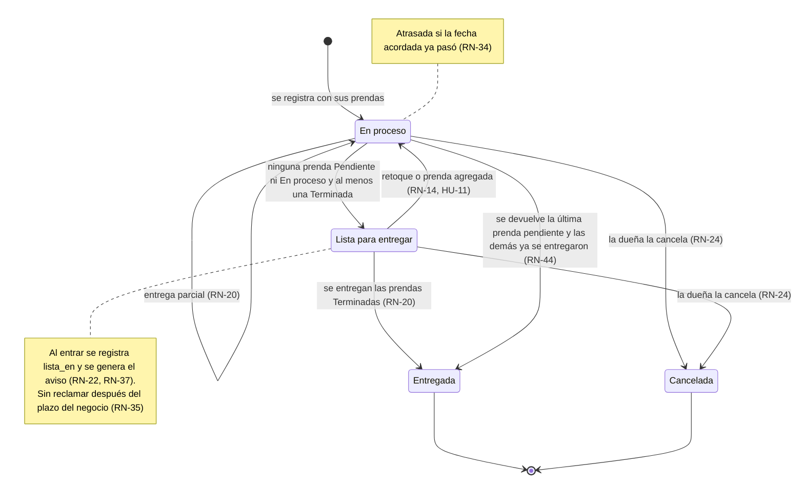

**Atrasada** y **sin reclamar** no son estados: son condiciones que se calculan sobre En proceso y Lista para entregar.

## 6. Estados de un aviso

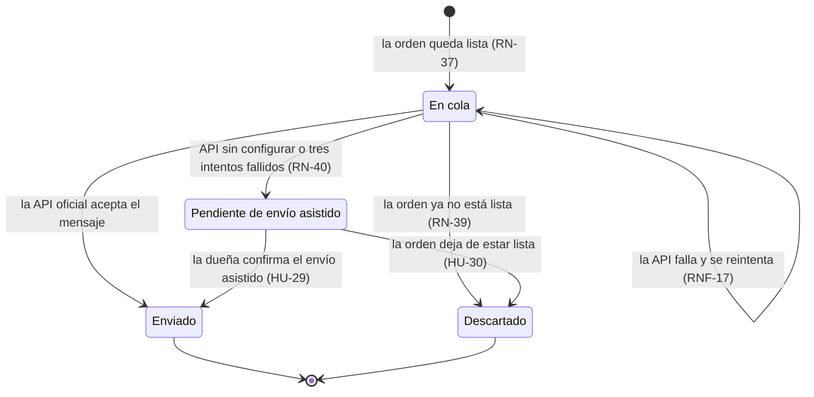

Cada vez que la orden vuelve a quedar lista nace un aviso nuevo; la base impide dos avisos para la misma vez (RN-38).

## 7. Estados de un pago

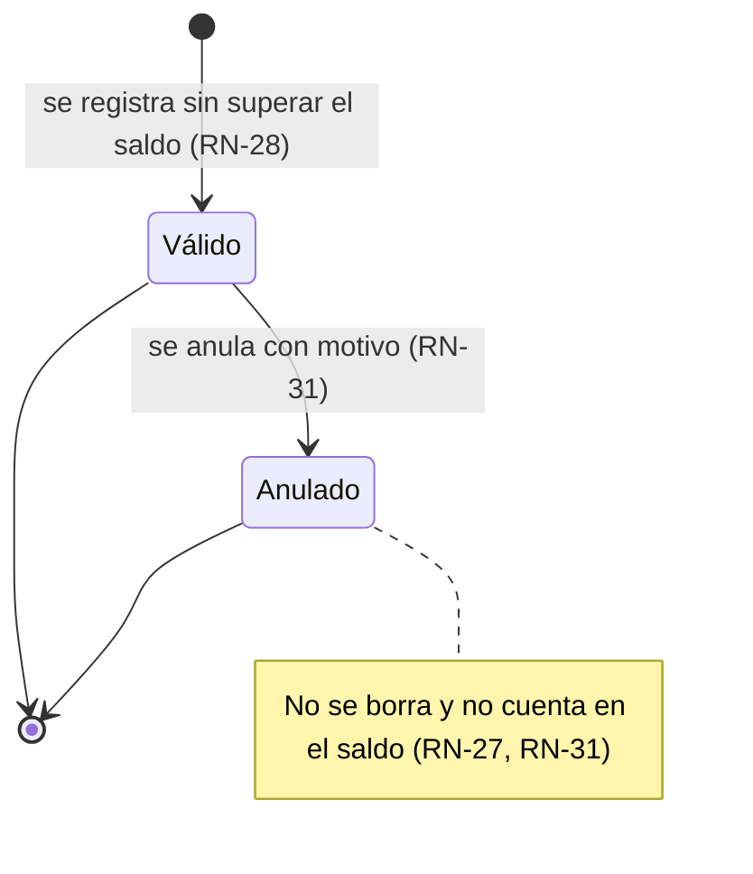

## 8. Registrar una orden

Muestra la transacción completa, la numeración sin repetidos (RN-08) y el tipo de prenda escrito con «Otro» (RN-43). Corresponde a PT-06 y PT-07.

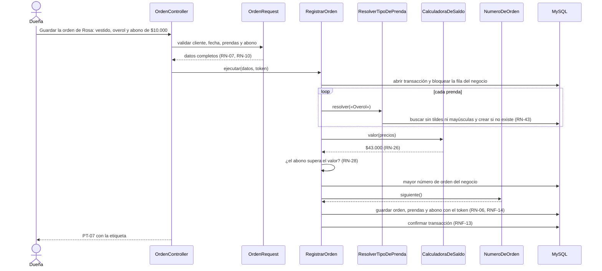

## 9. Enviar un aviso asistido

Cuando la API oficial no está configurada, la dueña envía el aviso desde su WhatsApp con el mensaje ya escrito. Corresponde a PT-18.

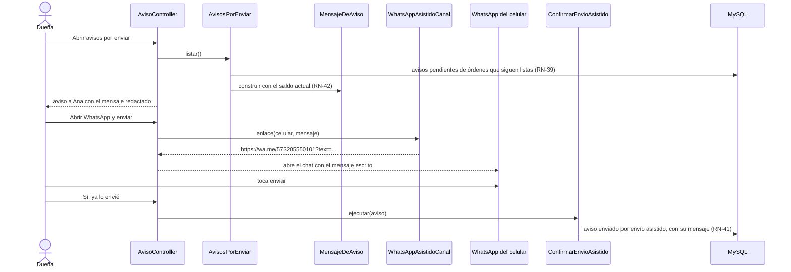

## 10. Devolver una prenda sin arreglar

Muestra una consecuencia que aparece solo al diagramar: al devolver la última prenda pendiente de la #0042, las demás están terminadas y la orden queda lista, lo que genera un aviso. Corresponde a PT-12.

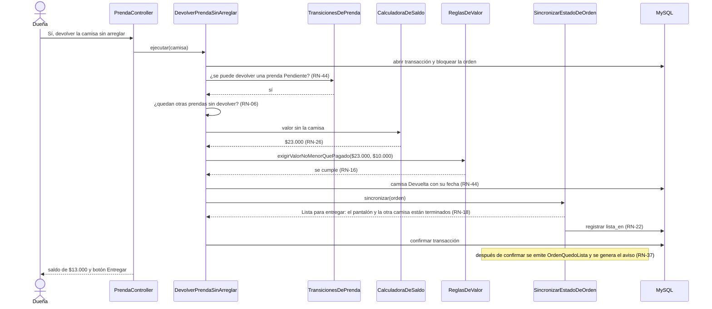

## 11. Ver una foto privada

Las fotos no están en una carpeta pública (RNF-25): cada una se entrega solo con sesión y si es del propio negocio. Corresponde a PT-10.

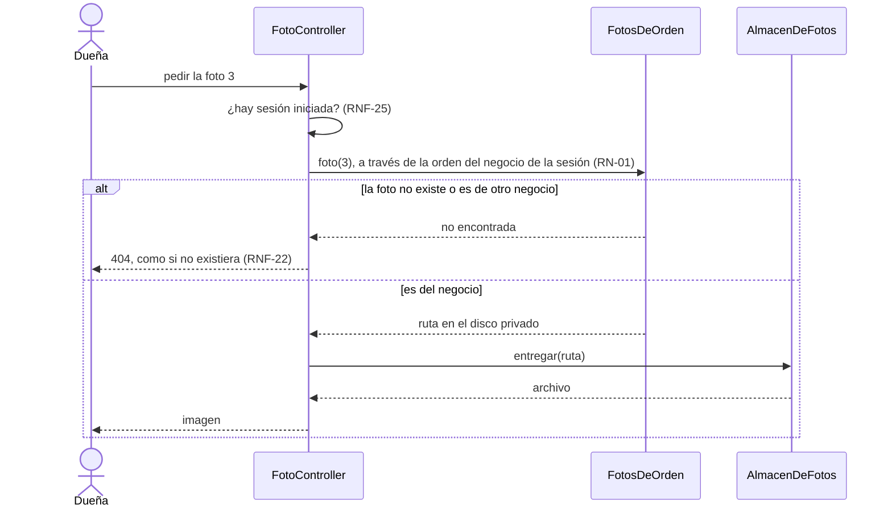

## 12. Componentes

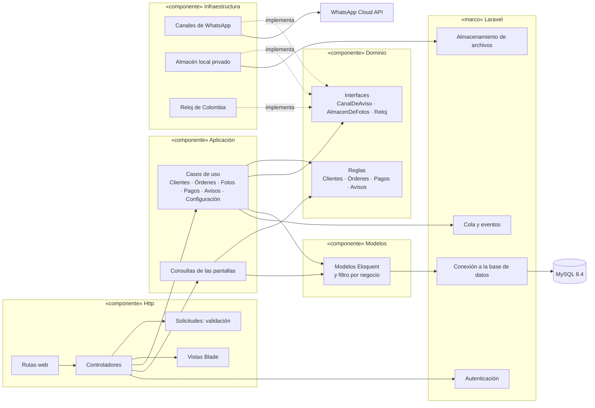

| Componente | Ofrece | Necesita |
| --- | --- | --- |
| **Http** | Las pantallas PT-01 a PT-23 | Aplicación y la autenticación de Laravel |
| **Aplicación** | Un caso de uso por acción y las consultas de lectura | Dominio, Modelos, la cola y las interfaces |
| **Dominio** | Reglas, objetos de valor e interfaces | Nada |
| **Modelos** | Acceso a las 10 tablas con el filtro por negocio | La conexión a la base de datos |
| **Infraestructura** | Implementaciones de `CanalDeAviso`, `AlmacenDeFotos` y `Reloj` | Dominio, la API de WhatsApp y el almacenamiento de Laravel |

## 13. Despliegue

La propuesta para el VPS. Las versiones y rutas se confirman al hacer HT-04.

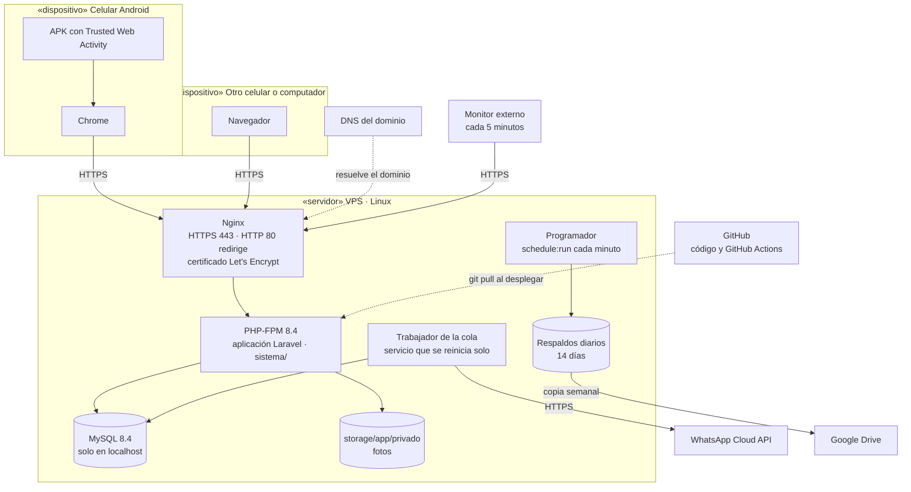

| Nodo | Qué corre | Requisito |
| --- | --- | --- |
| **Celular Android** | El APK abre el sistema en Chrome a pantalla completa | RNF-35 · ADR-006 |
| **Nginx** | Recibe HTTPS con certificado de Let's Encrypt y redirige lo que llegue por HTTP; publica `assetlinks.json` | RNF-18 · ADR-006 |
| **PHP-FPM 8.4** | La aplicación Laravel, configurada solo con variables de entorno | RNF-34 |
| **Trabajador de la cola** | `php artisan queue:work` como servicio del sistema, para que se reinicie solo | RNF-17 · HT-04 |
| **Programador** | Respaldo diario de la base y las fotos; copia semanal a Google Drive | RNF-15 · HT-05 |
| **MySQL 8.4** | Solo acepta conexiones del mismo servidor | RNF-23 |
| **Monitor externo** | Revisa el sistema cada 5 minutos | RNF-16 |
| **GitHub** | Guarda el código y corre las pruebas; el despliegue trae el código aprobado | RNF-30 |

## Decisiones que salieron al diagramar

| Hallazgo | Diagrama | Propuesta |
| --- | --- | --- |
| **Aviso con el cliente presente.** Si al devolver una prenda sin arreglar la orden queda lista, se genera un aviso aunque el cliente esté en el taller y se lleve todo enseguida | 10 | Esperar unos minutos antes de enviar el aviso automático. Si en ese tiempo la orden se entrega, el aviso se descarta solo (RN-39). No contradice ninguna regla; queda **por decidir antes de construir HU-28** (Sprint 4) y, si se acepta, se agrega a sus criterios |
| **La foto se busca por su orden.** `Foto` no tiene `negocio_id`, así que no puede usar el filtro global | 11 | `FotosDeOrden` busca la foto a través de su prenda y su orden, que sí filtran por negocio. Queda cubierto por la prueba de aislamiento (RNF-22) |
| **Pendiente no vuelve de En proceso.** Ninguna regla lo pide, y no cambia el estado de la orden | 4 | No se permite; si la dueña marca En proceso por error, no afecta ningún cálculo |

## Pendiente

- Decidir, antes de construir HU-28, si el aviso automático espera unos minutos antes de enviarse.
- Los diagramas y la especificación de los casos de uso están en [casos de uso](../casos-de-uso/README.md) (DOC-15).
