# Mockups

**Estado:** borrador · DOC-13 · adelantado del Sprint 2 · el instructor lo aprueba con el producto terminado (DOC-14)

## Para qué sirven

Muestran cómo se verá cada pantalla antes de programarla. Cada pantalla declara qué historias de usuario y qué criterios de aceptación muestra, así que se puede revisar contra los requisitos y no contra gustos.

## Cómo verlos

- **En GitHub:** la galería de capturas está al final de este documento.
- **Navegables:** con el servidor de la documentación (`python -m http.server 8765 --directory docs`), abre http://localhost:8765/03-diseno/mockups/. Los botones llevan de una pantalla a otra. También se pueden abrir en el celular.
- **Regenerar:** `node scripts/generar_mockups.mjs` comprueba que cada historia tenga pantalla, que los códigos y los enlaces existan, rehace la galería y el inventario, y vuelve a tomar las capturas con Edge o Chrome.

## Decisiones de diseño

| Decisión | Por qué | Requisito |
| --- | --- | --- |
| **Móvil primero:** una columna de hasta 430 px y controles de al menos 44 px | La dueña trabaja con el celular en la mano, junto a las prendas y con el cliente enfrente | RNF-07 |
| **Letra Atkinson Hyperlegible Next**, texto de 16 px o más | Fue diseñada para distinguir letras y números parecidos en pantallas pequeñas | RNF-11 |
| **Cada estado se muestra con texto y color**, nunca solo con color | Se entiende aunque no se distingan bien los colores o la pantalla tenga reflejo | RNF-11 |
| **Una acción principal por pantalla**, abajo y al alcance del pulgar | Registrar, entregar y cobrar se hacen rápido y con una mano | RNF-12 |
| **Lo que no se puede deshacer pide confirmación** y dice qué pasará | Cancelar una orden, anular un pago, devolver o eliminar una prenda | RNF-10 |
| **Errores junto al campo**, en español y con cómo corregirlos | Los mensajes son los mismos de los criterios de aceptación | RNF-09 |
| **Pesos con punto de miles y fechas como «mié 16 sep 2026»** | Así se leen en Colombia | RNF-08 |
| **El número de la orden va en una etiqueta amarilla**, como la de un sastre | Es lo que la dueña copia a mano en la bolsa; es el único uso del amarillo | HU-08 · RN-08 |
| **Cinco destinos fijos abajo:** Hoy, Órdenes, Nueva, Clientes y Dinero | Lo que se hace todos los días queda a un toque; el panel del día es la pantalla de inicio | HU-32 |
| **Solo se piden nombre y celular del cliente** | Son los datos necesarios; la política de tratamiento de datos está enlazada al iniciar sesión | RNF-26 |

## Sistema visual

Los colores, tamaños y componentes están en [estilos.css](estilos.css), que pasa a las vistas de Laravel en el Sprint 3.

| Uso | Color | Muestra en las pantallas |
| --- | --- | --- |
| Acción principal | Azul hilo `#2a44a8` | Guardar orden, Entregar, total por cobrar |
| Número de la orden | Amarillo tiza `#f2c23d` | Etiqueta de la bolsa, número en el encabezado |
| Pendiente | Gris `#4b5470` | Prenda que todavía no se empieza |
| En proceso | Azul `#1d4fb8` | Prenda u orden en arreglo |
| Terminada · Lista · Pagada · Enviado | Verde `#16703f` | Lo que ya está resuelto |
| Entregada | Tinta `#161b2e` | Lo que ya salió del taller |
| Devuelta · Por enviar | Ámbar `#8a4b00` | Prenda devuelta sin arreglar, aviso pendiente |
| Cancelada · Atrasada · Error | Rojo `#b3261e` | Lo que necesita atención o no se puede deshacer |
| Por cobrar | Amarillo suave `#fdf3d3` con texto `#6b4a00` | Órdenes con saldo |

Todos los textos cumplen un contraste de al menos 4,5:1 sobre su fondo.

## Mapa de navegación

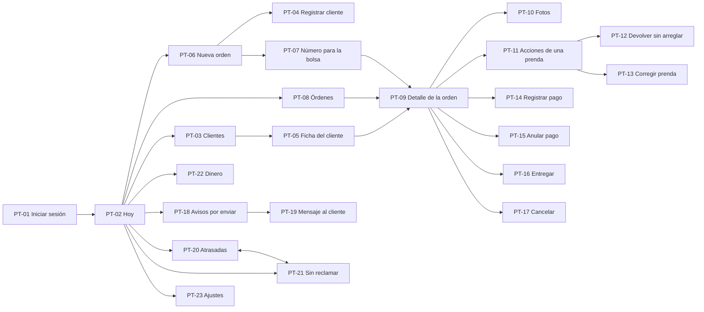

## Datos de ejemplo

Todas las pantallas usan el mismo conjunto de datos, tomado de los ejemplos de las historias de usuario. **Hoy es miércoles 16 de septiembre de 2026.** Los nombres son inventados: no son clientes reales del taller.

| Orden | Cliente | Situación | Debe |
| --- | --- | --- | --- |
| #0030 | Carmen Díaz | Lista desde el sábado 1 de agosto: 46 días sin reclamar, 2 camisas | $16.000 |
| #0039 | María Gómez | Entregada el 25 de agosto | Pagada |
| #0040 | Marta Rincón | Entregada | $12.000 |
| #0041 | Marta Rincón | Cancelada | No suma |
| #0042 | Marta Rincón | Recibida el lunes 7 de septiembre. En proceso: pantalón y camisa terminados, otra camisa pendiente. Valor $31.000, abono $10.000. Tuvo un aviso descartado | $21.000 |
| #0044 | Luis Pardo | En proceso, entrega el sábado 12 de septiembre: 4 días de atraso. Abono de $5.000 | $18.000 |
| #0045 | Sandra Ruiz | En proceso, entrega el martes 15 de septiembre: 1 día de atraso. Tiene un pago anulado y se pagó hoy | Pagada |
| #0046 | Ana Beltrán | Lista hoy; su aviso espera envío asistido | $9.000 |
| #0047 | Rosa Vargas | Se registra en PT-06 | $33.000 |

**Total por cobrar en el panel:** $76.000, de las órdenes #0030, #0040, #0042, #0044 y #0046. **Recibido en septiembre:** $54.000 en 5 pagos. La #0047 aparece solo en el flujo de registro.

Estos datos están también en la base de datos de ejemplo ([datos-de-ejemplo.sql](../modelo-de-datos/datos-de-ejemplo.sql)), y `scripts/verificar_modelo.py` comprueba que las consultas den estas mismas cifras.

## Qué no son

- **No funcionan:** no guardan nada y cada pantalla muestra un solo estado. Los demás estados están descritos en los criterios de aceptación.
- **Las fotos son siluetas de ejemplo**, no fotos reales de prendas.
- **El mensaje de WhatsApp de PT-19 es ilustrativo:** el texto final depende de la plantilla que apruebe Meta (ADR-003).
- **Formularios que se reutilizan:** PT-04 también sirve para corregir un cliente (HU-06), con el título «Corregir cliente». Agregar una prenda a una orden existente (HU-11) usa el mismo bloque de prenda de PT-06.

## Limitaciones

- **Sin validación con la usuaria final.** La dueña no está disponible, y el instructor aprueba el producto terminado, no los mockups por separado (DOC-14). Por eso cada pantalla se contrasta con sus criterios con `generar_mockups.mjs`, y la prueba de usabilidad con 3 compañeros (RNF-12) se hace sobre el sistema construido.
- **Sin wireframes separados.** Se pasó directo a mockups de alta fidelidad, porque el plazo es corto y un HTML navegable permite validar el flujo y el aspecto en una sola revisión.
- **Formato HTML.** Lo eligió el aprendiz el 14 de septiembre de 2026, porque queda versionado y es la base directa de las vistas. Si el instructor pide Figma, las pantallas se trasladan.
- **Apoyo de IA.** Se diseñaron con apoyo de un asistente de IA, como se declara en el plan de sprints; cada decisión está justificada arriba.

## Inventario

<!-- inventario:inicio -->

**23 pantallas.** Esta sección la genera el script; no se edita a mano.

| Código | Pantalla | Historias | Criterios que muestra |
| --- | --- | --- | --- |
| **PT-01** | [Iniciar sesión](pt-01-iniciar-sesion.html) | HU-01 | CA-01.2 |
| **PT-02** | [Panel del día](pt-02-panel-del-dia.html) | HU-32 | CA-32.1, CA-32.2 |
| **PT-03** | [Clientes](pt-03-clientes.html) | HU-04 | CA-04.1, CA-04.3 |
| **PT-04** | [Registrar o corregir un cliente](pt-04-registrar-cliente.html) | HU-03, HU-06, HU-10 | CA-03.3, CA-06.3, CA-10.2 |
| **PT-05** | [Ficha del cliente](pt-05-ficha-cliente.html) | HU-05 | CA-05.1, CA-05.2 |
| **PT-06** | [Nueva orden](pt-06-nueva-orden.html) | HU-07, HU-09, HU-10, HU-17, HU-24 | CA-07.1, CA-07.6, CA-09.1, CA-17.1, CA-17.2, CA-17.4, CA-24.1 |
| **PT-07** | [Número para la bolsa](pt-07-orden-guardada.html) | HU-08 | CA-08.1, CA-24.1 |
| **PT-08** | [Órdenes](pt-08-ordenes.html) | HU-15 | CA-15.1, CA-15.2 |
| **PT-09** | [Detalle de la orden](pt-09-detalle-orden.html) | HU-14, HU-31, HU-11, HU-30 | CA-14.1, CA-31.1, CA-08.3, CA-17.4 |
| **PT-10** | [Fotos de la orden](pt-10-fotos-orden.html) | HU-18 | CA-18.1, CA-18.2 |
| **PT-11** | [Acciones de una prenda](pt-11-acciones-prenda.html) | HU-20 | CA-20.1, CA-20.2, CA-20.5 |
| **PT-12** | [Devolver una prenda sin arreglar](pt-12-devolver-sin-arreglar.html) | HU-36 | CA-36.1, CA-36.2 |
| **PT-13** | [Corregir una prenda](pt-13-editar-prenda.html) | HU-12, HU-13, HU-19 | CA-12.1, CA-19.1 |
| **PT-14** | [Registrar un pago](pt-14-registrar-pago.html) | HU-23 | CA-23.3 |
| **PT-15** | [Anular un pago](pt-15-anular-pago.html) | HU-25 | CA-25.1 |
| **PT-16** | [Entregar la orden](pt-16-entregar-orden.html) | HU-21 | CA-21.2, CA-21.3 |
| **PT-17** | [Cancelar la orden](pt-17-cancelar-orden.html) | HU-22 | CA-22.1 |
| **PT-18** | [Avisos por enviar](pt-18-avisos-pendientes.html) | HU-29, HU-30 | CA-29.1, CA-29.2, CA-29.3, CA-30.2 |
| **PT-19** | [Mensaje en el celular del cliente](pt-19-aviso-cliente.html) | HU-28 | CA-28.1 |
| **PT-20** | [Órdenes atrasadas](pt-20-atrasadas.html) | HU-33 | CA-33.1 |
| **PT-21** | [Órdenes sin reclamar](pt-21-sin-reclamar.html) | HU-34 | CA-34.1 |
| **PT-22** | [Dinero](pt-22-dinero.html) | HU-26, HU-27 | CA-26.1, CA-27.1 |
| **PT-23** | [Ajustes](pt-23-ajustes.html) | HU-02, HU-35, HU-16, HU-01 | CA-02.1, CA-35.1, CA-16.2, CA-01.4 |

### Galería

<table><tr><td valign="top" width="33%">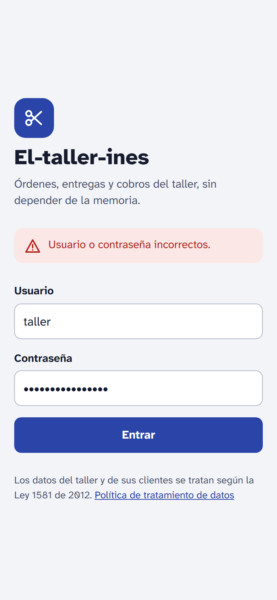 <b>PT-01</b> · Iniciar sesión</td><td valign="top" width="33%">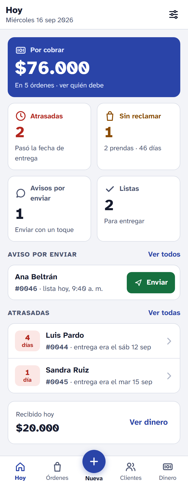 <b>PT-02</b> · Panel del día</td><td valign="top" width="33%">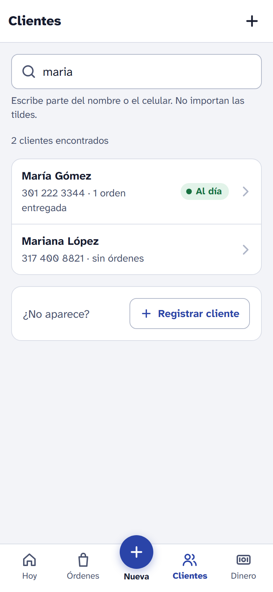 <b>PT-03</b> · Clientes</td></tr><tr><td valign="top" width="33%">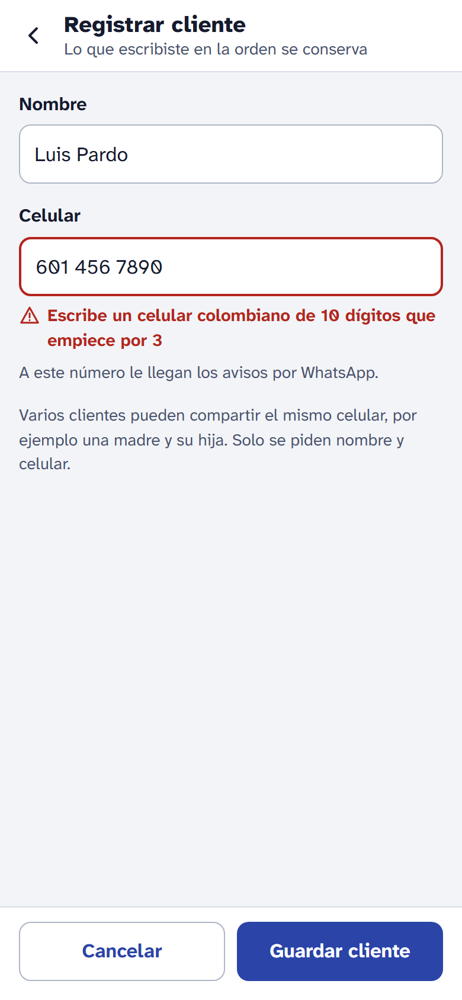 <b>PT-04</b> · Registrar o corregir un cliente</td><td valign="top" width="33%">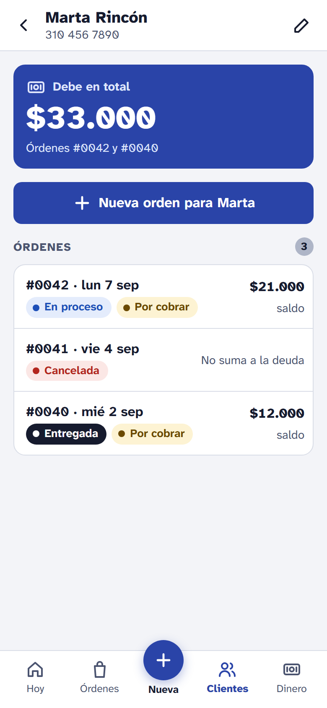 <b>PT-05</b> · Ficha del cliente</td><td valign="top" width="33%">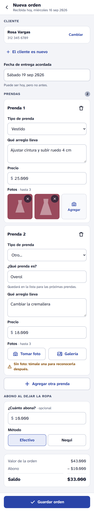 <b>PT-06</b> · Nueva orden</td></tr><tr><td valign="top" width="33%">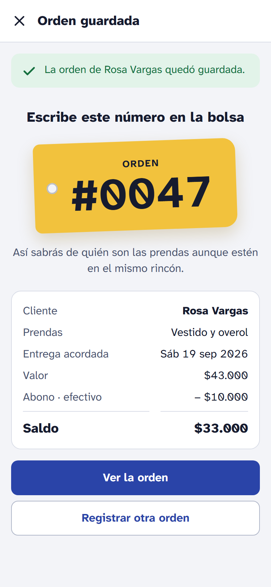 <b>PT-07</b> · Número para la bolsa</td><td valign="top" width="33%">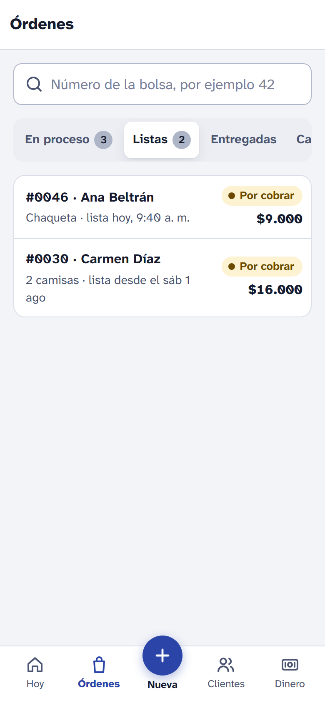 <b>PT-08</b> · Órdenes</td><td valign="top" width="33%">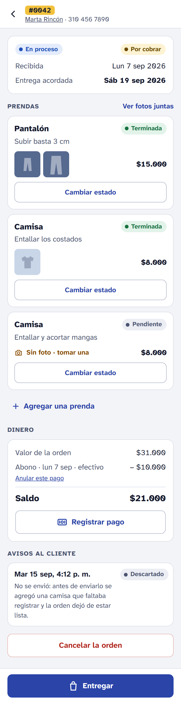 <b>PT-09</b> · Detalle de la orden</td></tr><tr><td valign="top" width="33%">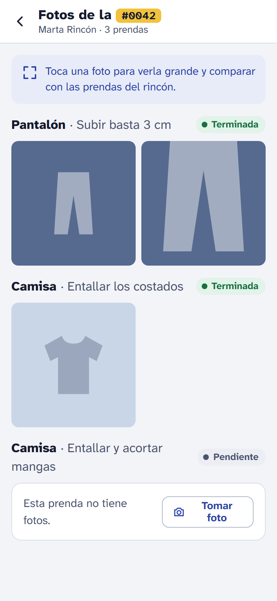 <b>PT-10</b> · Fotos de la orden</td><td valign="top" width="33%">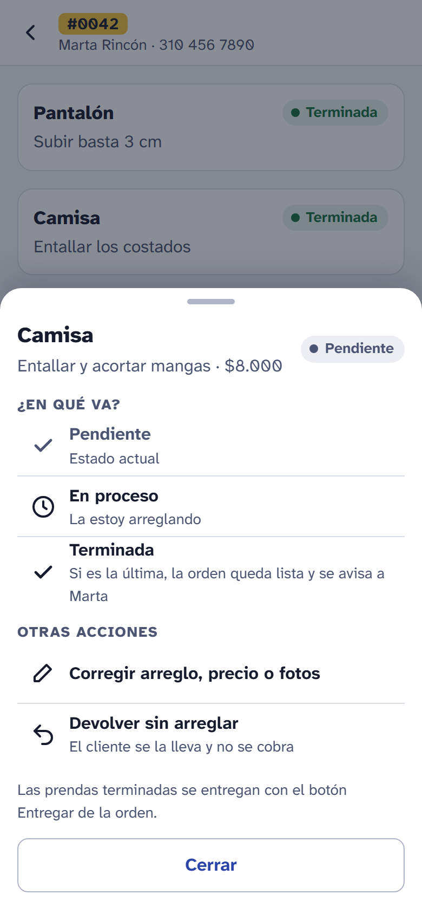 <b>PT-11</b> · Acciones de una prenda</td><td valign="top" width="33%">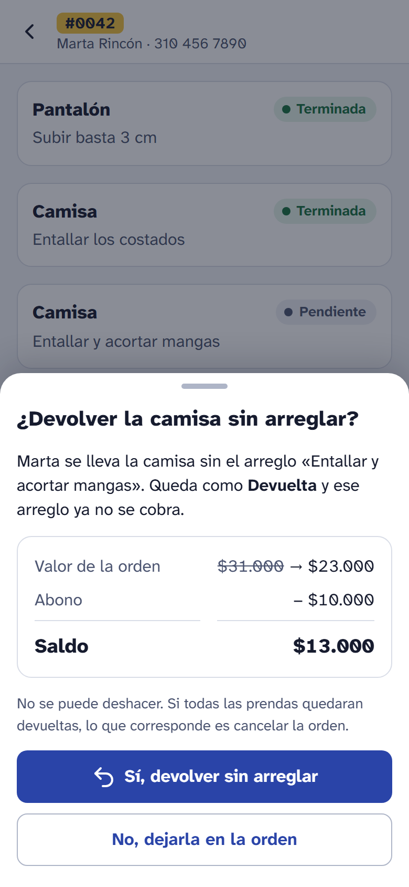 <b>PT-12</b> · Devolver una prenda sin arreglar</td></tr><tr><td valign="top" width="33%">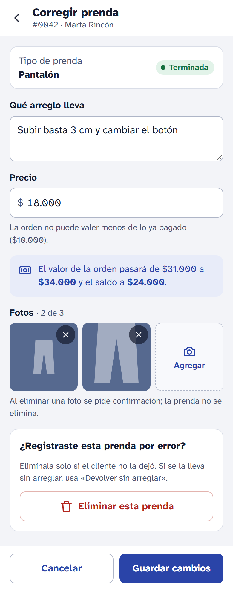 <b>PT-13</b> · Corregir una prenda</td><td valign="top" width="33%">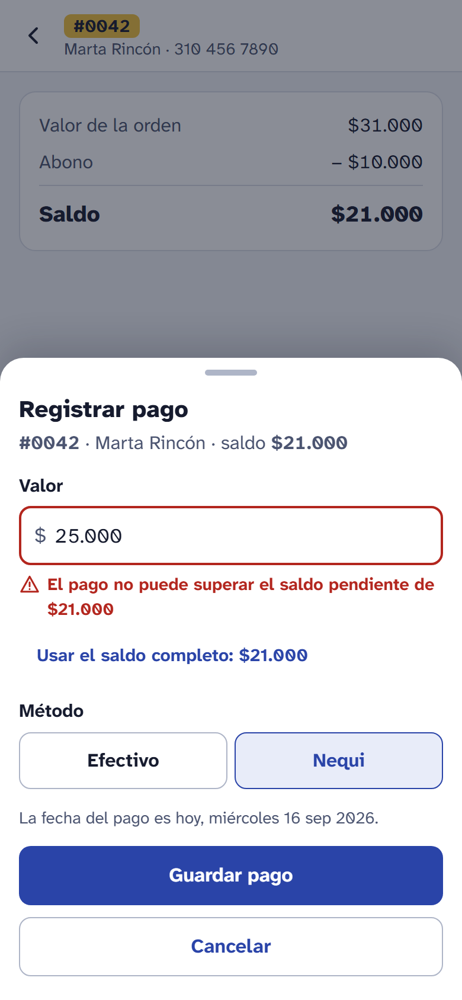 <b>PT-14</b> · Registrar un pago</td><td valign="top" width="33%">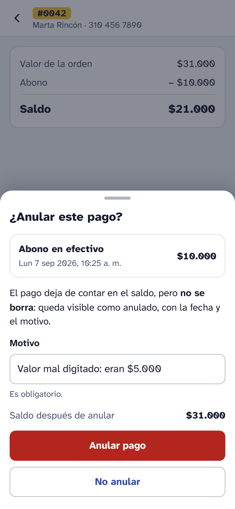 <b>PT-15</b> · Anular un pago</td></tr><tr><td valign="top" width="33%">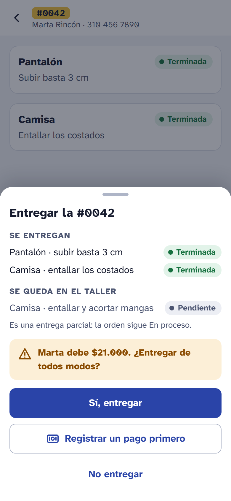 <b>PT-16</b> · Entregar la orden</td><td valign="top" width="33%">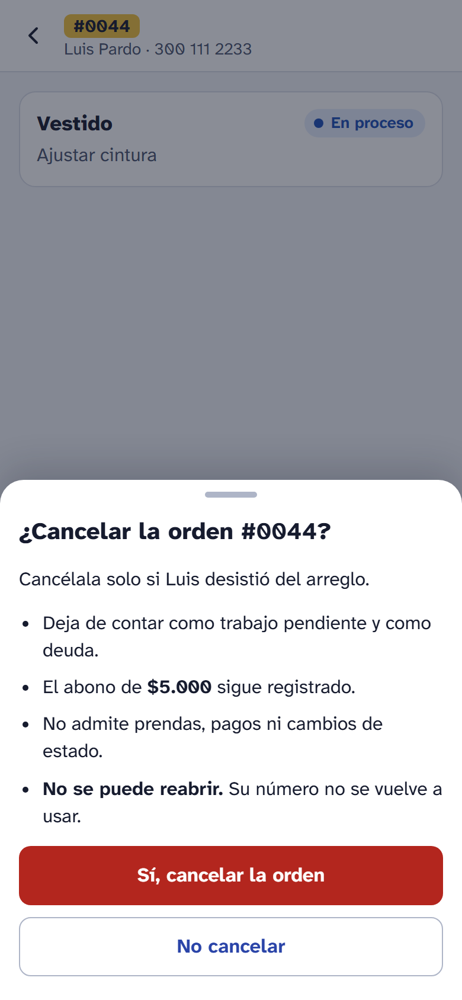 <b>PT-17</b> · Cancelar la orden</td><td valign="top" width="33%">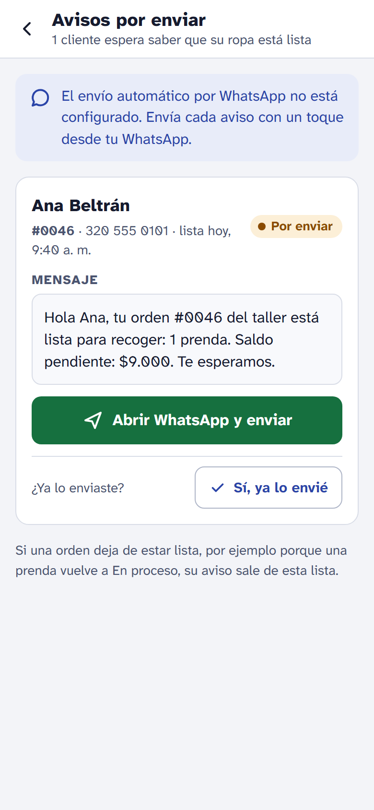 <b>PT-18</b> · Avisos por enviar</td></tr><tr><td valign="top" width="33%">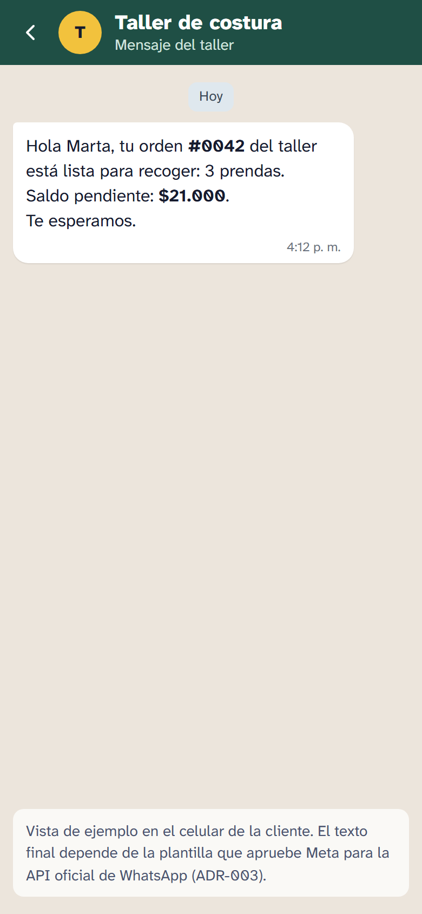 <b>PT-19</b> · Mensaje en el celular del cliente</td><td valign="top" width="33%">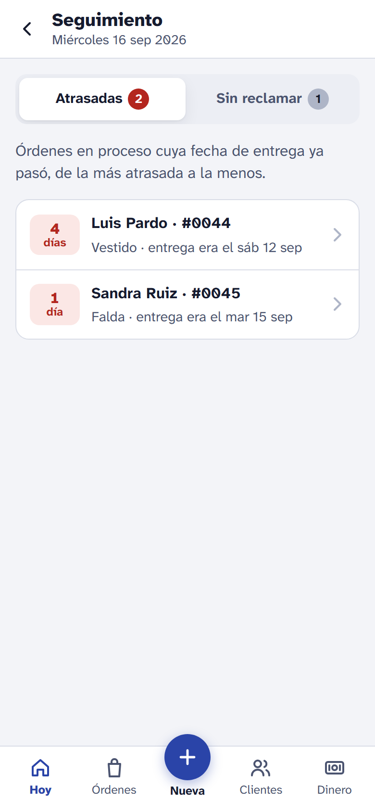 <b>PT-20</b> · Órdenes atrasadas</td><td valign="top" width="33%">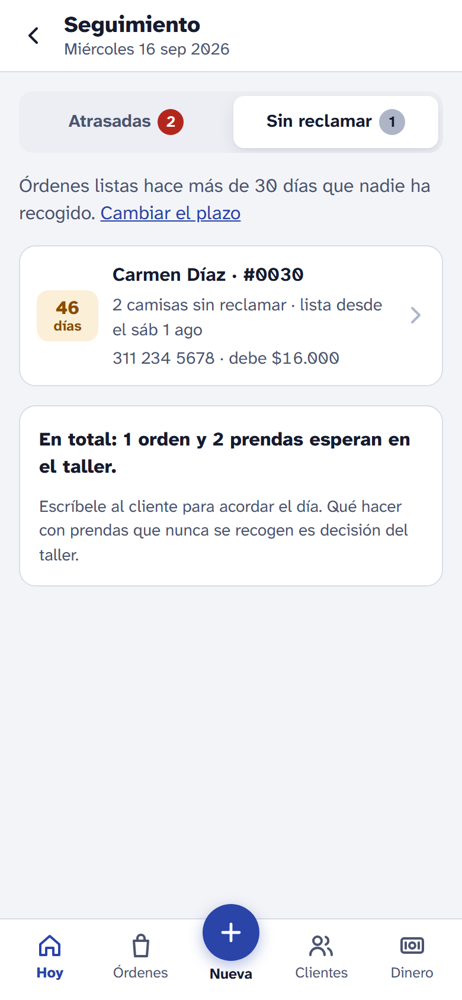 <b>PT-21</b> · Órdenes sin reclamar</td></tr><tr><td valign="top" width="33%">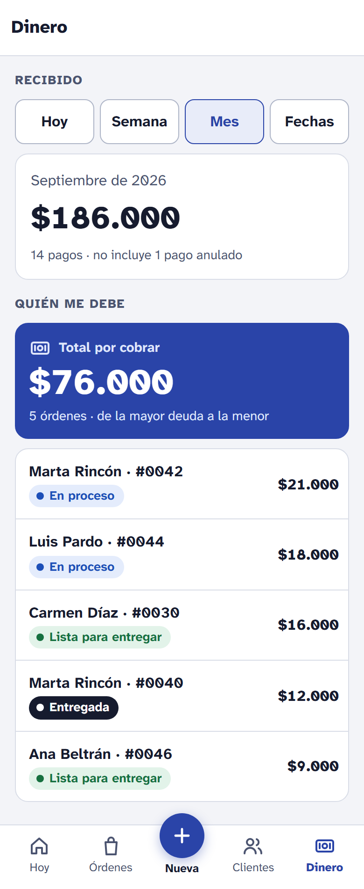 <b>PT-22</b> · Dinero</td><td valign="top" width="33%">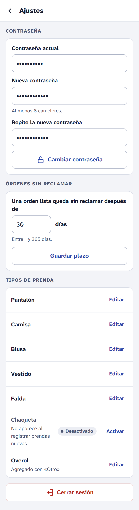 <b>PT-23</b> · Ajustes</td></tr></table>

<!-- inventario:fin -->
