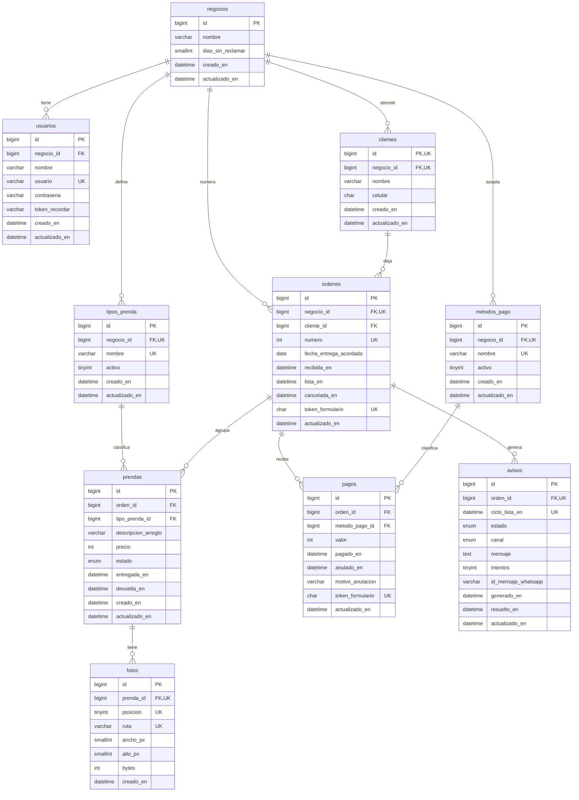

# Modelo de datos

**Estado:** borrador · DOC-17 · adelantado del Sprint 2 · se valida con el instructor

## Para qué sirve

Define qué información guarda el sistema, cómo se relaciona y qué garantiza la base de datos por sí sola. Es la base del diagrama de clases, de la arquitectura y de las migraciones de Laravel del Sprint 3.

## Cómo se construyó

1. **Conceptos:** cada entidad sale de un término del [glosario](../../02-requisitos/reglas-de-negocio.md#glosario) y de las reglas de negocio que lo describen.
2. **Modelo lógico:** entidades, atributos y relaciones, en el diagrama entidad-relación.
3. **Normalización** hasta la tercera forma normal (RNF-32), con una sola excepción documentada en [ADR-004](../adr/ADR-004-negocio-en-ordenes.md).
4. **Modelo físico** para MySQL 8.4 en [esquema.sql](esquema.sql), con un comentario en cada tabla y columna.
5. **Verificación automática:** `python scripts/verificar_modelo.py` crea la base en un MySQL temporal, carga los mismos datos de los mockups, comprueba que las consultas den las cifras de las pantallas y que la base rechace lo que las reglas prohíben. Después genera el [diccionario de datos](diccionario-de-datos.md), el diagrama y la sección de verificación de este documento.

## Convenciones

| Decisión | Por qué |
| --- | --- |
| **Nombres en español**, en minúsculas y con guion bajo; tablas en plural | Son los términos del glosario, los mismos de las pantallas y del código. En Laravel cada modelo declara su tabla, porque el plural automático está en inglés |
| **Llave primaria `id` numérica** en todas las tablas; las claves naturales, como el número de orden, van como clave única | Un número de orden o un nombre de tipo pueden cambiar de formato; el `id` no |
| **Dinero en pesos enteros** (`INT UNSIGNED`) | RN-11. La versión 1 guardaba el dinero con decimales de coma flotante, que redondean mal (F-02) |
| **Fechas y horas en hora de Colombia** (`DATETIME`) | RN-09. Colombia no cambia de horario, así que no hay horas ambiguas; la conexión fija la zona `-05:00` |
| **Collation `utf8mb4_0900_ai_ci`** | Compara sin distinguir mayúsculas ni tildes: la búsqueda de «maria» encuentra «María» (RF-05) y la base impide repetir «Overol» como «overol» (RN-43) |
| **Estados como `ENUM`** | Son un conjunto fijo definido por las reglas (RN-12, RN-41), no datos que la usuaria administre |
| **Columnas de fecha terminadas en `_en`** (`recibida_en`, `lista_en`) | Se lee como el hecho que registran. Los modelos de Laravel apuntan sus marcas de tiempo a estas columnas |

## Entidades

| Tabla | Qué representa | Nace de |
| --- | --- | --- |
| `negocios` | El taller que usa el sistema y su configuración | ADR-002 · RN-01 · RN-35 |
| `usuarios` | La persona que inicia sesión | HU-01 · HU-02 |
| `clientes` | Quien deja prendas y recibe los avisos | RN-02 a RN-04 · HU-03 a HU-06 |
| `tipos_prenda` | La lista de tipos de prenda de cada negocio | RN-10 · RN-43 · HU-09 · HU-16 |
| `metodos_pago` | Los métodos de pago que acepta cada negocio | RN-25 |
| `ordenes` | Lo que un cliente deja en una visita: lo que va en una bolsa | RN-05 a RN-09 · RN-18 a RN-24 · HU-07 · HU-08 |
| `prendas` | Cada pieza de ropa con su arreglo, precio y estado | RN-10 a RN-16 · RN-44 · HU-12 · HU-20 · HU-36 |
| `fotos` | Las fotos que identifican cada prenda | RN-17 · HU-17 a HU-19 |
| `pagos` | Cada pago o abono, incluidos los anulados | RN-25 a RN-31 · HU-23 a HU-25 |
| `avisos` | Cada aviso de orden lista, con su canal y resultado | RN-37 a RN-42 · HU-28 a HU-31 |

## Diagrama entidad-relación

Generado desde la base de datos real. En `ordenes`, `negocio_id` también forma parte de la llave foránea hacia `clientes` (ADR-004).

<!-- diagrama:inicio -->

<!-- diagrama:fin -->

## Normalización

### El punto de partida

Así se vería el registro del taller en una hoja de cálculo, con una fila por orden:

| Número | Cliente | Celular | Prenda 1 | Precio 1 | Prenda 2 | Precio 2 | Prenda 3 | Precio 3 | Abonos | Saldo | Estado |
| --- | --- | --- | --- | --- | --- | --- | --- | --- | --- | --- | --- |
| 42 | Marta Rincón | 3104567890 | Pantalón, subir basta 3 cm | 15.000 | Camisa, entallar | 8.000 | Camisa, acortar mangas | 8.000 | 10.000 | 21.000 | En proceso |
| 40 | Marta Rincón | 3104567890 | Pantalón, ajustar cintura | 20.000 | | | | | 8.000 | 12.000 | Entregada |

Tiene los problemas que la normalización resuelve:

- **Grupos repetidos:** tres columnas de prendas. Si un cliente trae cinco, no caben, y buscar «todas las camisas» obliga a revisar tres columnas.
- **Datos repetidos:** el celular de Marta está en cada orden. Si cambia de número, hay que corregirlo en todas o los avisos llegan a un número viejo.
- **Varios valores en una celda:** «Abonos» mezcla los pagos, sin fecha ni método.
- **Datos que dependen de otros:** el saldo y el estado se escriben a mano y se descuadran, como pasó en la versión 1 (F-02).

### Primera forma normal: un valor por celda, sin grupos repetidos

- Las prendas pasan a su tabla `prendas`, una fila por prenda, sin límite de cantidad.
- Los pagos pasan a `pagos`, cada uno con su valor, fecha y método.
- Las fotos pasan a `fotos`. El máximo de tres (RN-17) no se resuelve con tres columnas, sino con una columna `posicion` de 1 a 3 que no se repite por prenda.

### Segunda forma normal: todo depende de la clave completa

Todas las tablas tienen una llave primaria simple (`id`), así que ninguna columna puede depender de solo una parte de ella. También se revisaron las claves únicas compuestas:
- en `ordenes`, `(negocio_id, numero)`: la fecha acordada o el cliente dependen de la orden completa, no solo del número;
- en `fotos`, `(prenda_id, posicion)`: la ruta de la imagen depende de la prenda y de la posición juntas.

### Tercera forma normal: nada depende de otra columna que no sea clave

- **Nombre y celular del cliente** dependen del cliente, no de la orden: están en `clientes` y la orden solo guarda `cliente_id`.
- **El nombre del tipo de prenda y del método de pago** están en su tabla; la prenda y el pago guardan la referencia.
- **Saldo, valor y estado de la orden no se guardan:** se calculan de las prendas y los pagos (ver abajo).
- **Excepción documentada:** `ordenes.negocio_id` se puede obtener del cliente. Se guarda para que la base garantice que el número de orden no se repita en el negocio (RN-08). Una llave foránea compuesta impide que contradiga al cliente ([ADR-004](../adr/ADR-004-negocio-en-ordenes.md)).

## Qué no se guarda y qué sí

Lo que se calcula no se guarda, para que nunca quede desactualizado:

| Dato | Cómo se obtiene | Regla |
| --- | --- | --- |
| Estado de avance de la orden | Del estado de sus prendas, o de `cancelada_en` | RN-18 · RN-19 |
| Valor de la orden | Suma de los precios de las prendas que no están Devueltas | RN-26 |
| Saldo pendiente | Valor menos los pagos no anulados | RN-27 |
| Estado de pago | Pagada si el saldo es cero; Por cobrar si es mayor | RN-29 |
| Total por cobrar | Suma de los saldos de las órdenes no canceladas | RN-32 |
| Fecha de entrega real de la orden | La última `entregada_en` de sus prendas | RN-23 |
| Días de atraso y de espera | Diferencia entre hoy y la fecha acordada o `lista_en` | RN-34 · RN-36 |

Algunos datos parecen calculables, pero se guardan porque registran un hecho del momento:

| Dato | Por qué se guarda |
| --- | --- |
| `ordenes.lista_en` | Es el momento exacto en que la orden quedó lista. Después de un retoque o de una prenda agregada ya no se puede reconstruir, y es la base de las órdenes sin reclamar (RN-22, RN-35) |
| `avisos.ciclo_lista_en` | Identifica a cuál de las veces que la orden quedó lista pertenece el aviso; con él la base impide dos avisos para la misma vez (RN-38) |
| `avisos.mensaje` | Es el texto que realmente se envió, con el saldo de ese momento (RN-42) |
| `prendas.precio` y `pagos.valor` | Son lo acordado y lo pagado ese día. No hay lista de precios que los determine |

## Dónde se garantiza cada regla

Cada regla se protege en el lugar más cercano a los datos donde se puede expresar:
- **Base de datos:** restricciones que ningún código puede saltarse.
- **Aplicación:** reglas que dependen del estado anterior o de otras filas; van en la capa de dominio definida en la arquitectura (RNF-27) y se prueban (RNF-28).
- **Consulta:** datos que se calculan al leer.

| Regla | Base de datos | Aplicación | Consulta |
| --- | --- | --- | --- |
| **RN-01** | `negocio_id` en las tablas raíz; llave compuesta de `ordenes` hacia `clientes` | Filtro global por negocio (ADR-002); el tipo de prenda y el método de pago deben ser del mismo negocio | Toda consulta filtra por negocio |
| **RN-02** | `NOT NULL` y `ck_clientes_nombre` | Mensaje junto al campo (RNF-09) | — |
| **RN-03** | `ck_clientes_celular` | Mensaje junto al campo | — |
| **RN-04** | Sin clave única en `celular` | — | — |
| **RN-05** | `ordenes.cliente_id` obligatorio | — | — |
| **RN-06** | — | La orden y sus prendas se guardan en una transacción; no se elimina ni se devuelve la última prenda | — |
| **RN-07** | `ck_ordenes_entrega` | Mensaje junto al campo | — |
| **RN-08** | `uq_ordenes_negocio_numero` | Número siguiente con la fila del negocio bloqueada (ADR-004) | Formato `#0042` al mostrar |
| **RN-09** | Zona horaria de la conexión | Zona horaria de la aplicación | «Hoy» en hora de Colombia |
| **RN-10** | `NOT NULL`, `fk_prendas_tipo` y `ck_prendas_descripcion` | — | — |
| **RN-11** | `INT UNSIGNED` y `ck_prendas_precio` | — | — |
| **RN-12** | `ENUM` con valor inicial `pendiente` | — | — |
| **RN-13** | — | Solo se ofrece Entregada desde Terminada | — |
| **RN-14** | — | Terminada puede volver a En proceso | — |
| **RN-15** | — | Una prenda Entregada o Devuelta no se edita | — |
| **RN-16** | — | Se compara con lo pagado dentro de una transacción | — |
| **RN-17** | `ck_fotos_posicion` y `uq_fotos_prenda_posicion`; `ON DELETE CASCADE` | Reduce la imagen antes de guardarla | — |
| **RN-18** | Sin columna de estado en `ordenes` | — | Estado derivado de las prendas |
| **RN-19** | Sin columna de estado que editar | No existe la acción de cambiar el estado de la orden | — |
| **RN-20** | — | Entregar marca Entregadas las prendas Terminadas | — |
| **RN-21** | — | Confirmación con el saldo antes de entregar | — |
| **RN-22** | Columna `lista_en` | Se registra al quedar lista y se borra al volver a En proceso | — |
| **RN-23** | `ck_prendas_entregada` | Registra la hora de cada prenda entregada | Última entrega de la orden |
| **RN-24** | Columna `cancelada_en` | Bloquea prendas, pagos y cambios en una orden cancelada | — |
| **RN-25** | `NOT NULL`, `fk_pagos_metodo` y `ck_pagos_valor` | — | — |
| **RN-26** | — | — | Suma de precios sin las prendas devueltas |
| **RN-27** | Sin columna de saldo | — | Valor menos pagos no anulados |
| **RN-28** | `uq_pagos_token_formulario` evita el doble registro | Compara con el saldo al guardar, con la orden bloqueada | — |
| **RN-29** | — | — | Pagada o Por cobrar según el saldo |
| **RN-30** | — | Permite pagos en órdenes entregadas y los bloquea en canceladas | — |
| **RN-31** | `fk_pagos_orden` impide borrar; `ck_pagos_anulacion` y `ck_pagos_motivo` | No existe la acción de borrar un pago | Los anulados no suman |
| **RN-32** | — | — | Suma de saldos de órdenes no canceladas |
| **RN-33** | Índice `ix_pagos_pagado_en` | — | Suma de pagos no anulados del período |
| **RN-34** | Índice `ix_ordenes_negocio_entrega` | — | En proceso con fecha acordada anterior a hoy |
| **RN-35** | `ck_negocios_dias_sin_reclamar` | — | Lista por más días que el plazo del negocio |
| **RN-36** | — | — | Días calendario desde `lista_en` |
| **RN-37** | — | El evento de orden lista genera el aviso (ADR-003) | — |
| **RN-38** | `uq_avisos_orden_ciclo` | — | — |
| **RN-39** | Estado `descartado` y `ck_avisos_descartado` | Revisa el estado de la orden antes de enviar | — |
| **RN-40** | `ENUM` de canal y estado `pendiente_asistido` | Intenta la API oficial y pasa a envío asistido | Lista de avisos por enviar |
| **RN-41** | `ck_avisos_enviado` | Registra canal, mensaje y resultado | — |
| **RN-42** | Columna `mensaje` | Arma el mensaje con los datos del momento del envío | — |
| **RN-43** | `uq_tipos_prenda_negocio_nombre` con collation sin tildes ni mayúsculas | Usa el tipo existente si ya está | — |
| **RN-44** | Estado `devuelta` y `ck_prendas_devuelta` | Solo desde Pendiente o En proceso, sin dejar la orden sin prendas | Las devueltas no suman al valor |

## Índices y volumen

El volumen de referencia a 3 años es pequeño (RNF-01):

| Tabla | Filas |
| --- | --- |
| Clientes | 500 |
| Órdenes | 750 |
| Prendas | 2.200 |
| Fotos | 6.600 |
| Pagos | 1.500 |

Los índices se eligieron por las consultas que se hacen todos los días, no por el tamaño:

| Consulta | Índice |
| --- | --- |
| Buscar clientes por nombre o celular | `ix_clientes_negocio_nombre`, `ix_clientes_negocio_celular` |
| Buscar una orden por su número | `uq_ordenes_negocio_numero` |
| Órdenes atrasadas | `ix_ordenes_negocio_entrega` |
| Órdenes sin reclamar | `ix_ordenes_negocio_lista` |
| Prendas de una orden y su estado | `ix_prendas_orden_estado` |
| Dinero recibido en un período | `ix_pagos_pagado_en` |
| Avisos por enviar | `ix_avisos_estado` |

## Tablas del framework

Laravel crea además tablas técnicas que no forman parte del modelo del negocio:
- `sessions`: sesiones y su expiración (RNF-21);
- `jobs` y `failed_jobs`: cola de envío de avisos (ADR-003);
- `cache` y `cache_locks`: límite de intentos de inicio de sesión (RNF-20);
- `migrations`: versión del esquema (RNF-31).

## Verificación

<!-- verificacion:inicio -->

Resultado de `python scripts/verificar_modelo.py` sobre MySQL 8.4.7: **17 de 17 consultas** dan las cifras de los mockups y **32 de 32 pruebas** de restricciones se comportan como exigen las reglas.

### Consultas de referencia

| Consulta | Reglas | Pantallas | Resultado |
| --- | --- | --- | --- |
| Estado, valor y saldo de cada orden | RN-18, RN-26, RN-27, RN-29 | PT-05, PT-09, PT-22 | `30\|Lista para entregar\|16000\|16000\|Por cobrar / 39\|Entregada\|10000\|0\|Pagada / 40\|Entregada\|20000\|12000\|Por cobrar / 41\|Cancelada\|8000\|8000\|Cancelada / 42\|En proceso\|31000\|21000\|Por cobrar / 44\|En proceso\|23000\|18000\|Por cobrar / 45\|En proceso\|20000\|0\|Pagada / 46\|Lista para entregar\|20000\|9000\|Por cobrar` |
| Número visible de una orden | RN-08 | PT-07, PT-09 | `#0042` |
| Siguiente número de orden en cada negocio | RN-08 | PT-07 | `47\|2` |
| Total por cobrar del negocio | RN-32 | PT-02, PT-22 | `76000\|5` |
| Quién me debe, de la mayor deuda a la menor | RN-29, RN-32 | PT-22 | `42\|21000 / 44\|18000 / 30\|16000 / 40\|12000 / 46\|9000` |
| Órdenes atrasadas con sus días de atraso | RN-09, RN-34 | PT-02, PT-20 | `44\|4 / 45\|1` |
| Órdenes sin reclamar con sus días de espera y prendas | RN-35, RN-36 | PT-02, PT-21 | `30\|46\|2` |
| Órdenes listas para entregar | RN-18 | PT-02, PT-08 | `2` |
| Avisos por enviar con un toque | RN-40 | PT-02, PT-18 | `46` |
| Dinero recibido hoy | RN-09, RN-33 | PT-02 | `20000` |
| Dinero recibido en septiembre, pagos válidos y anulados | RN-31, RN-33 | PT-22 | `54000\|5\|1` |
| Ficha de Marta Rincón: órdenes y total que debe | RN-27, RN-29, RN-32 | PT-05 | `3\|33000` |
| Fecha de entrega real de las órdenes entregadas | RN-20, RN-23 | PT-05 | `39\|2026-08-25 10:00 / 40\|2026-09-10 11:20` |
| Buscar «maria» sin tildes ni mayúsculas | RN-01 | PT-03 | `María Gómez / Mariana López` |
| Buscar «marta» solo en el propio negocio | RN-01 | PT-03 | `Marta Rincón` |
| Tipos de prenda que se ofrecen al registrar | RN-43 | PT-06, PT-23 | `Blusa / Camisa / Falda / Overol / Pantalón / Vestido` |
| Una devolución sin arreglar baja el valor y el saldo | RN-26, RN-27, RN-44 | PT-12 | `23000\|13000` |

### La base de datos rechaza lo que las reglas prohíben

| Regla | Caso | Debe | Resultado |
| --- | --- | --- | --- |
| RN-02 | Cliente con el nombre vacío | Rechazarse | Rechazada por `ck_clientes_nombre` |
| RN-03 | Celular fijo 6014567890 | Rechazarse | Rechazada por `ck_clientes_celular` |
| RN-03 | Celular de 9 dígitos | Rechazarse | Rechazada por `ck_clientes_celular` |
| RN-04 | Dos clientes con el mismo celular | Aceptarse | Aceptada |
| RN-01 | Orden de un negocio con un cliente de otro | Rechazarse | Rechazada por `fk_ordenes_cliente` |
| RN-07 | Entrega antes de la recepción | Rechazarse | Rechazada por `ck_ordenes_entrega` |
| RN-07 | Entrega el mismo día de la recepción | Aceptarse | Aceptada |
| RN-08 | Número de orden repetido en el mismo negocio | Rechazarse | Rechazada por `uq_ordenes_negocio_numero` |
| RN-08 | El mismo número en otro negocio | Aceptarse | Aceptada |
| RN-10 | Prenda sin descripción del arreglo | Rechazarse | Rechazada por `ck_prendas_descripcion` |
| RN-11 | Prenda con precio $0 | Rechazarse | Rechazada por `ck_prendas_precio` |
| RN-12 | Estado de prenda que no existe | Rechazarse | Rechazada por `estado` |
| RN-17 | Cuarta foto de una prenda | Rechazarse | Rechazada por `ck_fotos_posicion` |
| RN-17 | Dos fotos en el mismo lugar | Rechazarse | Rechazada por `uq_fotos_prenda_posicion` |
| RN-17 | Tercera foto de una prenda | Aceptarse | Aceptada |
| RN-17 | Eliminar una prenda elimina sus fotos | Aceptarse | Aceptada |
| RNF-03 | Foto de más de 1.600 px en su lado mayor | Rechazarse | Rechazada por `ck_fotos_lado_mayor` |
| RN-23 | Prenda Entregada sin fecha de entrega | Rechazarse | Rechazada por `ck_prendas_entregada` |
| RN-25 | Pago de $0 | Rechazarse | Rechazada por `ck_pagos_valor` |
| RN-31 | Anular un pago sin motivo | Rechazarse | Rechazada por `ck_pagos_anulacion` |
| RN-31 | Anular un pago con motivo | Aceptarse | Aceptada |
| RN-31 | Borrar una orden que tiene prendas y pagos | Rechazarse | Rechazada por `fk_avisos_orden` |
| RN-35 | Plazo sin reclamar de 400 días | Rechazarse | Rechazada por `ck_negocios_dias_sin_reclamar` |
| RN-35 | Plazo sin reclamar de 0 días | Rechazarse | Rechazada por `ck_negocios_dias_sin_reclamar` |
| RN-38 | Segundo aviso para la misma vez que la orden quedó lista | Rechazarse | Rechazada por `uq_avisos_orden_ciclo` |
| RN-41 | Aviso marcado como enviado sin canal ni mensaje | Rechazarse | Rechazada por `ck_avisos_enviado` |
| RN-43 | Tipo «overol» repetido sin distinguir mayúsculas | Rechazarse | Rechazada por `uq_tipos_prenda_negocio_nombre` |
| RN-43 | Tipo «PANTALON» repetido sin distinguir tildes | Rechazarse | Rechazada por `uq_tipos_prenda_negocio_nombre` |
| RN-43 | Tipo nuevo «Enterizo» escrito con «Otro» | Aceptarse | Aceptada |
| RN-44 | Prenda Devuelta sin fecha de devolución | Rechazarse | Rechazada por `ck_prendas_devuelta` |
| RN-44 | Prenda Devuelta con su fecha | Aceptarse | Aceptada |
| RNF-14 | El mismo formulario de pago enviado dos veces | Rechazarse | Rechazada por `uq_pagos_token_formulario` |

<!-- verificacion:fin -->

## Archivos

| Archivo | Contenido |
| --- | --- |
| [esquema.sql](esquema.sql) | Tablas, llaves, índices y restricciones para MySQL 8.4 |
| [datos-de-ejemplo.sql](datos-de-ejemplo.sql) | Los datos de los mockups y un segundo negocio para probar el aislamiento |
| [consultas-de-referencia.sql](consultas-de-referencia.sql) | Cómo se calcula lo que no se guarda, con su resultado esperado |
| [diccionario-de-datos.md](diccionario-de-datos.md) | Cada tabla y columna con su tipo, restricciones y descripción, generado desde la base |

## Pendiente

- Validar el modelo con el instructor.
- En el Sprint 3, las migraciones de Laravel deben producir este mismo esquema; se comprobará comparando la estructura de ambas bases.
