# Manual de usuario · Puntada

**Entregable:** DOC-22 · **Versión del sistema:** la desplegada el 22 de septiembre de 2026 · **APK:** 1.0.0 · [English version](user-manual.md)

Este manual es para la dueña del taller: la persona que recibe las prendas, las arregla, cobra y las entrega. Explica cómo instalar la app en el celular y cómo hacer cada tarea del día.

Las imágenes son del sistema real con **datos de ejemplo**: Marta Rincón, Ana Beltrán y los demás clientes no existen.

## Contenido

1. [Qué hace el sistema](#1-qué-hace-el-sistema)
2. [Instalar la app](#2-instalar-la-app)
3. [Entrar y salir](#3-entrar-y-salir)
4. [La pantalla Hoy](#4-la-pantalla-hoy)
5. [Clientes](#5-clientes)
6. [Registrar una orden](#6-registrar-una-orden)
7. [Buscar y ver las órdenes](#7-buscar-y-ver-las-órdenes)
8. [Trabajar las prendas](#8-trabajar-las-prendas)
9. [Cobrar](#9-cobrar)
10. [Entregar](#10-entregar)
11. [Avisar al cliente por WhatsApp](#11-avisar-al-cliente-por-whatsapp)
12. [Órdenes atrasadas y sin reclamar](#12-órdenes-atrasadas-y-sin-reclamar)
13. [Cancelar una orden](#13-cancelar-una-orden)
14. [Sin internet](#14-sin-internet)
15. [Problemas frecuentes](#15-problemas-frecuentes)
16. [Cuidar los datos de tus clientes](#16-cuidar-los-datos-de-tus-clientes)

## 1. Qué hace el sistema

Reemplaza el cuaderno y la memoria. Con él:

- cada prenda que recibes queda anotada, con su arreglo, su precio y hasta 3 fotos;
- cada orden tiene un **número** que escribes en la bolsa, así sabes de quién es la ropa aunque esté mezclada en el rincón;
- sabes cuánto te debe cada cliente, porque los abonos y pagos restan solos, y cuánto dinero recibiste en el día, la semana o el mes;
- cuando una orden queda lista, el cliente recibe un **aviso por WhatsApp**;
- la pantalla **Hoy** te dice qué necesita tu atención: cobros, entregas atrasadas y avisos.

**Las palabras que usa el sistema:**

| Palabra | Qué significa |
| --- | --- |
| **Orden** | Todo lo que un cliente deja en una visita. Tiene un número, como #0042 |
| **Prenda** | Cada pieza de ropa de la orden, con su arreglo y su precio |
| **Estado de la prenda** | Pendiente → En proceso → Terminada → Entregada |
| **Estado de la orden** | Se calcula solo, a partir de sus prendas: **En proceso**, **Lista** (todo terminado), **Entregada** o **Cancelada** |
| **Saldo** | Lo que falta por pagar: el valor de la orden menos lo pagado |
| **Aviso** | El mensaje de WhatsApp que le dice al cliente que su ropa está lista |

## 2. Instalar la app

Puedes usar el sistema desde el navegador, pero en el celular es más cómodo instalarlo: queda un ícono **Taller** en la pantalla de inicio y abre a pantalla completa, como cualquier app.

### En Android: con el APK

1. En el celular, abre **Chrome** y entra a:
   **https://proyectosena.online/taller/descargas/taller.apk**
2. Chrome puede advertir que el archivo podría ser dañino. Toca **Descargar de todos modos**. La app viene del mismo sitio del sistema.
3. Cuando termine la descarga, toca **Abrir**.
4. La primera vez, Android dice que por seguridad no permite instalar apps de esa fuente. Toca **Configuración**, activa **Permitir de esta fuente** y vuelve atrás.
5. Toca **Instalar**. Si Play Protect pregunta por una app que no reconoce, toca **Instalar de todos modos**.
6. Abre **Taller** desde la pantalla de inicio.

Los nombres de los botones cambian un poco según la marca y la versión de Android, pero los pasos son los mismos.

> **Si al abrir la app ves la barra del navegador un par de segundos:** pasa cuando el navegador principal del celular no es Chrome, por ejemplo Brave. La app funciona igual. Para que abra directo, pon Chrome como navegador predeterminado en **Ajustes → Aplicaciones → Apps predeterminadas → Navegador**.

### En otro celular o en el computador: desde el navegador

1. Abre **https://proyectosena.online/taller/** en Chrome o Edge.
2. Busca la opción de instalar: en el celular, en el menú **⋮ → Instalar app** (o **Agregar a la pantalla principal**); en el computador, el ícono de instalar en la barra de dirección.
3. Queda un ícono **Taller** que abre el sistema en su propia ventana.

En iPhone el sistema funciona desde Safari, pero no está probado para instalarse como app.

## 3. Entrar y salir

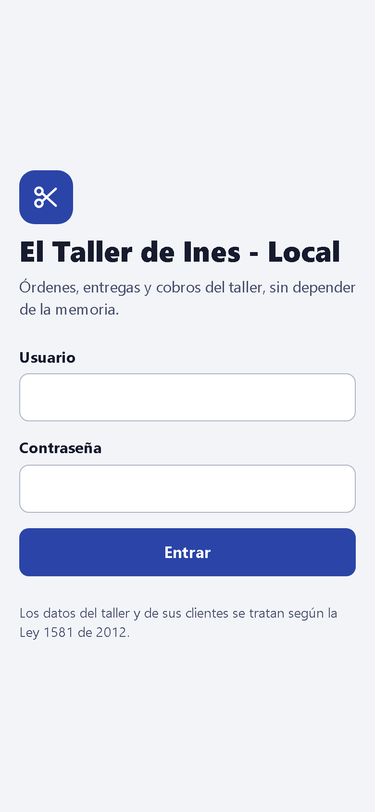

**Entrar:** escribe tu **Usuario** y tu **Contraseña** y toca **Entrar**. Los dos te los entrega quien instaló el sistema.

- Si alguno está mal, el sistema dice «Usuario o contraseña incorrectos», sin decir cuál de los dos, para que nadie adivine tu usuario.
- Después de varios intentos fallidos seguidos tienes que esperar unos segundos antes de volver a intentar. El mensaje te dice cuántos.

**Entrar con Google, sin contraseña:** si quien te instaló el sistema registró tu correo de Google, debajo del botón Entrar aparece **Entrar con Google**. Tócalo, elige tu cuenta y ya estás adentro. No tienes que acordarte de ninguna contraseña.

- Si no ves ese botón, es que tu correo no quedó registrado: entra con usuario y contraseña, y pídele a quien te instaló el sistema que lo agregue.
- Si eliges una cuenta de Google distinta a la registrada, el sistema no te deja entrar y te lo dice. No pasa nada malo: vuelve a intentar con la tuya.

**Salir:** en **Hoy**, toca el ícono de ajustes (arriba a la derecha) y luego **Cerrar sesión**. Hazlo siempre si le prestas el celular a alguien o usas un computador que no es tuyo.

**Cambiar la contraseña:** en **Ajustes**, escribe la **Contraseña actual**, la **Nueva contraseña** (al menos 8 caracteres) y repítela. Toca **Cambiar contraseña**.

 

## 4. La pantalla Hoy

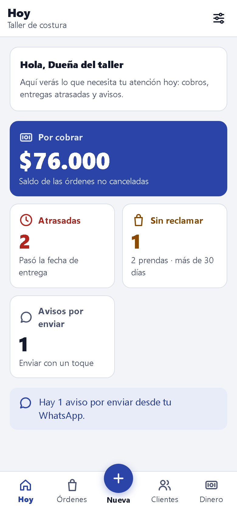

Es lo primero que ves al entrar. Te muestra lo que necesita tu atención:

| Tarjeta | Qué te dice | Al tocarla |
| --- | --- | --- |
| **Por cobrar** | Cuánto te deben en total, sumando las órdenes que no están canceladas | Ves quién te debe y cuánto has recibido ([sección 9](#9-cobrar)) |
| **Atrasadas** | Cuántas órdenes pasaron su fecha de entrega sin estar listas | Ves cuáles son ([sección 12](#12-órdenes-atrasadas-y-sin-reclamar)) |
| **Sin reclamar** | Cuántas órdenes llevan más de 30 días listas sin que nadie las recoja | Ves cuáles son y cuánto deben |
| **Avisos por enviar** | Cuántos avisos de WhatsApp no salieron solos y tienes que enviar tú | Los envías con un toque ([sección 11](#11-avisar-al-cliente-por-whatsapp)) |

**La barra de abajo** está en casi todas las pantallas: **Hoy**, **Órdenes**, **Nueva** (el botón redondo, para registrar una orden), **Clientes** y **Dinero**.

 

## 5. Clientes

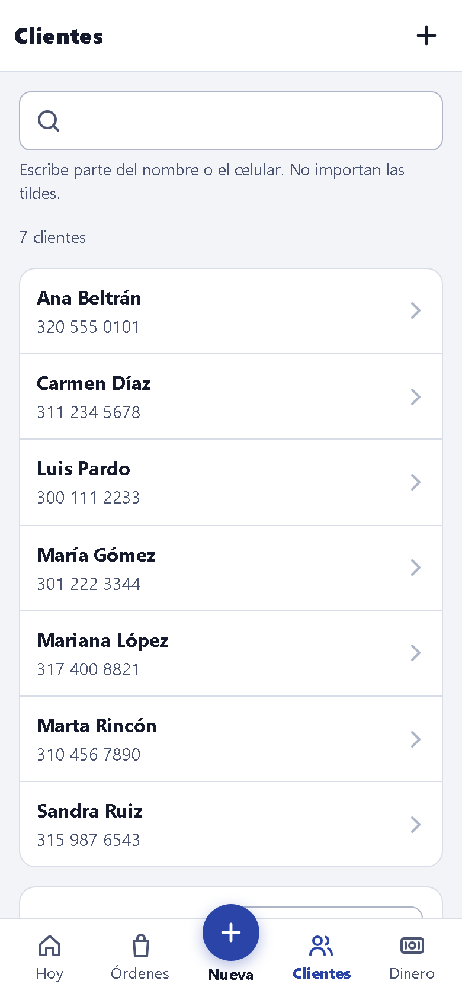

Toca **Clientes** en la barra de abajo.

**Buscar:** escribe parte del nombre o del celular. No importan las tildes: «marta rincon» encuentra a Marta Rincón.

**Registrar un cliente:** toca **Registrar cliente** (abajo de la lista, en «¿No aparece?»). Solo se piden **Nombre** y **Celular**.

- Al celular le llegan los avisos por WhatsApp, así que escríbelo bien.
- Varios clientes pueden compartir el mismo celular, por ejemplo una madre y su hija.

 

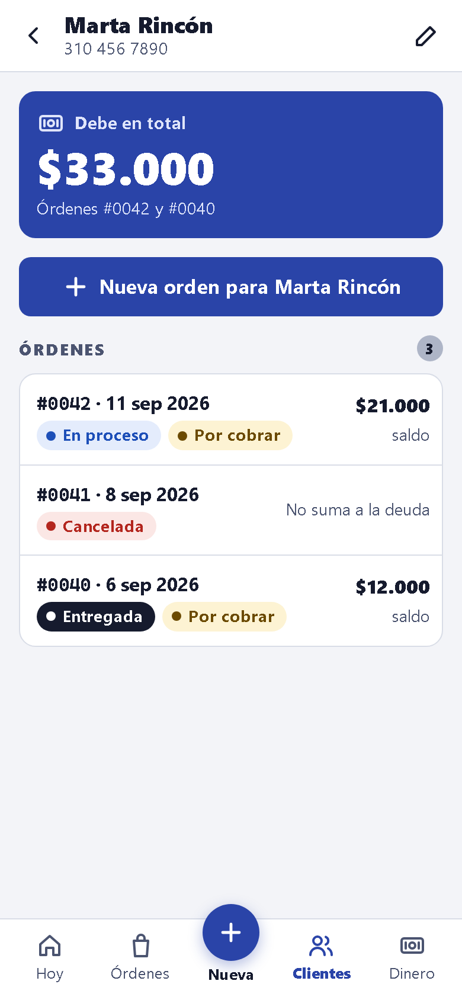

**La ficha del cliente:** toca un cliente para verla. Muestra cuánto **debe en total** y en qué órdenes, y todas sus órdenes con su estado y su saldo. Una orden cancelada aparece con «No suma a la deuda».

- **Nueva orden para…** registra una orden para ese cliente, ya elegido.
- **Corregir sus datos:** toca el lápiz de arriba a la derecha.

 

## 6. Registrar una orden

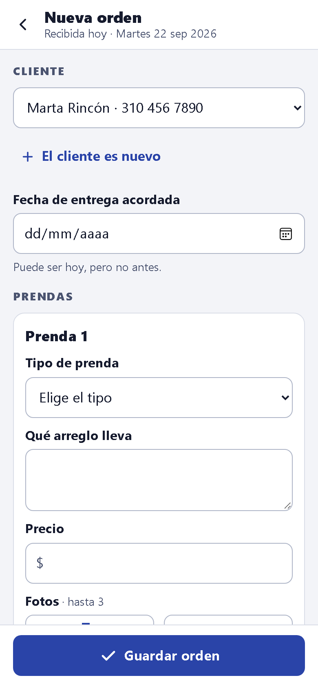

Toca **Nueva** (el botón redondo de la barra de abajo).

1. **Cliente:** elígelo de la lista. Si es nuevo, **regístralo antes de llenar la orden**: toca **El cliente es nuevo**, guárdalo y, en su ficha, toca **Nueva orden para…**. Lo que ya hubieras escrito en la orden no se conserva.
2. **Fecha de entrega acordada:** la que le prometiste al cliente. Puede ser hoy, pero no antes.
3. **Cada prenda:**
   - **Tipo de prenda:** elige de la lista. Si no está, elige **Otro…** y escribe qué prenda es; quedará en la lista para las próximas.
   - **Qué arreglo lleva:** por ejemplo «Subir basta 3 cm».
   - **Precio:** en pesos, sin centavos. Puedes escribir «15000» o «15.000».
   - **Fotos (hasta 3):** **Tomar foto** abre la cámara; **Galería** elige fotos que ya tienes. El sistema las reduce solo para que no gasten tus datos. Si la prenda no tiene foto, el sistema te lo recuerda: una foto ayuda a reconocerla en el rincón.
4. ¿El cliente dejó más de una prenda? Toca **Agregar otra prenda**. Para quitar una, toca la caneca de esa prenda.
5. Toca **Guardar orden**.

 

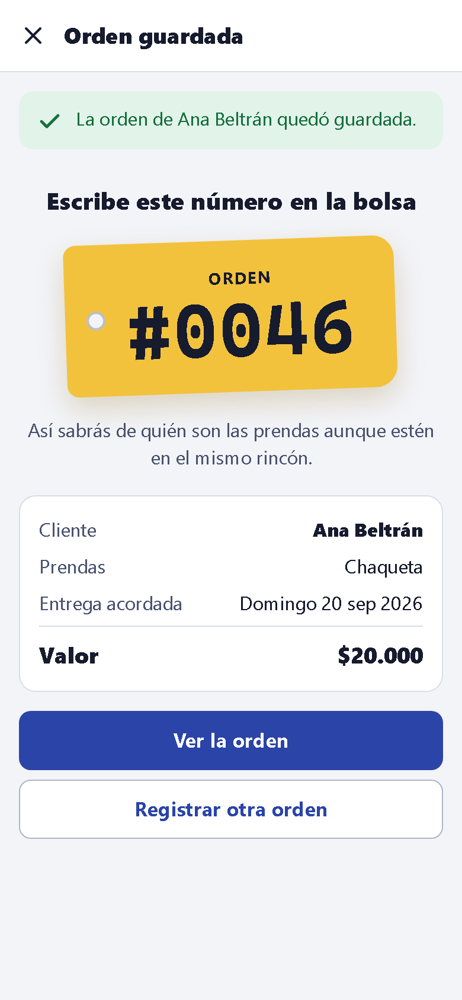

**Escribe el número en la bolsa.** Al guardar, el sistema muestra el número de la orden en grande, por ejemplo **#0046**. Escríbelo en la bolsa o en una etiqueta: así sabrás de quién son las prendas aunque estén en el mismo rincón.

Desde ahí puedes **Ver la orden** o **Registrar otra orden**.

Si tocas **Guardar orden** dos veces seguidas no se crean dos órdenes: el sistema guarda una sola.

 

## 7. Buscar y ver las órdenes

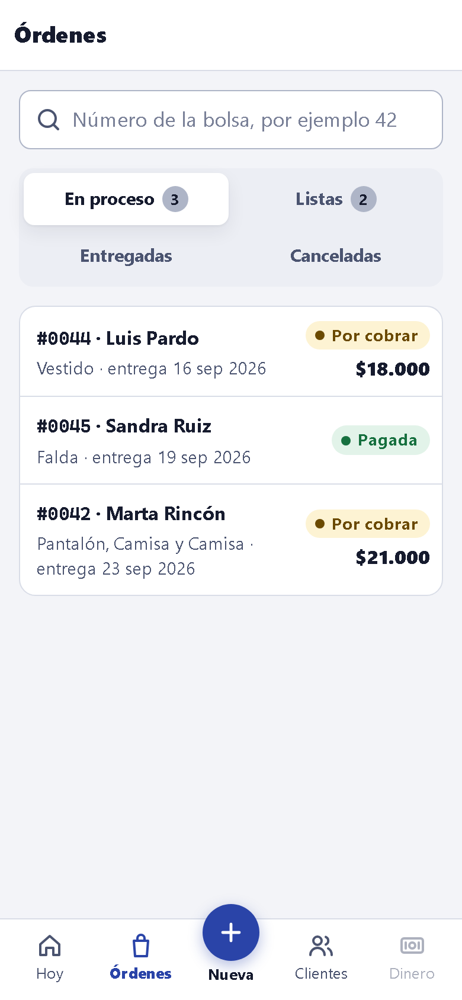

Toca **Órdenes** en la barra de abajo.

- **Pestañas:** **En proceso**, **Listas**, **Entregadas** y **Canceladas**. Las dos primeras muestran cuántas hay.
- **Buscar orden por número:** escribe «42» o «#0042» y el sistema abre esa orden. Es lo más rápido cuando el cliente llega con el número.

Cada orden de la lista muestra el cliente, las prendas, la fecha de entrega y si está **Pagada** o **Por cobrar**.

 

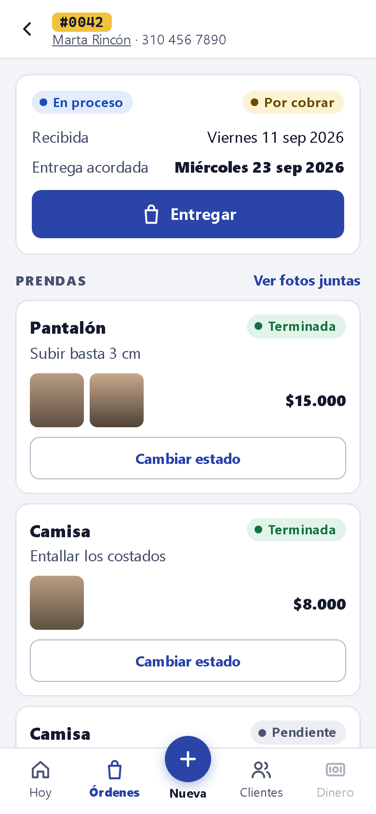

**El detalle de la orden** tiene todo:

- arriba, el **número** y el cliente (toca su nombre para ver su ficha);
- el estado de la orden y si está pagada, la fecha en que la recibiste y la de entrega;
- las **prendas**, con su estado, sus fotos y su precio;
- el **dinero**: valor, pagos y saldo;
- los **avisos** que se le han enviado al cliente;
- los botones para **Entregar**, **Registrar pago** y **Cancelar la orden**.

**Ver las fotos:** toca las fotos de una prenda o **Ver fotos juntas**. Tocando una foto la ves grande, para compararla con las prendas del rincón.

 

## 8. Trabajar las prendas

### Cambiar el estado

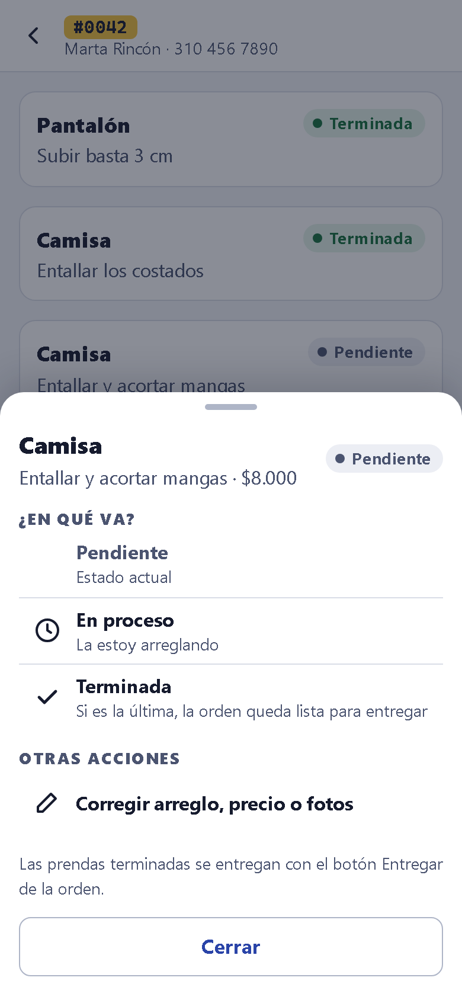

En el detalle de la orden, toca **Cambiar estado** en la prenda. El sistema solo te ofrece los cambios posibles:

| Si la prenda está | Puede pasar a |
| --- | --- |
| **Pendiente** | En proceso («La estoy arreglando») o Terminada |
| **En proceso** | Terminada |
| **Terminada** | En proceso, si necesita un retoque |

- Cuando marcas Terminada la **última** prenda, la orden queda **Lista para entregar** y el cliente recibe el aviso por WhatsApp.
- Si una prenda de una orden lista vuelve a En proceso, la orden deja de estar lista, y si el aviso todavía no había salido, ya no sale.
- **Entregada** no se marca aquí: se hace con el botón **Entregar** de la orden ([sección 10](#10-entregar)).

 

### Corregir el arreglo, el precio o las fotos

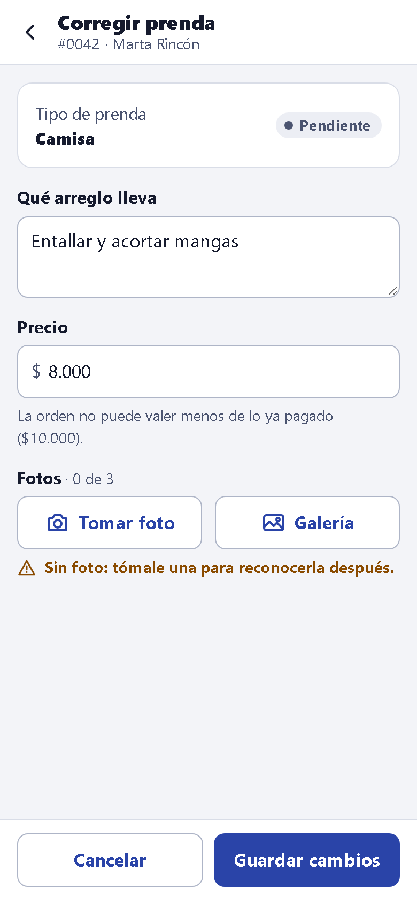

En **Cambiar estado**, toca **Corregir arreglo, precio o fotos**.

- Cambia **Qué arreglo lleva** o el **Precio** y toca **Guardar cambios**. El valor y el saldo de la orden se recalculan solos.
- El tipo de prenda no se cambia.
- **La orden no puede valer menos de lo ya pagado.** Si bajas un precio por debajo de eso, el sistema no lo guarda: primero anula el pago que sobra ([sección 9](#9-cobrar)).
- **Fotos:** agrega las que falten, hasta 3 por prenda. Se suben apenas las eliges.
- Una prenda Entregada, o de una orden cancelada, ya no se puede corregir.

 

### Agregar una prenda que olvidaste anotar

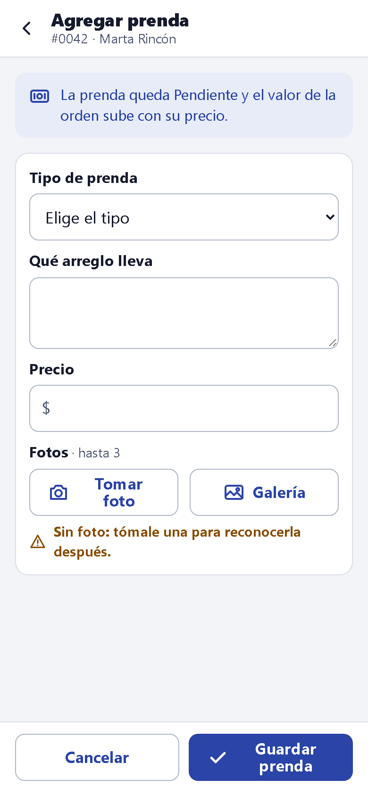

Si el cliente dejó una prenda que no quedó en la orden, no hace falta crear otra orden. En el detalle, debajo de las prendas, toca **Agregar una prenda**, llénala como en una orden nueva y toca **Guardar prenda**.

- La prenda queda **Pendiente** y el valor de la orden sube con su precio.
- Si la orden estaba **lista**, vuelve a **En proceso**.
- Solo se puede en órdenes **En proceso** o **Listas**. A una orden entregada o cancelada no se le agregan prendas.

 

## 9. Cobrar

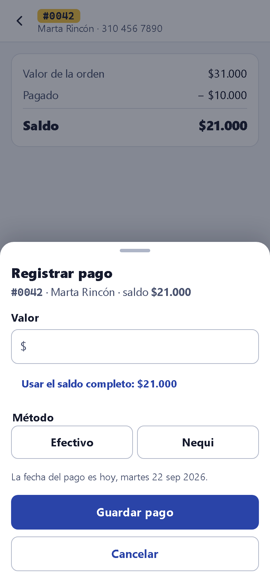

**Registrar un pago o un abono:** en el detalle de la orden, toca **Registrar pago**.

1. Escribe el **Valor**. Si el cliente paga todo, toca **Usar el saldo completo**.
2. Elige el **Método**: Efectivo, Nequi o los que tenga tu taller.
3. Toca **Guardar pago**. La fecha es la de hoy.

- No se puede pagar más que el saldo.
- Una orden entregada sigue recibiendo pagos, por ejemplo si el cliente se llevó la ropa debiendo. Una cancelada, no.

 

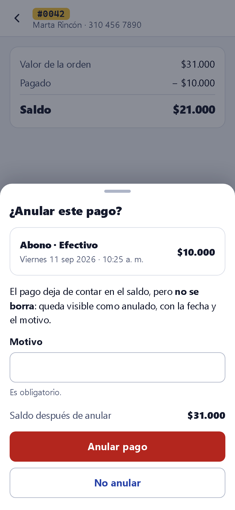

**Anular un pago mal registrado:** en el detalle, en la parte del dinero, toca **Anular este pago** junto al pago.

- Escribe el **Motivo**; es obligatorio.
- El sistema te muestra cómo queda el saldo antes de confirmar.
- Toca **Anular pago**. El pago **no se borra**: deja de contar en el saldo y queda visible como anulado, con la fecha y el motivo.

 

### Cuánto recibiste y quién te debe

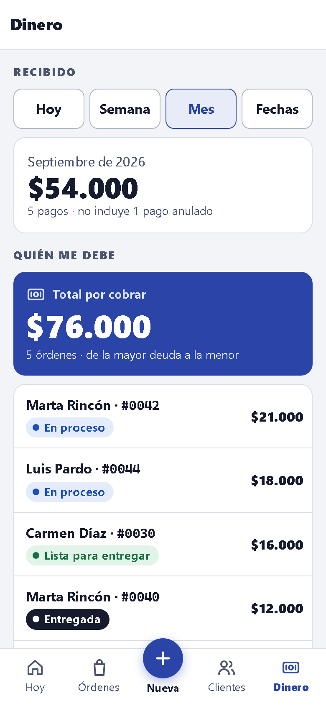

Toca **Dinero** en la barra de abajo, o la tarjeta **Por cobrar** de **Hoy**.

**Recibido:** cuánto dinero te entró. Elige **Hoy**, **Semana** (de lunes a domingo), **Mes** o **Fechas**. Con **Fechas** eliges **Desde** y **Hasta** y tocas **Ver lo recibido**.

- Suma los pagos y abonos de ese período, del día en que se registraron.
- **Los pagos anulados no cuentan.** Si hubo alguno, el sistema lo dice debajo del total, por ejemplo «5 pagos · no incluye 1 pago anulado», para que la cuenta te cuadre con lo que recuerdas.

**Quién me debe:** el total por cobrar y las órdenes que deben, **de la mayor deuda a la menor**, con su estado. Toca una para abrirla y cobrar. Las órdenes pagadas y las canceladas no aparecen.

 

## 10. Entregar

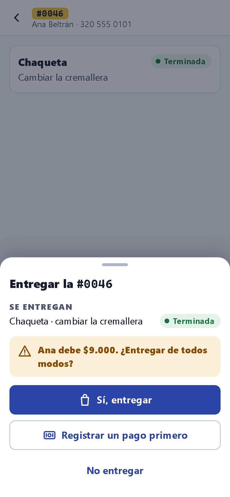

Cuando el cliente viene por su ropa, abre la orden (búscala por número) y toca **Entregar**.

- El sistema muestra **qué se entrega**: las prendas Terminadas.
- Si hay prendas sin terminar, aparecen en **Se queda en el taller**. Es una entrega parcial: la orden sigue En proceso con lo que falta.
- **Si el cliente debe,** el sistema lo dice antes de confirmar, por ejemplo «Ana debe $9.000. ¿Entregar de todos modos?». Puedes **Registrar un pago primero**, entregar igual con **Sí, entregar**, o **No entregar**.

El botón **Entregar** solo aparece si hay algo terminado.

 

## 11. Avisar al cliente por WhatsApp

**El aviso sale solo.** Cuando una orden queda lista, el sistema le escribe al cliente por WhatsApp desde el número del taller:

> Hola Marta, tu orden #0042 del taller está lista para recoger. Prendas listas: 3. Saldo pendiente: $21.000. Te esperamos.

En el detalle de la orden, en **Avisos al cliente**, ves cada aviso y qué pasó con él: **Enviado**, **En cola** (sale en unos minutos), **Por enviar** o **Descartado** (la orden dejó de estar lista antes de enviarlo).

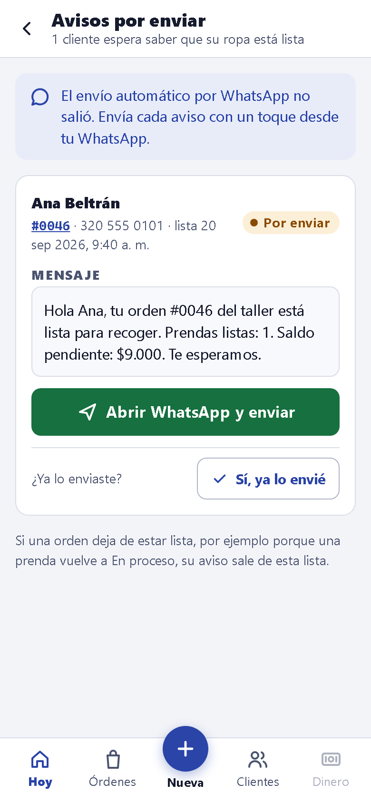

**Si el aviso no pudo salir solo,** por ejemplo porque WhatsApp no respondió después de varios intentos, queda **por enviar** y la pantalla **Hoy** te lo muestra. Envíalo tú:

1. En **Hoy**, toca **Avisos por enviar**.
2. En el aviso del cliente, toca **Abrir WhatsApp y enviar**. Se abre WhatsApp en el chat del cliente, con el mensaje ya escrito.
3. Envíalo desde WhatsApp y vuelve a la app.
4. Toca **Sí, ya lo envié**. Si no lo enviaste, no lo toques: el aviso sigue en la lista.

Si una orden deja de estar lista, su aviso sale solo de esta lista.

 

## 12. Órdenes atrasadas y sin reclamar

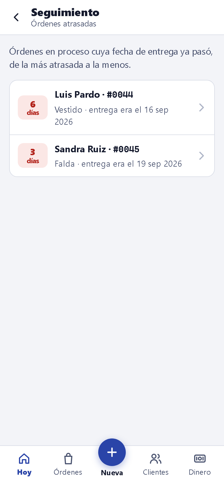

**Atrasadas:** en **Hoy**, toca **Atrasadas**. Son las órdenes en proceso cuya fecha de entrega ya pasó, de la más atrasada a la menos, con cuántos días lleva cada una. Sirve para decidir qué arreglar primero o a quién llamar para correr la fecha.

 

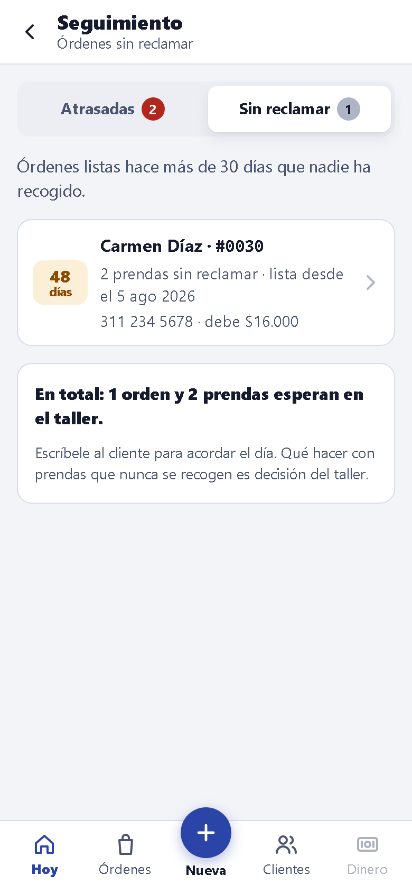

**Sin reclamar:** en **Hoy**, toca **Sin reclamar**. Son las órdenes listas hace más de 30 días que nadie ha recogido, con el celular del cliente y cuánto debe. Escríbele para acordar el día. Qué hacer con la ropa que nunca se recoge es decisión del taller.

 

## 13. Cancelar una orden

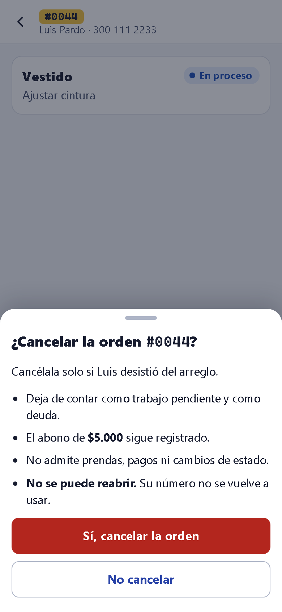

Cancela una orden solo si el cliente **desistió del arreglo**. En el detalle, toca **Cancelar la orden** (al final) y confirma con **Sí, cancelar la orden**.

Al cancelarla:

- deja de contar como trabajo pendiente y como deuda;
- los abonos que ya pagó siguen registrados;
- no admite prendas, pagos ni cambios de estado;
- **no se puede reabrir**, y su número no se vuelve a usar.

Una orden entregada no se puede cancelar.

 

## 14. Sin internet

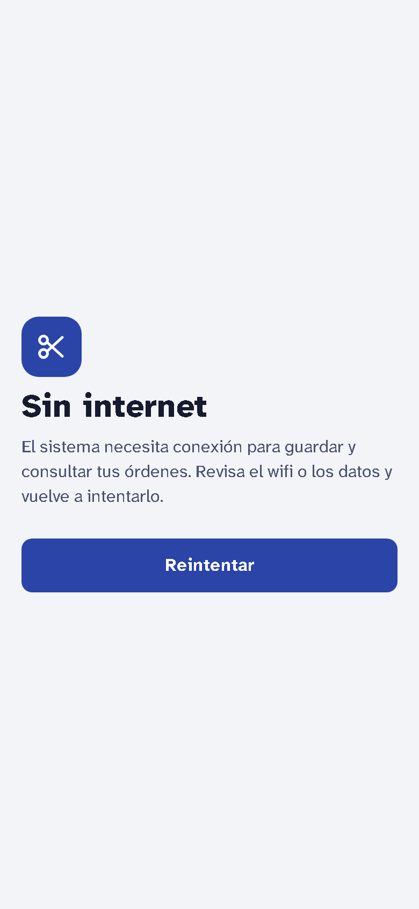

El sistema guarda todo en el servidor, así que **necesita internet** para guardar y consultar. Sin conexión, la app muestra: «Sin internet. El sistema necesita conexión para guardar y consultar tus órdenes».

Revisa el wifi o los datos y toca **Reintentar**. Nada de lo que ya guardaste se pierde.

 

## 15. Problemas frecuentes

| Qué pasa | Qué hacer |
| --- | --- |
| **Olvidé mi contraseña** | Pídele a quien instaló el sistema que te asigne una nueva, y cámbiala en **Ajustes** |
| **«Hiciste demasiados intentos»** | Espera los segundos que dice el mensaje y vuelve a intentar con calma |
| **Al abrir la app se ve la barra del navegador unos segundos** | Tu navegador principal no es Chrome. Funciona igual; si quieres que abra directo, pon Chrome como predeterminado ([sección 2](#2-instalar-la-app)) |
| **Android no me deja instalar el APK** | Permite instalar apps desde Chrome: en el aviso, toca **Configuración → Permitir de esta fuente** |
| **El cliente dice que no le llegó el aviso** | En el detalle de la orden, mira **Avisos al cliente**. Si dice **Por enviar**, envíalo tú desde **Avisos por enviar**. Si dice **Enviado**, revisa que el celular del cliente esté bien escrito en su ficha |
| **Me equivoqué en un precio** | **Cambiar estado → Corregir arreglo, precio o fotos** ([sección 8](#8-trabajar-las-prendas)) |
| **Registré un pago que no era** | Anúlalo con su motivo ([sección 9](#9-cobrar)). No se borra: queda como anulado |
| **La foto no sube** | Revisa la conexión. Cada prenda tiene hasta 3 fotos y cada foto puede pesar hasta 10 MB |
| **Marqué Terminada una prenda por error** | Vuelve a **Cambiar estado** y márcala **En proceso** |
| **Olvidé una prenda en la orden** | En el detalle, **Agregar una prenda** ([sección 8](#8-trabajar-las-prendas)) |

## 16. Cuidar los datos de tus clientes

Los nombres y celulares de tus clientes son datos personales. El sistema los trata según la **Ley 1581 de 2012** de protección de datos, y tú también ayudas a cuidarlos:

- **No compartas tu usuario ni tu contraseña.**
- **Cierra sesión** si otra persona va a usar el celular o el computador.
- Las fotos de las prendas **solo se ven con la sesión iniciada**: no quedan públicas ni se guardan en el celular.
- Usa el celular de cada cliente solo para avisarle de su ropa.
